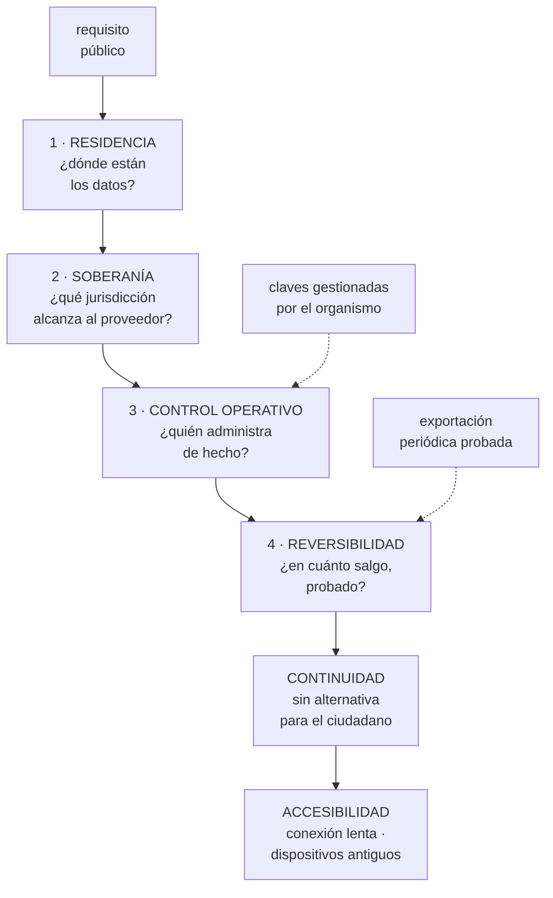

# 280 — Capstone sector público: soberanía y continuidad

> [← 279 · Capstone salud: privacidad e interoperabilidad](../../part-23-industry-capstones/279-capstone-salud-privacidad-e-interoperabilidad/README.md) · [Índice de la parte](../README.md) · [281 · Capstone media: streaming y distribución global →](../../part-23-industry-capstones/281-capstone-media-streaming-y-distribucion-global/README.md)

**Parte:** 23 — Capstones por industria y defensa final<br>
**Nivel:** experto · **Horas estimadas:** 8<br>
**Laboratorio:** `capstone` · **Estado:** `EXECUTABLE_CORE`

## 🎯 Propósito

Capstone de sector público: soberanía y continuidad. La clase da el encargo y la restricción que manda —**el servicio no se puede sustituir por otro y el Estado responde de que siga funcionando y de que sus datos no queden bajo jurisdicción ajena**—, lo que eso obliga técnicamente, y las pruebas negativas que verifican que la soberanía declarada es real.

## 📚 Resultados de aprendizaje

Al finalizar podrás:

1. **Distinguir** residencia, soberanía y control operativo efectivo.
2. **Diseñar** para continuidad cuando no existe un competidor al que acudir.
3. **Planificar** la reversibilidad de proveedor como requisito, no como discurso.
4. **Atender** a toda la población, incluida la que no tiene buena conexión.
5. **Verificar** el diseño con las pruebas negativas del sector.

## 🧩 Conceptos centrales

| Concepto | Comprensión verificable |
|---|---|
| `residencia de datos` | Dónde están almacenados físicamente. Necesaria y muy insuficiente. |
| `soberanía` | Bajo qué jurisdicción y control quedan los datos y quién puede ser obligado a entregarlos. |
| `control operativo` | Quién puede acceder, administrar y detener el servicio en la práctica. |
| `reversibilidad` | Capacidad demostrada de recuperar datos y funciones y llevarlas a otro sitio en un plazo conocido. |
| `servicio esencial` | Aquel para el que el ciudadano no tiene alternativa. Cambia el cálculo de disponibilidad. |
| `accesibilidad` | Que el servicio sea usable por toda la población, incluidas conexiones lentas y capacidades diversas. |

## 🧠 Modelo mental

El capstone no premia cantidad de servicios, sino trazabilidad entre contexto, decisiones, implementación, fallos, evidencia y aprendizaje.

Aplicado a esta clase, separa siempre cuatro planos: **intención** (qué necesita el usuario),
**configuración** (qué declaramos), **estado observado** (qué existe de verdad) y
**evidencia** (cómo sabemos que cumple). Confundirlos produce diseños que se ven correctos
en un diagrama pero fallan al operar.

## 🗺️ Flujo de razonamiento



## 📖 Desarrollo

### 1. El encargo y las tres capas de la soberanía

**El encargo.** La plataforma de trámites de una administración: identidad ciudadana, presentación de solicitudes, notificaciones con efectos legales, pago de tasas y consulta de expedientes. Servicio esencial, con obligación de continuidad y con requisitos de soberanía.

```text
CIFRAS DE PARTIDA
  ciudadanos con identidad digital           6,2 M
  trámites/año                              19 M
  picos                                     fin de plazos
                                            fiscales:
                                            ×22 en 48 h
  notificaciones con efecto legal/año        4,1 M
  organismos que consumen datos              41
  obligación de conservación                 hasta 30 años
  y disponibilidad exigida                   99,9 % en
                                             horario, con
                                             plazos legales
                                             que no se
                                             suspenden
```

Y la restricción que manda:

```text
EL CIUDADANO NO TIENE ALTERNATIVA
  si el comercio cae, se compra en otro sitio  clase 277
  si esto cae, el trámite no se puede hacer
  → y si cae el último día de plazo, se produce un daño
    jurídico

→ consecuencias
  la disponibilidad no es una decisión de coste: es una
    obligación
  el sistema debe poder acreditar CUÁNDO estuvo caído,
    porque los plazos se amplían por ello
  y hace falta una vía alternativa: presencial o
    diferida, no como cortesía sino como parte del diseño
```

Y las tres capas de la soberanía, que se confunden constantemente:

```text
1  RESIDENCIA
   los datos están en centros situados en el territorio
   → necesaria y muy insuficiente
   → un dato en el territorio puede estar bajo control de
     una entidad sujeta a otra jurisdicción

2  SOBERANÍA JURÍDICA
   ¿qué legislación alcanza al proveedor y a su matriz?
   → ¿puede una autoridad extranjera obligarle a entregar
     datos alojados aquí?
   → esta pregunta es jurídica y determina decisiones
     técnicas

3  CONTROL OPERATIVO EFECTIVO
   ¿quién administra de hecho?
   → ¿el personal de soporte del proveedor puede acceder?
   → ¿desde dónde? ¿con qué registro? ¿con autorización de
     quién?
   → ¿quién tiene las claves de cifrado?

→ y la tercera es la que se puede verificar técnicamente
→ las tres juntas son lo que hace real una declaración de
  soberanía; una sola no basta
```

Y lo que de ahí se deriva:

```text
CLAVES GESTIONADAS POR EL ORGANISMO
  el cifrado con claves que el proveedor no puede usar
  → si el proveedor es obligado a entregar datos, entrega
    cifrado
  → coste: gestión de claves propia, con su recuperación
    y su ensayo                             clase 197

ACCESO DEL PROVEEDOR, CONTROLADO
  cualquier acceso de soporte requiere aprobación explícita
  y queda registrado
  → y ese registro lo conserva el organismo, no el
    proveedor

Y REVERSIBILIDAD DEMOSTRADA
  → que es la siguiente sección
```

### 2. Reversibilidad: el requisito que nadie prueba

Todos los pliegos la exigen y casi nadie la comprueba. Y sin prueba, no existe.

```text
LO QUE SUELE HABER
  una cláusula: «el adjudicatario entregará los datos al
  finalizar el contrato»
  → sin formato definido
  → sin plazo verificado
  → sin haberlo hecho nunca                     ley 22

LO QUE HACE FALTA
  1  EXPORTACIÓN PERIÓDICA REAL
     datos y metadatos, en formato abierto y documentado,
     fuera del proveedor
     → mensual, no al final
  2  QUE ESA EXPORTACIÓN SE PUEDA CARGAR EN OTRO SITIO
     → y probarlo, al menos una vez al año
     → cargar en un entorno alternativo y consultar
  3  DEPENDENCIAS INVENTARIADAS Y CLASIFICADAS
     qué usamos que solo existe en este proveedor
     y qué coste tendría sustituirlo
  4  Y UN PLAZO DE SALIDA ESTIMADO Y REVISADO
     → «podríamos operar en otro proveedor en N meses»
     → con N medido, no supuesto

→ la reversibilidad no es no usar servicios gestionados
→ es saber exactamente qué costaría dejar de usarlos
                                            clase 273
```

Y el equilibrio honesto:

```text
RENUNCIAR A LOS SERVICIOS GESTIONADOS
  → más coste, más operación, menos seguridad por defecto
  → y con un equipo público, casi siempre peor resultado

USARLOS SIN NINGÚN INVENTARIO
  → salida imposible en un plazo razonable

EL PUNTO INTERMEDIO
  gestionado para lo que tiene equivalente en otros
  proveedores
  → cómputo, objetos, relacional, colas, identidad
  cuidado con lo que no lo tiene
  → servicios propietarios sin equivalente, funciones muy
    específicas, modelos exclusivos
  y una capa fina propia en las fronteras que más costaría
  cambiar
  → sin construir abstracciones grandes, que cuestan más
    de lo que ahorran                        clase 267
```

Y la continuidad, que aquí tiene una forma distinta:

```text
NO BASTA CON OTRA REGIÓN DEL MISMO PROVEEDOR
  el escenario que preocupa al regulador no es una caída
  técnica
  → es la indisponibilidad del proveedor por causa
    jurídica o comercial

→ y de ahí sale una decisión cara: una capacidad mínima
  de servicio fuera del proveedor principal
  → no todo el sistema: los trámites críticos y la
    consulta de expedientes
  → y probada, no declarada

→ es el único sector de este programa donde
  «multiproveedor» se justifica por sí mismo
                                            clase 273
```

### 3. Continuidad, plazos y accesibilidad

Lo que este sector exige y que en los demás no aparece.

```text
LOS PLAZOS LEGALES NO SE SUSPENDEN SOLOS
  si el sistema cae el último día de un plazo, hay que
    acreditar la caída
  → registro de disponibilidad con sellado de tiempo
    fiable y conservado
  → y un procedimiento para ampliar plazos con base
    documental

→ y esto convierte el registro de disponibilidad en un
  documento con efectos jurídicos
→ que a su vez exige que sea inmutable y auditable
                                            clase 278

LAS NOTIFICACIONES CON EFECTO LEGAL
  el momento de puesta a disposición importa
  la evidencia de entrega importa
  y el acceso del ciudadano a esa evidencia importa
  → idempotencia y no duplicación son requisitos legales
    aquí, no técnicos                       clase 210
```

Y el pico, que es de una forma peculiar:

```text
FIN DE PLAZO: ×22 EN 48 HORAS
  no es estacional suave como el comercio
  → es una pared

lo que funciona
  cola de presentación con acuse inmediato
  → «tu solicitud ha sido registrada a las 23:47:12» y el
    procesamiento va detrás
  → el registro es lo que tiene efecto jurídico, no el
    procesamiento
  vertido por prioridad: presentar antes que consultar
                                            clase 262
  y capacidad elástica reservada para esas ventanas

→ y aquí el diseño asíncrono no es una preferencia
  técnica: es lo que permite cumplir el plazo del
  ciudadano                                    ley 18
```

Y la accesibilidad, que en este sector es obligación legal:

```text
EL SERVICIO DEBE FUNCIONAR PARA TODA LA POBLACIÓN
  con conexiones lentas o intermitentes
  con dispositivos antiguos
  con lectores de pantalla y navegación por teclado
  con contraste suficiente
  y sin depender de que el usuario tenga un teléfono
    concreto

→ consecuencias técnicas reales
  peso de página muy limitado
  funcionamiento sin ejecución de guiones para lo esencial
  formularios que se pueden guardar y retomar
  → porque una conexión que se cae a mitad de un trámite
    de 40 minutos es un problema de accesibilidad, no de
    experiencia

→ y esto CONTRADICE muchas decisiones habituales de la
  ingeniería moderna
→ y en este sector, gana la accesibilidad
```

### 4. Las pruebas negativas del capstone

Varias de estas las ejecuta una intervención o una auditoría de la administración.

```text
DE SOBERANÍA Y CONTROL
  ☐ ¿algún dato sale del territorio? incluidos registros,
    métricas y copias
  ☐ ¿el personal del proveedor puede acceder? ¿desde
    dónde? ¿queda registrado dónde?
  ☐ ¿quién tiene las claves y puede el proveedor descifrar
    sin nosotros?
  ☐ ¿el soporte técnico ve datos personales al depurar?
  ☐ ¿los modelos o servicios de terceros procesan datos
    fuera?                                  clase 251

DE REVERSIBILIDAD
  ☐ ¿existe exportación mensual completa fuera del
    proveedor?
  ☐ ¿se ha CARGADO alguna vez en otro sitio? ¿cuándo?
  ☐ ¿qué servicios usamos sin equivalente en otro
    proveedor?
  ☐ ¿en cuántos meses podríamos operar fuera? ¿de dónde
    sale esa cifra?

DE CONTINUIDAD
  ☐ ¿los trámites críticos funcionan si el proveedor
    principal no está disponible?
  ☐ ¿se ha ensayado con carga?
  ☐ ¿el registro de disponibilidad es inmutable y sirve
    para acreditar una caída?
  ☐ ¿existe la vía alternativa y alguien la ha usado?

DE PICO Y PLAZOS
  ☐ simular ×22 durante 6 horas: ¿se registra todo?
  ☐ ¿el acuse de registro es inmediato e independiente del
    procesamiento?
  ☐ ¿una notificación puede duplicarse o perderse?
  ☐ ¿el sellado de tiempo es fiable y su desviación se
    vigila?

DE ACCESIBILIDAD
  ☐ ¿el trámite se completa con conexión de 1 Mbps y 400
    ms de latencia?
  ☐ ¿se puede completar solo con teclado y con lector de
    pantalla?
  ☐ ¿un formulario largo se puede guardar y retomar?
  ☐ ¿funciona lo esencial sin ejecución de guiones?
```

**El entregable del capstone:**

```text
1  el análisis de las tres capas de soberanía, con quién
   controla qué
2  el inventario de dependencias sin equivalente y su
   coste de sustitución
3  el plan de reversibilidad con la última prueba de carga
   externa
4  la capacidad mínima fuera del proveedor principal y su
   ensayo
5  el diseño del pico de fin de plazo, con acuse
   independiente
6  el registro de disponibilidad con valor probatorio
7  el informe de accesibilidad con pruebas reales
8  y el resultado de las pruebas negativas, con lo que
   falló
```

Y el cierre que enlaza con la clase siguiente: aquí la restricción es jurídica y el volumen llega a golpes. En el siguiente sector el volumen es continuo y enorme, el coste por byte decide la arquitectura y la calidad percibida se mide en el dispositivo del espectador. Medios y distribución global es la materia de la clase 281.

## 🔬 Ejemplo trabajado

**El capstone resuelto. Lo que sigue es el análisis de soberanía que encontró tres fugas de datos fuera del territorio, la prueba de reversibilidad que nunca se había hecho, y el pico de fin de plazo con la cola de registro.**

**El análisis de las tres capas.**

```text
CAPA 1 · RESIDENCIA
  declarada     todos los datos en la región nacional
  verificada    barrido automático de recursos por región

  hallazgos
    ✓ bases de datos, objetos y cómputo: en región
    ✗ REGISTROS de aplicación: enviados a un servicio
      de análisis alojado fuera
      → incluían identificadores de ciudadano en las
        trazas de error
    ✗ MÉTRICAS Y RASTREO: agregados fuera
      → sin datos personales, pero con patrones de uso
    ✗ COPIAS DE SEGURIDAD de un servicio secundario
      replicadas a una región extranjera por una opción
      por defecto                              ley 26

  → tres fugas, ninguna intencionada, todas por valores
    por defecto o por integraciones antiguas
  → y la declaración de residencia era falsa desde hacía
    años

CAPA 2 · SOBERANÍA JURÍDICA
  análisis jurídico externo
  → el proveedor tenía matriz sujeta a legislación
    extranjera con posibilidad de requerimiento
  → conclusión: la residencia no basta

  decisión técnica derivada
    cifrado con claves gestionadas por el organismo, en
    módulo propio                            clase 197
    → el proveedor no puede descifrar
    → coste: gestión, custodia y ensayo de recuperación
      de claves; 0,5 personas

CAPA 3 · CONTROL OPERATIVO
  prueba: se pidió al proveedor la lista de accesos de su
  personal a los entornos del organismo en 12 meses

  respuesta
    accesos de soporte                            41
    con aprobación previa del organismo             6
    registrados por el organismo                    0
    → los otros 35 se conocieron por esta petición

  corrección
    acceso del proveedor solo con aprobación explícita,
    sesión grabada y registro conservado por el organismo
    → contractual y técnicamente
    accesos en los 12 meses siguientes             9
    todos aprobados y registrados                  9
```

**La prueba de reversibilidad.**

```text
el pliego exigía reversibilidad
la cláusula existía desde hacía 6 años
y nunca se había ejecutado                     ley 22

el ejercicio
  exportar todo y cargarlo en un entorno de otro
  proveedor, y consultar

lo que pasó
  exportación de bases relacionales          3 días
  exportación de objetos (41 TB)             9 días
    → y con coste de salida de 3.900 USD
  metadatos del catálogo                     NO EXPORTABLE
    en formato abierto
  configuración de identidad y permisos      NO EXPORTABLE
  definiciones de flujos de trabajo          NO EXPORTABLE
    (formato propietario)

  carga en el entorno alternativo
    datos                                    correcta
    permisos                                 rehechos a
                                             mano, 4
                                             semanas
    flujos de trabajo                        reescritos, 11
                                             semanas

  tiempo total del ejercicio parcial      17 semanas
  estimación de salida completa           14 meses
```

Y las decisiones que salieron:

```text
los flujos de trabajo se reescribieron en un formato
abierto y ejecutable en cualquier proveedor
  → coste: 9 semanas
  → y la estimación de salida bajó de 14 a 5 meses

la configuración de identidad y permisos pasó a
infraestructura como código, exportable  clase 128

el catálogo de metadatos se replicó a un formato abierto
mensualmente

y se estableció un ejercicio de carga externa ANUAL
  → tercer año: 6 semanas, con el 92 % automatizado

→ y lo importante: la cifra de salida pasó a ser un dato
  medido que se revisa, no una cláusula
```

**El pico de fin de plazo.**

```text
el escenario
  último día de plazo fiscal
  ×22 sobre un día normal, concentrado entre las 18:00 y
  las 23:59

diseño anterior
  el trámite se procesaba de forma síncrona
  → a las 21:40 el sistema se saturó
  → 41 minutos sin servicio
  → 19.000 ciudadanos sin poder presentar
  → ampliación de plazo por resolución, y 340
    reclamaciones

diseño nuevo
  presentación → validación mínima → REGISTRO con acuse
  y sello de tiempo → cola → procesamiento
  → el acuse llega en menos de 2 segundos
  → el procesamiento puede tardar horas y no afecta al
    plazo
  y vertido por prioridad: presentar > consultar >
  descargar histórico
```

Y el resultado del ensayo con carga sintética:

```text
carga simulada             ×22 durante 6 horas
  presentaciones                         414.000
  acuses emitidos                        414.000
  acuses con sello de tiempo válido      414.000
  pérdidas                                     0
  latencia del acuse, percentil 99          1,7 s
  retraso máximo del procesamiento      3 h 40 min
  consultas de expediente vertidas          31 %
    durante el pico

→ y el ciudadano que consultaba veía «servicio de consulta
  no disponible por alta demanda; la presentación funciona
  con normalidad»
→ mensaje acordado con el área jurídica antes
```

Y el día real, ese año:

```text
pico real                              ×19
tiempo sin servicio de presentación      0
acuses emitidos                    361.000
reclamaciones                            4
ampliaciones de plazo por caída          0

y el retraso del procesamiento           2 h 10
  → sin efecto jurídico, porque el registro ya constaba
```

**La accesibilidad, medida.**

```text
prueba con conexión de 1 Mbps y 400 ms de latencia
  antes   trámite completo               no completable
                                         (el formulario
                                          tardaba 74 s en
                                          cargar)
  después                                completable en
                                         4 min 20

peso de la página del trámite
  antes                                      3,9 MB
  después                                    412 KB

completable solo con teclado y lector de pantalla
  antes                                          no
  después                                        sí

formulario largo guardable y retomable
  antes                                          no
  después                                        sí
  → y esto solo redujo los abandonos del 34 % al 11 %

y lo que costó
  se retiraron 3 bibliotecas del cliente y se sustituyó
  la validación en el navegador por validación en el
  servidor con recarga parcial
  → decisión que en otro sector habría sido un retroceso
  → aquí es cumplir la obligación legal
```

**Las cifras finales del capstone.**

```text                                        antes     después
datos fuera del territorio                 3 fugas           0
accesos del proveedor registrados por
  el organismo                              0 de 41      9 de 9
claves controladas por el organismo             no          sí

reversibilidad probada                          no    sí, anual
salida estimada                            14 meses    5 meses
servicios sin equivalente                        7           2

caída en fin de plazo                       41 min           0
ampliaciones de plazo por caída                  1           0
acuse independiente del procesamiento           no          sí

trámite completable a 1 Mbps                    no          sí
peso de la página                           3,9 MB      412 KB
abandono de formularios largos                34 %        11 %
```

**La lección que este capstone deja**: la declaración de residencia nacional era **falsa desde hacía años** por tres caminos que nadie había elegido —registros con identificadores a un servicio externo, métricas fuera y copias replicadas por una opción por defecto—. Y la cláusula de reversibilidad llevaba **seis años en el pliego sin ejecutarse nunca**: al probarla, la salida real resultó ser de catorce meses, y bajó a cinco solo tras reescribir lo que estaba en formatos propietarios.

## 🧪 Laboratorio guiado

Ejecuta desde la raíz:

```bash
python classes/part-23-industry-capstones/280-capstone-sector-publico-soberania-y-continuidad/lab.py
```

El laboratorio selecciona el motor de práctica **`capstone`** y produce
`lab_result.json`. El escenario, sus comprobaciones y el artefacto esperado corresponden a
esta clase; no requiere credenciales y deja explícito qué debe revalidarse en un sandbox real.

1. Lee `exercise.steps` y formula una predicción antes de ejecutar.
2. Ejecuta la práctica y verifica todos los elementos de `checks`.
3. Provoca el caso de `negative_test` y explica la señal observada.
4. Materializa `public-sector-capstone` en `evidence/` usando la plantilla indicada.
5. Para proveedor real, sigue `sandbox.requires`, registra costo y ejecuta `destroy`.

### Evidencia esperada

El artefacto principal es un incremento integrado, demostrable y documentado. Además, la entrega debe incluir el comando ejecutado,
la salida estructurada y una conclusión que no exceda lo observado.

## 🏆 Reto verificable

Construye **`public-sector-capstone`** para el caso CloudShop. Incluye una alternativa descartada,
un supuesto que pueda falsarse, una prueba de fallo y una decisión de rollback.

## ✅ Criterio de aceptación

- [ ] `lab.py` termina con código 0 y genera JSON válido.
- [ ] La entrega conecta al menos tres requisitos con mecanismos verificables.
- [ ] Existe una prueba positiva y una prueba negativa con evidencia.
- [ ] Seguridad, costo y operación aparecen como decisiones, no como anexos.
- [ ] Se declara una limitación y una condición que obligaría a revisar el diseño.
- [ ] Otra persona puede repetir el recorrido sin conocimiento tácito.

## ⚠️ Errores frecuentes

| Síntoma | Causa probable | Corrección |
|---|---|---|
| Se declara residencia nacional y hay datos fuera del territorio | Registros, métricas y copias salen por integraciones antiguas y opciones por defecto | Barre automáticamente todos los recursos por región, incluidos registros, métricas y copias, y controla los valores por defecto de replicación. |
| La residencia se cumple y la soberanía sigue sin estar garantizada | Se confunde dónde están los datos con quién puede ser obligado a entregarlos y quién los administra | Analiza las tres capas: residencia, jurisdicción del proveedor y control operativo; cifra con claves que el proveedor no pueda usar. |
| La cláusula de reversibilidad existe y nadie sabe cuánto costaría salir | Nunca se ha ejecutado una exportación ni una carga en otro sitio | Exporta mensualmente en formato abierto y carga en un entorno alternativo al menos una vez al año; la cifra de salida debe ser medida. |
| El sistema cae en fin de plazo y hay que ampliar plazos por resolución | El trámite se procesa de forma síncrona y la pared de demanda lo satura | Separa registro y procesamiento: acuse inmediato con sello de tiempo, cola detrás, y vertido por prioridad de presentar sobre consultar. |
| El servicio no se puede usar con conexión lenta o con lector de pantalla | Se aplicaron decisiones habituales de experiencia sin la restricción legal de accesibilidad | Limita el peso, haz que lo esencial funcione sin guiones y permite guardar y retomar formularios largos; aquí la accesibilidad gana. |
| No se puede acreditar cuándo estuvo caído el servicio | El registro de disponibilidad no es inmutable ni está sellado | Trata ese registro como documento con efectos jurídicos: inmutable, con sello de tiempo fiable y conservado por el organismo. |

## 🛡️ Seguridad, ética y costo

Trabaja con cuentas propias o sandboxes autorizados. No publiques secretos, identificadores
reales ni datos personales. Antes de crear recursos pagos define presupuesto, etiquetas y
comando de destrucción; después verifica que no queden recursos huérfanos. Los ejemplos
locales enseñan contratos, pero no certifican cumplimiento ni disponibilidad de producción.

## ❓ Preguntas de comprobación

1. ¿Qué distingue residencia, soberanía jurídica y control operativo?
2. ¿Qué hace real un plan de reversibilidad y qué lo convierte en discurso?
3. ¿Por qué en este sector se justifica una capacidad fuera del proveedor principal?
4. ¿Cómo se diseña el pico de fin de plazo sin ampliar plazos por caída?
5. ¿Qué decisiones técnicas impone la accesibilidad y por qué aquí prevalecen?

## 🔗 Referencias

- ENISA (2024). *European Cybersecurity Certification Scheme for Cloud Services*. <https://www.enisa.europa.eu/topics/certification>
- Comisión Europea (2023). *Data Act — cambio de proveedor y portabilidad en la nube*. <https://digital-strategy.ec.europa.eu/en/policies/data-act>
- W3C (2023). *Web Content Accessibility Guidelines (WCAG) 2.2*. <https://www.w3.org/TR/WCAG22/>
- AWS (2024). *Digital sovereignty and data residency guidance*. <https://aws.amazon.com/compliance/data-protection/>
- Microsoft (2024). *Azure sovereign cloud and data residency*. <https://learn.microsoft.com/azure/cloud-adoption-framework/scenarios/sovereignty/>
- Documentación oficial vigente del servicio implementado; registra URL y fecha de consulta.

---

> [Evaluación](assessment.md) · [Contrato de clase](lesson.yaml) · [Índice de la parte](../README.md)

| Anterior | Índice | Siguiente |
|---|---|---|
| [← 279 · Capstone salud: privacidad e interoperabilidad](../../part-23-industry-capstones/279-capstone-salud-privacidad-e-interoperabilidad/README.md) | [Parte 23](../README.md) · [Programa](../../README.md) | [281 · Capstone media: streaming y distribución global →](../../part-23-industry-capstones/281-capstone-media-streaming-y-distribucion-global/README.md) |
