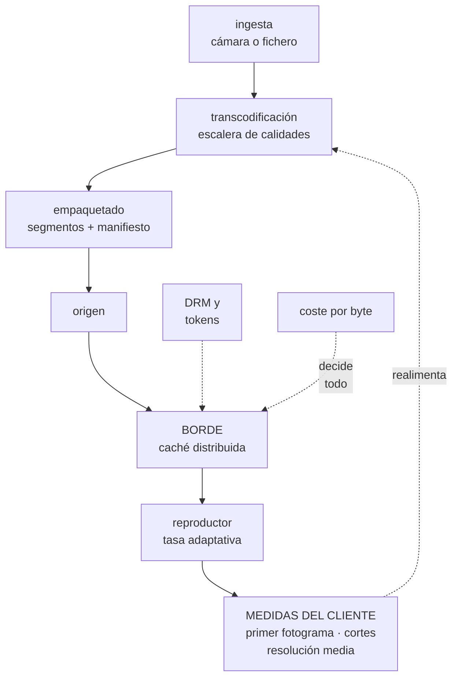

# 281 — Capstone media: streaming y distribución global

> [← 280 · Capstone sector público: soberanía y continuidad](../../part-23-industry-capstones/280-capstone-sector-publico-soberania-y-continuidad/README.md) · [Índice de la parte](../README.md) · [282 · Capstone industria: IoT, edge y operación desconectada →](../../part-23-industry-capstones/282-capstone-industria-iot-edge-y-operacion-desconectada/README.md)

**Parte:** 23 — Capstones por industria y defensa final<br>
**Nivel:** experto · **Horas estimadas:** 8<br>
**Laboratorio:** `capstone` · **Estado:** `EXECUTABLE_CORE`

## 🎯 Propósito

Capstone de medios: streaming y distribución global. La clase da el encargo y la restricción que manda —**el coste por byte servido y la calidad percibida en el dispositivo del espectador deciden todo lo demás**—, por qué aquí el borde no es una optimización sino la arquitectura, y las pruebas negativas de un sector donde el pico se produce por un evento que se anuncia con meses de antelación.

## 📚 Resultados de aprendizaje

Al finalizar podrás:

1. **Explicar** por qué el coste por byte reordena todas las decisiones.
2. **Diseñar** la cadena de vídeo desde la ingesta hasta el reproductor.
3. **Medir** calidad percibida y no disponibilidad de servidor.
4. **Planificar** un evento en directo con capacidad y con degradación.
5. **Verificar** el diseño con las pruebas negativas del sector.

## 🧩 Conceptos centrales

| Concepto | Comprensión verificable |
|---|---|
| `coste por byte servido` | La unidad económica del sector. Domina sobre cómputo y almacenamiento. |
| `tasa de acierto en el borde` | Porcentaje de bytes servidos desde la caché. Un punto de mejora vale mucho dinero. |
| `calidad percibida` | Lo que experimenta el espectador: tiempo hasta el primer fotograma, cortes y resolución media. |
| `tasa de bits adaptativa` | El reproductor elige la calidad según la red. Traslada la decisión al dispositivo. |
| `directo frente a bajo demanda` | El directo no admite reproceso ni reintento largo: lo que se pierde, se pierde. |
| `purga de caché` | Invalidar contenido distribuido. Cara, lenta y necesaria; se diseña desde el principio. |

## 🧠 Modelo mental

El capstone no premia cantidad de servicios, sino trazabilidad entre contexto, decisiones, implementación, fallos, evidencia y aprendizaje.

Aplicado a esta clase, separa siempre cuatro planos: **intención** (qué necesita el usuario),
**configuración** (qué declaramos), **estado observado** (qué existe de verdad) y
**evidencia** (cómo sabemos que cumple). Confundirlos produce diseños que se ven correctos
en un diagrama pero fallan al operar.

## 🗺️ Flujo de razonamiento



## 📖 Desarrollo

### 1. El encargo y la unidad que decide

**El encargo.** Una plataforma de vídeo: catálogo bajo demanda, canales en directo, un evento anual con audiencia masiva, y distribución en 40 países con derechos por territorio.

```text
CIFRAS DE PARTIDA
  horas de catálogo                        41.000
  espectadores simultáneos, día normal     180.000
  espectadores simultáneos, evento anual   2,4 M
  tráfico servido/mes                      14 PB
  países con derechos distintos            40
  y el reparto del coste
    distribución de bytes                  71 %
    transcodificación                      14 %
    almacenamiento                          9 %
    resto                                   6 %
```

Y la restricción que manda:

```text
EL COSTE POR BYTE SERVIDO MANDA SOBRE EL RESTO
  el 71 % del coste es mover bytes
  → y de ahí sale que la arquitectura sea la red de
    distribución, y no los servicios de cómputo

y la aritmética que lo hace evidente
  14 PB/mes
  1 punto de tasa de acierto en el borde = 140 TB que no
    salen del origen
  → y cada punto de acierto vale decenas de miles al mes

→ por eso decisiones que en otros sectores son detalles
  aquí son estructurales
    tamaño de segmento
    cabeceras de caché
    nombres de fichero y su variabilidad
    y la escalera de calidades
```

Y la segunda restricción, que es la que define el producto:

```text
LO QUE IMPORTA ES LA CALIDAD PERCIBIDA, NO LA
DISPONIBILIDAD DEL SERVIDOR
  un servidor al 100 % con vídeo que se corta es un fallo
  → y ninguna métrica de servidor lo detecta

las medidas que importan, todas en el CLIENTE
  tiempo hasta el primer fotograma
  porcentaje de sesiones con al menos un corte
  tiempo total en pausa por almacenamiento intermedio
  resolución media servida
  y errores de inicio de reproducción

→ y este es el mismo principio de la clase 268 llevado al
  extremo: si no se mide en el dispositivo, no se mide
```

### 2. La cadena de vídeo

Del origen al ojo, con las decisiones de cada tramo.

```text
INGESTA
  bajo demanda: ficheros maestros a un almacén
  directo: flujo redundante desde dos rutas distintas
  → y en directo, la redundancia de ingesta es lo único
    que salva un evento: si se pierde ahí, no hay
    reproceso

TRANSCODIFICACIÓN
  una escalera de calidades por título
  decisión  escalera fija frente a escalera por contenido
  → una animación y un partido de fútbol no necesitan la
    misma tasa de bits para verse igual
  → la escalera por contenido reduce bytes entre un 15 %
    y un 30 % sin pérdida percibida
  empeora   más cómputo de análisis y más complejidad
  y en directo no hay tiempo: escalera fija por tipo de
    canal

EMPAQUETADO
  segmentos y manifiesto
  decisión  tamaño de segmento
    segmentos cortos  → menos retardo en directo, más
                        peticiones, peor acierto de caché
    segmentos largos  → mejor acierto, más retardo
  → y esta decisión sola mueve el coste y la experiencia
    a la vez

DISTRIBUCIÓN
  el borde es la arquitectura
  claves de caché estables: sin parámetros variables en la
    ruta
  → un identificador de sesión en la ruta destruye el
    acierto de caché y multiplica la factura
  y jerarquía de caché: borde → intermedio → origen
  → el intermedio protege el origen en un pico

REPRODUCTOR
  tasa adaptativa: el cliente decide
  → y ahí está la mayor parte de la calidad percibida
  buffer inicial frente a tiempo hasta el primer fotograma
  → más buffer, menos cortes, arranque más lento
  y comunicación de medidas al servicio de análisis

DERECHOS Y ACCESO
  tokens firmados con caducidad corta y con territorio
  cifrado de contenido con licencias por dispositivo
  → y el bloqueo por territorio se comprueba en el borde,
    no en el origen
```

Y la purga, que hay que diseñar antes de necesitarla:

```text
RETIRAR UN CONTENIDO DE 40 PAÍSES
  por caducidad de derechos, por orden judicial o por
  error
  → y hacerlo en minutos, no en horas

  lo que lo hace posible
    versionado en la ruta en vez de purga masiva
    tokens de acceso con caducidad corta
    → así retirar el permiso vale casi tanto como purgar
    y purga selectiva para lo urgente

→ y probarlo: la purga es una de esas capacidades que
  nadie ha ejercitado hasta que hace falta   ley 22
```

### 3. El evento en directo

El sector tiene un pico peculiar: se conoce con meses de antelación y no admite fallo.

```text
LO QUE LO DIFERENCIA
  la fecha se sabe                          clase 262
  la audiencia se puede estimar con histórico
  y NO HAY SEGUNDA OPORTUNIDAD: el partido ocurre una vez

y las formas de fallar, en orden de gravedad
  1  perder la ingesta               → no hay contenido
  2  saturar el origen               → todos afectados
  3  agotar la capacidad del borde   → región afectada
  4  fallar la autorización          → nadie entra
  5  degradar la calidad             → aceptable
```

Y el plan, que es sobre todo de reserva y de ensayo:

```text
CAPACIDAD RESERVADA CON ANTELACIÓN
  el borde se contrata; no se autoescala solo
  → y hay que avisar al proveedor de distribución con
    semanas

CALENTAMIENTO DE CACHÉ
  el contenido estático y los manifiestos, precargados

AUTORIZACIÓN, QUE ES EL CUELLO REAL
  2,4 M de espectadores entran en 4 minutos
  → el pico no es de vídeo: es de LOGIN y de emisión de
    tokens
  → y ahí se cae la mayoría de los eventos
  mitigación: tokens emitidos con antelación, ventana de
    entrada escalonada y capacidad específica para
    identidad                                clase 209

DEGRADACIÓN DECIDIDA ANTES
  1  se apagan recomendaciones y catálogo enriquecido
  2  se limita la calidad máxima
  3  se sirve una calidad única si hace falta
  4  y se vierte el acceso a bajo demanda
  → todo antes que perder el directo    clase 262

Y ENSAYO CON CARGA SINTÉTICA
  al menos dos, uno a 3 semanas y otro a 1
                                            clase 261
```

### 4. Las pruebas negativas del capstone

Lo que hay que ejecutar para saber si el diseño aguanta.

```text
DE COSTE Y CACHÉ
  ☐ ¿cuál es la tasa de acierto en el borde por tipo de
    contenido?
  ☐ ¿hay algún parámetro variable en las rutas que rompa
    la clave de caché?
  ☐ ¿cuánto tráfico llega al origen y por qué?
  ☐ ¿cuál es el coste por hora vista y su tendencia?

DE CALIDAD PERCIBIDA
  ☐ ¿qué porcentaje de sesiones tiene al menos un corte?
  ☐ ¿tiempo hasta el primer fotograma, percentil 95, por
    país?
  ☐ ¿resolución media servida por tipo de red?
  ☐ simular una red de 3 Mbps con pérdidas: ¿qué hace el
    reproductor?

DE FALLO
  ☐ caer el origen durante 10 minutos: ¿siguen las
    sesiones activas?
  ☐ caer una región de borde: ¿se redistribuye o falla?
  ☐ perder una de las dos rutas de ingesta en directo:
    ¿se nota?
  ☐ el servicio de licencias no responde: ¿qué ve el
    espectador?

DE DERECHOS Y ACCESO
  ☐ un espectador fuera de territorio con un enlace
    directo: ¿accede?
  ☐ un token caducado reutilizado: ¿funciona?
  ☐ retirar un título de 40 países: ¿cuánto tarda y se
    verifica?
  ☐ ¿un enlace de segmento se puede compartir y consumir
    sin autorización?

DEL EVENTO
  ☐ ensayo con carga sintética al 120 % de lo estimado
  ☐ 2,4 M de autorizaciones en 4 minutos: ¿aguanta
    identidad?
  ☐ ¿la degradación por prioridad se ejecuta sola o
    requiere una persona?
  ☐ ¿quién puede activar la calidad única y en cuánto
    tiempo?
```

**El entregable del capstone:**

```text
1  la cadena completa con las decisiones de cada tramo
2  la política de caché y su tasa de acierto objetivo
3  las métricas de calidad percibida y sus objetivos
                                            clase 268
4  el diseño de derechos por territorio y de retirada de
   contenido
5  el plan del evento: capacidad, autorización,
   degradación y ensayos
6  el coste por hora vista, base y evento
7  y el resultado de las pruebas negativas, con lo que
   falló
```

Y el cierre que enlaza con la clase siguiente: aquí la red es la arquitectura y el espectador siempre está conectado. En el siguiente sector el dispositivo está lejos, la conexión falla durante días y el sistema tiene que seguir funcionando sin ella. Industria, dispositivos y operación desconectada es la materia de la clase 282.

## 🔬 Ejemplo trabajado

**El capstone resuelto. Lo que sigue es el parámetro en la ruta que costaba 61.000 USD al mes, el evento que se cayó por identidad y no por vídeo, y las cifras de calidad percibida antes y después.**

**El parámetro que rompía la caché.**

```text
situación
  tasa de acierto en el borde                    71 %
  tráfico al origen                          4,1 PB/mes
  coste del origen y su salida            81.000 USD/mes

la investigación empezó por una pregunta simple
  «¿por qué el 29 % de los bytes va al origen si el
  catálogo es estático?»

lo que se encontró, agrupando peticiones al origen
  por tipo de recurso
    segmentos de vídeo                            88 %
    manifiestos                                    9 %
    imágenes y otros                               3 %

  y dentro de los segmentos, por patrón de ruta
    → el reproductor añadía un identificador de sesión
      como parámetro de consulta
    → y la configuración del borde incluía los parámetros
      en la clave de caché

→ cada espectador pedía SU copia de cada segmento
→ la caché servía solo lo que un mismo espectador repetía
```

Y la corrección:

```text
el identificador de sesión pasó a una cabecera que no
forma parte de la clave
y la clave de caché se normalizó explícitamente

resultado a las 2 semanas
  tasa de acierto                        71 % → 96,4 %
  tráfico al origen                  4,1 PB → 0,5 PB/mes
  coste del origen y su salida    81.000 → 20.000 USD/mes

  ahorro                              61.000 USD/mes
  esfuerzo                            9 horas
```

Y la lectura:

```text
el parámetro llevaba 3 años
y nadie lo había mirado porque el sistema FUNCIONABA
→ la calidad percibida era buena; solo el coste era malo
→ y sin unidad económica —coste por hora vista— nada lo
  señalaba                                clase 270

coste por hora vista
  antes                                 0,0141 USD
  después                               0,0038 USD
```

**El evento que se cayó por identidad.**

```text
el evento del año anterior
  espectadores esperados                     1,9 M
  capacidad de borde contratada              sí, al 130 %
  ensayo de carga de vídeo                   sí, superado

lo que pasó
  20:57  se abre la entrada
  20:58  340.000 peticiones de autorización en 60 segundos
  20:58  el servicio de identidad se satura
  20:59  los reintentos del cliente multiplican la carga
         por 3                                clase 201
  21:02  el 61 % de los espectadores no puede entrar
  21:14  se restablece, con el evento empezado

  vídeo servido durante toda la caída        perfecto
  → la infraestructura de vídeo estaba ociosa

→ el cuello no era el vídeo: era la puerta
```

Y el rediseño para el año siguiente:

```text
1  TOKENS EMITIDOS CON ANTELACIÓN
   quien tenía la aplicación abierta recibía su token
   desde 2 horas antes, renovado en segundo plano
   → el 71 % de la audiencia entró sin pedir autorización
     en el minuto crítico

2  ENTRADA ESCALONADA
   la sala se abre por lotes de usuarios, con 15 segundos
   de separación, indicado en la interfaz
   → «tu acceso se activa en 12 s»

3  CAPACIDAD ESPECÍFICA PARA IDENTIDAD
   dimensionada para el pico de entrada, no para el uso
   medio                                    clase 262

4  REINTENTOS DEL CLIENTE CON RETROCESO Y JITTER
   → y esto solo bajó la carga de pico un 43 %

5  Y ENSAYO ESPECÍFICO DE AUTORIZACIÓN
   2,4 M de autorizaciones en 4 minutos, sintéticas
```

Y el evento del año siguiente:

```text
espectadores simultáneos, pico              2,41 M
autorizaciones en el minuto de apertura     418.000
fallos de autorización                        0,03 %
tiempo hasta el primer fotograma, p95         2,1 s
sesiones con al menos un corte                 1,7 %
degradación activada                          nivel 1
  (recomendaciones y catálogo enriquecido apagados,
   19 minutos)
incidentes                                          0

y el coste del evento
  distribución                       214.000 USD
  capacidad reservada de identidad     9.000 USD
  → y esos 9.000 eran lo que faltaba el año anterior
```

**La escalera por contenido.**

```text
prueba con 200 títulos, comparando escalera fija y
escalera calculada por contenido

                          bytes    calidad percibida
                                   (evaluación ciega,
                                    40 personas)
  escalera fija            100 %       referencia
  por contenido             78 %       indistinguible
                                       en 191 de 200
                                       peor en 4
                                       mejor en 5

→ -22 % de bytes en el catálogo
→ y de los 4 peores, 3 eran contenido con mucho grano y
  se corrigieron con un mínimo por perfil

efecto anual
  bytes servidos                  14 PB → 11,2 PB/mes
  ahorro de distribución          ~47.000 USD/mes
  coste de transcodificación      +8.000 USD/mes
  neto                            ~39.000 USD/mes
```

**La retirada de contenido, probada.**

```text
escenario  caducan los derechos de una serie en 12 países
           a medianoche

primer intento, con purga masiva
  purga de 41.000 objetos en 12 territorios
  tiempo hasta que dejó de servirse         3 h 20 min
  → y durante ese tiempo se sirvió contenido sin derechos
  → riesgo contractual real

rediseño
  el acceso pasa por token firmado con territorio y con
  caducidad de 5 minutos
  → retirar los derechos invalida la emisión de tokens
    nuevos
  → el contenido deja de ser accesible en 5 minutos
  → la purga sigue existiendo, para limpiar, sin urgencia

segundo ensayo
  tiempo hasta dejar de servirse            4 min 40 s
  → y verificado desde 12 puntos de medición
```

**Las cifras finales del capstone.**

```text                                        antes     después
tasa de acierto en el borde                  71 %      96,4 %
tráfico al origen                       4,1 PB/mes   0,5 PB/mes
bytes servidos                            14 PB      11,2 PB
coste por hora vista                     0,0141      0,0031

tiempo hasta el primer fotograma p95       4,8 s       1,9 s
sesiones con al menos un corte             6,4 %       1,7 %
resolución media servida                  720p        1080p

fallos de autorización en el evento        61 %       0,03 %
incidentes en el evento                       1           0
tiempo de retirada de contenido        3 h 20 min    4 min 40 s
```

Y la observación final del equipo:

```text
de las tres mejoras grandes
  la caché                        9 horas de trabajo
  la escalera por contenido       6 semanas
  la entrada escalonada           4 semanas

→ la de 9 horas ahorró más que las otras dos juntas
→ y llevaba tres años delante de todo el mundo
```

**La lección que este capstone deja**: un identificador de sesión en la ruta de los segmentos hacía que cada espectador pidiera **su propia copia de cada trozo de vídeo**, y corregirlo costó nueve horas y **61.000 USD al mes**; llevaba tres años sin que nadie lo notara porque la calidad percibida era buena y solo el coste era malo. Y el evento que falló no falló por vídeo: la infraestructura de vídeo estuvo ociosa mientras **el 61 % de los espectadores no podía cruzar la puerta**.

## 🧪 Laboratorio guiado

Ejecuta desde la raíz:

```bash
python classes/part-23-industry-capstones/281-capstone-media-streaming-y-distribucion-global/lab.py
```

El laboratorio selecciona el motor de práctica **`capstone`** y produce
`lab_result.json`. El escenario, sus comprobaciones y el artefacto esperado corresponden a
esta clase; no requiere credenciales y deja explícito qué debe revalidarse en un sandbox real.

1. Lee `exercise.steps` y formula una predicción antes de ejecutar.
2. Ejecuta la práctica y verifica todos los elementos de `checks`.
3. Provoca el caso de `negative_test` y explica la señal observada.
4. Materializa `media-capstone` en `evidence/` usando la plantilla indicada.
5. Para proveedor real, sigue `sandbox.requires`, registra costo y ejecuta `destroy`.

### Evidencia esperada

El artefacto principal es un incremento integrado, demostrable y documentado. Además, la entrega debe incluir el comando ejecutado,
la salida estructurada y una conclusión que no exceda lo observado.

## 🏆 Reto verificable

Construye **`media-capstone`** para el caso CloudShop. Incluye una alternativa descartada,
un supuesto que pueda falsarse, una prueba de fallo y una decisión de rollback.

## ✅ Criterio de aceptación

- [ ] `lab.py` termina con código 0 y genera JSON válido.
- [ ] La entrega conecta al menos tres requisitos con mecanismos verificables.
- [ ] Existe una prueba positiva y una prueba negativa con evidencia.
- [ ] Seguridad, costo y operación aparecen como decisiones, no como anexos.
- [ ] Se declara una limitación y una condición que obligaría a revisar el diseño.
- [ ] Otra persona puede repetir el recorrido sin conocimiento tácito.

## ⚠️ Errores frecuentes

| Síntoma | Causa probable | Corrección |
|---|---|---|
| La tasa de acierto en el borde es baja y el origen recibe mucho tráfico | Hay parámetros variables en la ruta que forman parte de la clave de caché | Normaliza explícitamente la clave de caché y mueve identificadores de sesión a cabeceras que no la compongan. |
| Los servidores están sanos y los espectadores se quejan de cortes | Se mide disponibilidad de servidor y no calidad percibida | Instrumenta el reproductor: tiempo hasta el primer fotograma, sesiones con corte, tiempo en pausa y resolución media, por país y tipo de red. |
| Un evento en directo falla al abrirse aunque el vídeo aguante | El pico real es de autorización y no de vídeo, y los reintentos lo multiplican | Emite tokens con antelación, escalona la entrada, dimensiona identidad para el pico y aplica retroceso con dispersión en el cliente. |
| Retirar un contenido por derechos tarda horas | Se depende de la purga masiva de la caché | Controla el acceso con tokens de caducidad corta por territorio: revocar la emisión corta el acceso en minutos y la purga limpia sin urgencia. |
| El coste sube con la audiencia y nadie sabe si es razonable | No hay unidad económica: se mira la factura y no el coste por hora vista | Define coste por hora vista y sigue su tendencia; es lo que hace visible un desperdicio que funciona bien. |
| El directo se pierde y no hay forma de recuperarlo | La ingesta no era redundante y el directo no admite reproceso | Duplica la ingesta por rutas distintas y ensáyalo cortando una; lo que se pierde en directo no se recupera. |

## 🛡️ Seguridad, ética y costo

Trabaja con cuentas propias o sandboxes autorizados. No publiques secretos, identificadores
reales ni datos personales. Antes de crear recursos pagos define presupuesto, etiquetas y
comando de destrucción; después verifica que no queden recursos huérfanos. Los ejemplos
locales enseñan contratos, pero no certifican cumplimiento ni disponibilidad de producción.

## ❓ Preguntas de comprobación

1. ¿Por qué el coste por byte reordena las decisiones de este sector?
2. ¿Qué decisiones de la cadena afectan a la vez al coste y a la experiencia?
3. ¿Qué métricas de calidad percibida hay que medir y dónde?
4. ¿Cuál es el cuello de botella real de un evento en directo masivo?
5. ¿Cómo se retira un contenido de muchos territorios en minutos?

## 🔗 Referencias

- Bitmovin (2024). *Video Developer Report* — métricas de calidad de experiencia. <https://bitmovin.com/video-developer-report/>
- Netflix Technology Blog (2018). *Dynamic optimizer: per-title and per-shot encoding*. <https://netflixtechblog.com/dynamic-optimizer-a-perceptual-video-encoding-optimization-framework-e19f1e3a277f>
- AWS (2024). *Media and entertainment reference architectures*. <https://aws.amazon.com/media/resources/>
- Google Cloud (2024). *Live streaming and video-on-demand architectures*. <https://cloud.google.com/architecture/live-streaming-and-video-on-demand>
- CTA (2020). *CTA-5004: Common Media Client Data* — medición desde el reproductor. <https://cdn.cta.tech/cta/media/media/resources/standards/pdfs/cta-5004-final.pdf>
- Documentación oficial vigente del servicio implementado; registra URL y fecha de consulta.

---

> [Evaluación](assessment.md) · [Contrato de clase](lesson.yaml) · [Índice de la parte](../README.md)

| Anterior | Índice | Siguiente |
|---|---|---|
| [← 280 · Capstone sector público: soberanía y continuidad](../../part-23-industry-capstones/280-capstone-sector-publico-soberania-y-continuidad/README.md) | [Parte 23](../README.md) · [Programa](../../README.md) | [282 · Capstone industria: IoT, edge y operación desconectada →](../../part-23-industry-capstones/282-capstone-industria-iot-edge-y-operacion-desconectada/README.md) |
