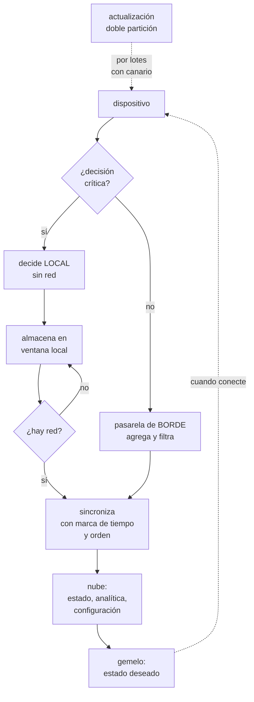

# 282 — Capstone industria: IoT, edge y operación desconectada

> [← Clase anterior](../../part-23-industry-capstones/281-capstone-media-streaming-y-distribucion-global/README.md) · [Índice de la parte](../README.md) · [Clase siguiente →](../../part-23-industry-capstones/283-capstone-saas-multi-tenancy-y-unit-economics/README.md)

**Parte:** 23 — Capstones por industria y defensa final<br>
**Nivel:** experto · **Horas estimadas:** 8<br>
**Laboratorio:** `capstone` · **Estado:** `EXECUTABLE_CORE`

## 🎯 Propósito

Capstone industrial: dispositivos, borde y operación desconectada. La clase da el encargo y la restricción que manda —**la conexión no es fiable y el dispositivo tiene que seguir haciendo su trabajo sin ella**—, lo que eso obliga en decisión local, sincronización y actualización remota, y las pruebas negativas de un sector donde una actualización mal hecha deja mil equipos inaccesibles.

## 📚 Resultados de aprendizaje

Al finalizar podrás:

1. **Decidir** qué se resuelve en el dispositivo y qué en la nube.
2. **Diseñar** sincronización tolerante a desconexiones largas.
3. **Actualizar** flota remota sin dejar equipos inaccesibles.
4. **Gestionar** identidad y ciclo de vida de dispositivos a escala.
5. **Verificar** el diseño con las pruebas negativas del sector.

## 🧩 Conceptos centrales

| Concepto | Comprensión verificable |
|---|---|
| `operación desconectada` | El dispositivo cumple su función sin red, durante horas o días, y reconcilia al volver. |
| `gemelo de dispositivo` | Estado deseado y estado informado de cada equipo, sincronizados cuando hay conexión. |
| `actualización con doble partición` | Se escribe en la partición inactiva y se arranca en ella; si falla, vuelve sola a la anterior. |
| `identidad de dispositivo` | Credencial única por equipo, idealmente en hardware, revocable individualmente. |
| `borde` | Capacidad de cómputo cercana a los dispositivos que agrega, filtra y decide con baja latencia. |
| `ventana de datos` | Cuánto histórico guarda el dispositivo antes de sobrescribir. Define lo que se puede perder. |

## 🧠 Modelo mental

El capstone no premia cantidad de servicios, sino trazabilidad entre contexto, decisiones, implementación, fallos, evidencia y aprendizaje.

Aplicado a esta clase, separa siempre cuatro planos: **intención** (qué necesita el usuario),
**configuración** (qué declaramos), **estado observado** (qué existe de verdad) y
**evidencia** (cómo sabemos que cumple). Confundirlos produce diseños que se ven correctos
en un diagrama pero fallan al operar.

## 🗺️ Flujo de razonamiento



## 📖 Desarrollo

### 1. El encargo y la restricción que manda

**El encargo.** Una plataforma para 41.000 equipos industriales instalados en plantas y en campo: sensores de proceso, controladores de línea y equipos móviles. Deben operar, informar y actualizarse.

```text
CIFRAS DE PARTIDA
  dispositivos                             41.000
  emplazamientos                           380
  conectividad
    fija fiable                            42 %
    fija intermitente                      39 %
    móvil o satélite                       19 %
  mediciones/segundo, agregadas            1,9 M
  vida útil del equipo                     8-12 años
  y el requisito de negocio
    una línea parada cuesta                14.000 USD/hora
```

Y la restricción que manda:

```text
LA CONEXIÓN NO ES FIABLE Y EL TRABAJO NO PUEDE ESPERAR
  un controlador que detiene la línea porque no llega la
  respuesta de la nube es un fallo de diseño, no de red

→ y de ahí sale la primera regla del sector
  TODA DECISIÓN CON CONSECUENCIA FÍSICA SE TOMA LOCAL
  → parar una máquina, abrir una válvula, disparar una
    alarma de seguridad
  → la nube observa, ajusta parámetros y aprende; no
    decide en el instante

→ y la segunda
  EL DISPOSITIVO ES UN SISTEMA COMPLETO, no un sensor
  → tiene almacenamiento, lógica, estado y actualizaciones
  → y una vida útil de una década, que es más de lo que
    dura cualquier decisión de arquitectura de nube
```

Y la consecuencia sobre el ciclo de vida:

```text
8-12 AÑOS DE VIDA ÚTIL CAMBIAN LAS REGLAS
  el protocolo tiene que sobrevivir a varias generaciones
    de plataforma
  la credencial tiene que poder rotarse sin visita física
  el formato de datos tiene que ser compatible hacia atrás
    y hacia delante                          clase 106
  y habrá dispositivos con versiones muy distintas
    conviviendo, siempre

→ diseñar suponiendo que toda la flota está actualizada es
  el error estructural del sector
→ y en la práctica, un 8-15 % de la flota está siempre
  varias versiones por detrás
```

### 2. Reparto de responsabilidad y sincronización

Qué corre dónde, y qué pasa cuando vuelve la conexión.

```text
EN EL DISPOSITIVO
  control en tiempo real y seguridad
  almacenamiento en ventana: horas o días de datos
  reglas locales de alarma
  y capacidad de operar desconectado el tiempo objetivo

EN LA PASARELA DE BORDE, por emplazamiento
  agregación y reducción: de 1.900 mediciones/s a 40
  → y esto decide el coste de todo lo demás
  reglas que necesitan varias fuentes
  almacenamiento intermedio cuando cae el enlace
  y actualización local de la flota del emplazamiento

EN LA NUBE
  estado consolidado y gemelos
  analítica, comparación entre plantas y modelos
  configuración y campañas de actualización
  alertas de negocio y mantenimiento

→ y la regla que ordena el reparto
  si la respuesta debe llegar en menos de lo que tarda un
  viaje de ida y vuelta poco fiable, va abajo
```

Y la sincronización, que es el problema técnico central:

```text
LO QUE HAY QUE RESOLVER
  el dispositivo estuvo 3 días sin red
  → tiene 3 días de datos y ha tomado decisiones
  → y la nube, mientras, le cambió la configuración

LAS REGLAS QUE FUNCIONAN
  1  CADA MEDICIÓN LLEVA SU MARCA DE TIEMPO DE ORIGEN
     → nunca la de llegada
     → y con reloj del dispositivo sincronizado y su
       desviación informada
  2  LA SINCRONIZACIÓN ES IDEMPOTENTE Y REANUDABLE
     → identificador de secuencia por dispositivo y
       confirmación con marca de agua      clase 242
     → si se corta a mitad, se reanuda donde iba
  3  LO NUEVO PRIMERO, LO VIEJO DESPUÉS
     → al reconectar, primero el estado actual y las
       alarmas; el histórico va detrás, con menor
       prioridad
     → porque saber cómo está la máquina ahora vale más
       que los tres días anteriores
  4  Y LA CONFIGURACIÓN SE APLICA CON VERSIÓN Y
     CONFIRMACIÓN
     → el gemelo tiene estado deseado y estado informado
     → y la diferencia entre ambos es la métrica que
       importa

→ y la ventana local define lo que se acepta perder
  → 72 horas de ventana significa que una desconexión de
    cinco días pierde dos
  → y eso se decide con negocio, no en ingeniería
```

Y el coste, que aquí se decide en el borde:

```text
1,9 M mediciones/s enviadas en crudo son inasumibles
  → agregación en el borde: media, máximo, mínimo y
    desviación por ventana
  → y el dato crudo solo cuando hay anomalía o a petición

→ reducción típica de 40 a 200 veces
→ y aquí ley 28 se ve con claridad: cada medición enviada
  es una factura, en transporte, en ingesta y en
  almacenamiento                            clase 270
```

### 3. Actualizar la flota sin perderla

El riesgo característico del sector: una actualización deja mil equipos sin acceso y hay que ir físicamente.

```text
LO QUE LO EVITA
  1  DOBLE PARTICIÓN
     se escribe en la inactiva, se arranca en ella
     → si el arranque no confirma en N minutos, vuelve
       sola a la anterior
     → esta sola medida elimina la mayoría de las visitas

  2  CONFIRMACIÓN DESDE EL DISPOSITIVO
     no basta con que la descarga termine
     → el dispositivo debe informar de que arrancó, de que
       su función esencial pasa una comprobación y de que
       recupera conexión

  3  DESPLIEGUE POR LOTES CON CANARIO
     1 dispositivo → 10 → 1 % → 10 % → 100 %
                                            clase 102
     y detención automática si el lote no confirma

  4  VENTANA DE MANTENIMIENTO POR EMPLAZAMIENTO
     no se actualiza una línea en producción

  5  Y FIRMA Y VERIFICACIÓN DE LA IMAGEN
     el dispositivo solo arranca lo que está firmado
                                            clase 216
     → porque un equipo en campo es físicamente accesible

→ y la métrica de la campaña
  dispositivos actualizados, fallidos, revertidos y SIN
  RESPUESTA
  → esa última es la que importa: son visitas
```

Y la identidad, que a esta escala es un problema en sí:

```text
CADA DISPOSITIVO CON SU PROPIA CREDENCIAL
  nunca una compartida por modelo o por lote
  → una credencial compartida convierte un equipo robado
    en acceso a la flota entera         clase 269
  idealmente en elemento seguro de hardware
  y provisión en fábrica o en primera instalación

Y REVOCACIÓN INDIVIDUAL
  un equipo retirado, robado o vendido deja de tener
  acceso
  → y esto requiere inventario de ciclo de vida
                                            clase 253
  → dispositivo dado de alta, activo, en mantenimiento,
    retirado

→ y el estado más peligroso es «instalado hace 7 años,
  nadie sabe dónde, sigue conectando»
```

Y la seguridad física, que en este sector es parte del modelo:

```text
el atacante puede tener el dispositivo en la mano
  → asumir que el firmware se puede extraer
  → nada de secretos compartidos en la imagen
  → cifrado en reposo del almacenamiento local
  → y arranque verificado

→ y el modelo de amenazas debe incluir «un equipo
  comprometido informa datos falsos»
  → detectable comparando entre equipos del mismo
    emplazamiento
```

### 4. Las pruebas negativas del capstone

Lo que hay que ejecutar. Varias exigen un laboratorio con dispositivos reales.

```text
DE DESCONEXIÓN
  ☐ cortar la red a un dispositivo 72 horas: ¿sigue
    haciendo su trabajo?
  ☐ al reconectar, ¿llega primero el estado actual o el
    histórico?
  ☐ ¿se duplica algún dato al reanudar una sincronización
    cortada?
  ☐ desconectar un emplazamiento entero 5 días: ¿qué se
    pierde?
  ☐ ¿qué pasa si el reloj del dispositivo se desvía 4
    horas?

DE ACTUALIZACIÓN
  ☐ interrumpir la energía a mitad de una actualización:
    ¿arranca?
  ☐ instalar una imagen que no arranca: ¿vuelve sola?
  ☐ ¿cuántos dispositivos quedaron sin responder en la
    última campaña?
  ☐ actualizar un equipo con 4 versiones de retraso:
    ¿funciona?
  ☐ intentar instalar una imagen sin firmar: ¿la acepta?

DE IDENTIDAD Y CICLO DE VIDA
  ☐ ¿hay credenciales compartidas entre dispositivos?
  ☐ revocar un dispositivo: ¿deja de conectar de
    inmediato?
  ☐ ¿cuántos dispositivos conectan sin estar en el
    inventario?
  ☐ ¿cuántos llevan más de un año sin conectar y siguen
    autorizados?

DE DATOS Y COSTE
  ☐ ¿cuántas mediciones se envían y cuántas se usan?
  ☐ ¿la agregación del borde pierde información
    necesaria?
  ☐ un dispositivo que informa valores imposibles: ¿se
    detecta?                                clase 243
  ☐ ¿cuál es el coste por dispositivo y por mes?

DE OPERACIÓN
  ☐ ¿se puede diagnosticar un dispositivo sin ir
    físicamente?
  ☐ caer la nube 4 horas: ¿se para alguna línea?
  ☐ ¿existe procedimiento para un emplazamiento aislado y
    se ha usado?
```

**El entregable del capstone:**

```text
1  el reparto de responsabilidad entre dispositivo, borde
   y nube, con el criterio
2  el diseño de sincronización y la ventana local
   acordada con negocio
3  el mecanismo de actualización y el resultado de la
   última campaña
4  el modelo de identidad y el inventario de ciclo de vida
5  la política de agregación y el coste por dispositivo
6  el modelo de amenazas con acceso físico
7  y el resultado de las pruebas negativas, con lo que
   falló
```

Y el cierre que enlaza con la clase siguiente: aquí el cliente es una planta y el dispositivo está lejos. En el siguiente, muchos clientes comparten la misma infraestructura y el reto es que ninguno se entere de los demás mientras se sabe cuánto cuesta cada uno. Multiinquilino y economía por cliente es la materia de la clase 283.

## 🔬 Ejemplo trabajado

**El capstone resuelto. Lo que sigue es la campaña de actualización que dejó 1.140 equipos sin responder, la sincronización que duplicaba datos, y el reparto que evitó parar líneas cuando cayó la nube.**

**La campaña que salió mal, antes del rediseño.**

```text
campaña de actualización de firmware
  dispositivos objetivo                     18.400
  método                                    envío directo,
                                            partición única
  despliegue                                todos a la vez

resultado
  actualizados y confirmados                16.980   92,3 %
  fallidos con reintento correcto              280
  SIN RESPONDER                              1.140    6,2 %

y el coste de esos 1.140
  visitas técnicas necesarias                1.140
  coste medio por visita                     190 USD
  coste total                            216.600 USD
  tiempo hasta recuperar la flota          11 semanas
  y 34 de ellos en emplazamientos remotos: 4 meses
```

Y la causa:

```text
la nueva imagen fallaba al arrancar en dispositivos con
una revisión de hardware concreta
  → esa revisión era el 6,1 % de la flota
  → y con partición única, un arranque fallido dejaba el
    equipo inutilizable

→ un canario de 10 dispositivos elegidos por revisión de
  hardware lo habría detectado
→ y la doble partición lo habría hecho irrelevante
```

Y el rediseño:

```text
doble partición con vuelta atrás automática a los 10
  minutos sin confirmación
confirmación en tres pasos: arranque, comprobación
  funcional y reconexión
despliegue por lotes: 1 → 10 → 1 % → 10 % → 100 %
  con detención automática si un lote no confirma al 98 %
canario estratificado por revisión de hardware, modelo y
  tipo de conectividad
y firma verificada en el arranque

campaña siguiente, 19.100 dispositivos
  actualizados y confirmados                 18.874   98,8 %
  revertidos automáticamente                    214
    → todos de una revisión de hardware; detectados en el
      lote del 1 % y la campaña se detuvo sola
  SIN RESPONDER                                  12   0,06 %
  visitas necesarias                             12
  coste                                       2.280 USD
```

**La sincronización que duplicaba.**

```text
síntoma
  los informes de producción de emplazamientos con
  conectividad intermitente daban entre un 3 % y un 11 %
  más de unidades producidas que el conteo físico

→ y llevaba dos años                            ley 29
→ nadie lo había investigado porque «los sensores a veces
  fallan»
```

Y la causa, encontrada agrupando por emplazamiento:

```text
la sincronización enviaba un lote y esperaba confirmación
  → si el enlace caía tras enviar y antes de confirmar,
    el dispositivo reenviaba el lote entero
  → y la ingesta no deduplicaba

y el patrón
  emplazamientos con enlace fiable        0 % de exceso
  con enlace intermitente                 3-11 %
  con enlace satélite                     hasta 19 %

→ la correlación con la calidad del enlace fue lo que lo
  identificó                                clase 258
```

Y la corrección:

```text
identificador de secuencia por dispositivo, monótono
confirmación con marca de agua: «he recibido hasta el
  número N»
deduplicación por (dispositivo, secuencia) en la ingesta
y reanudación desde N+1, no reenvío del lote
                                            clase 242

resultado
  exceso frente al conteo físico       3-19 % → 0,02 %
  y el 0,02 % restante se explicó por mediciones
  descartadas por calidad, documentadas
```

Y lo que el equipo anotó:

```text
durante dos años, la planificación de producción usó
cifras infladas entre un 3 % y un 19 % según el
emplazamiento
→ y las decisiones de compra de materia prima se tomaron
  con ellas
→ el coste real de este fallo no fue técnico
```

**El reparto de responsabilidad, puesto a prueba.**

```text
prueba  «la nube no está disponible durante 4 horas»

antes del rediseño
  las reglas de alarma se evaluaban en la nube
  → durante una caída de 40 minutos el año anterior:
    3 líneas paradas por precaución
    coste                          14.000 × 3 × 0,67
                                   = 28.140 USD

después del rediseño
  control y seguridad: local, siempre
  reglas de alarma de proceso: local
  reglas que necesitan varias fuentes del emplazamiento:
    pasarela de borde
  comparación entre plantas, modelos y mantenimiento
    predictivo: nube

  resultado de la prueba de 4 horas
    líneas paradas                                 0
    alarmas locales disparadas y atendidas         7
    datos acumulados y sincronizados al volver   100 %
    tiempo de puesta al día tras reconectar    22 min
    y lo que se perdió                    ninguna
                                          medición
```

**Identidad y ciclo de vida.**

```text
inventario inicial
  dispositivos en el sistema de gestión         41.000
  dispositivos que conectaron el último mes     43.180
  → 2.180 dispositivos conectando SIN estar en el
    inventario

investigación de esos 2.180
  instalados por integradores y nunca registrados   1.740
  equipos de laboratorio y pruebas                    290
  equipos vendidos o retirados que seguían
    conectando                                        147
  sin identificar                                       3
    → los 3 usaban una credencial compartida de un lote
      de 2016

→ la credencial compartida del lote de 2016 daba acceso a
  4.100 dispositivos
→ llevaba 8 años activa                          ley 25
```

Y la corrección, que tardó:

```text
provisión individual en la primera conexión para los
  equipos que lo soportaban                    31.400
visita técnica para los que no                  4.100
  → escalonada en 14 meses, aprovechando mantenimientos
revocación de la credencial compartida al terminar
inventario obligatorio en el alta, con integradores

resultado a los 18 meses
  dispositivos fuera de inventario         2.180 → 0
  credenciales compartidas                     1 → 0
  dispositivos autorizados sin conectar
    en más de 1 año                          890 → 0
```

**Las cifras finales del capstone.**

```text                                        antes     después
ACTUALIZACIÓN
dispositivos sin responder tras campaña      6,2 %      0,06 %
coste de visitas por campaña           216.600 USD    2.280 USD
tiempo de recuperación de flota          11 semanas    2 días

DATOS
exceso de producción informado            3-19 %       0,02 %
mediciones enviadas/s                     1,9 M         41.000
coste por dispositivo y mes                0,84 USD    0,19 USD

DESCONEXIÓN
ventana local                              4 horas     96 horas
líneas paradas por caída de nube (4 h)           3           0
datos perdidos en desconexión de 5 días        n/d    24 h del
                                                      histórico

IDENTIDAD
dispositivos fuera de inventario             2.180           0
credenciales compartidas                         1           0
imágenes sin firmar aceptadas                   sí          no
```

**La lección que este capstone deja**: una actualización sin doble partición dejó **1.140 equipos inaccesibles** por una revisión de hardware que era el 6,1 % de la flota, y costó 216.600 USD en visitas y once semanas; el mismo fallo, con doble partición y canario estratificado, produjo 214 vueltas atrás automáticas y **doce visitas**. Y durante dos años la planificación de producción usó cifras infladas hasta un **19 %** porque una sincronización reenviaba lotes enteros al cortarse el enlace, sin que nada diera error.

## 🧪 Laboratorio guiado

Ejecuta desde la raíz:

```bash
python classes/part-23-industry-capstones/282-capstone-industria-iot-edge-y-operacion-desconectada/lab.py
```

El laboratorio selecciona el motor de práctica **`capstone`** y produce
`lab_result.json`. El escenario, sus comprobaciones y el artefacto esperado corresponden a
esta clase; no requiere credenciales y deja explícito qué debe revalidarse en un sandbox real.

1. Lee `exercise.steps` y formula una predicción antes de ejecutar.
2. Ejecuta la práctica y verifica todos los elementos de `checks`.
3. Provoca el caso de `negative_test` y explica la señal observada.
4. Materializa `industry-capstone` en `evidence/` usando la plantilla indicada.
5. Para proveedor real, sigue `sandbox.requires`, registra costo y ejecuta `destroy`.

### Evidencia esperada

El artefacto principal es un incremento integrado, demostrable y documentado. Además, la entrega debe incluir el comando ejecutado,
la salida estructurada y una conclusión que no exceda lo observado.

## 🏆 Reto verificable

Construye **`industry-capstone`** para el caso CloudShop. Incluye una alternativa descartada,
un supuesto que pueda falsarse, una prueba de fallo y una decisión de rollback.

## ✅ Criterio de aceptación

- [ ] `lab.py` termina con código 0 y genera JSON válido.
- [ ] La entrega conecta al menos tres requisitos con mecanismos verificables.
- [ ] Existe una prueba positiva y una prueba negativa con evidencia.
- [ ] Seguridad, costo y operación aparecen como decisiones, no como anexos.
- [ ] Se declara una limitación y una condición que obligaría a revisar el diseño.
- [ ] Otra persona puede repetir el recorrido sin conocimiento tácito.

## ⚠️ Errores frecuentes

| Síntoma | Causa probable | Corrección |
|---|---|---|
| Una actualización deja cientos de equipos inaccesibles | Partición única y despliegue a toda la flota a la vez | Usa doble partición con vuelta atrás automática, confirmación funcional desde el dispositivo y lotes con canario estratificado por revisión de hardware. |
| Los informes cuentan más de lo que ocurrió y correlaciona con la calidad del enlace | La sincronización reenvía lotes al cortarse y la ingesta no deduplica | Numera secuencias por dispositivo, confirma con marca de agua, reanuda desde el siguiente y deduplica en la ingesta. |
| Una caída de la nube para líneas de producción | Decisiones con consecuencia física evaluadas en la nube | Toda decisión crítica va en el dispositivo o en la pasarela; la nube observa, ajusta y aprende, no decide en el instante. |
| Conectan dispositivos que no están en ningún inventario | Altas por terceros sin registro y credenciales compartidas por lote | Credencial individual por equipo, provisión en fábrica o primera conexión, inventario obligatorio en el alta y revocación individual. |
| El coste crece linealmente con el número de sensores | Se envían mediciones en crudo sin agregar en el borde | Agrega por ventana en la pasarela y envía crudo solo ante anomalía o a petición; cada medición enviada es una factura. |
| Al reconectar tras días sin red tarda mucho en saberse cómo está la máquina | Se sincroniza el histórico antes que el estado actual | Prioriza estado y alarmas al reconectar y manda el histórico detrás, con menor prioridad. |

## 🛡️ Seguridad, ética y costo

Trabaja con cuentas propias o sandboxes autorizados. No publiques secretos, identificadores
reales ni datos personales. Antes de crear recursos pagos define presupuesto, etiquetas y
comando de destrucción; después verifica que no queden recursos huérfanos. Los ejemplos
locales enseñan contratos, pero no certifican cumplimiento ni disponibilidad de producción.

## ❓ Preguntas de comprobación

1. ¿Qué decisiones deben tomarse en el dispositivo y por qué?
2. ¿Qué cuatro reglas hacen fiable una sincronización tras días sin red?
3. ¿Qué mecanismos evitan que una campaña de actualización obligue a visitas?
4. ¿Por qué una credencial compartida por lote es un fallo estructural?
5. ¿Qué define la ventana local y quién debe decidirla?

## 🔗 Referencias

- AWS (2024). *IoT Lens, Well-Architected Framework*. <https://docs.aws.amazon.com/wellarchitected/latest/iot-lens/iot-lens.html>
- Microsoft (2024). *Azure IoT reference architecture and device update*. <https://learn.microsoft.com/azure/architecture/reference-architectures/iot>
- IETF (2021). *RFC 9019: A Firmware Update Architecture for Internet of Things*. <https://www.rfc-editor.org/rfc/rfc9019.html>
- IEC (2020). *IEC 62443: seguridad en sistemas de automatización industrial*. <https://www.iec.ch/blog/understanding-iec-62443>
- Google Cloud (2024). *Edge and industrial IoT architectures*. <https://cloud.google.com/architecture/connected-devices>
- Documentación oficial vigente del servicio implementado; registra URL y fecha de consulta.

---

> [Evaluación](assessment.md) · [Contrato de clase](lesson.yaml) · [Índice de la parte](../README.md)
