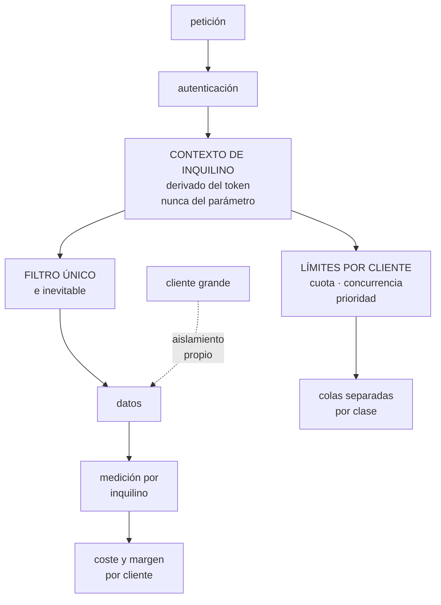

# 283 — Capstone SaaS: multi-tenancy y unit economics

> [← 282 · Capstone industria: IoT, edge y operación desconectada](../../part-23-industry-capstones/282-capstone-industria-iot-edge-y-operacion-desconectada/README.md) · [Índice de la parte](../README.md) · [284 · Capstone datos e IA: plataforma gobernada →](../../part-23-industry-capstones/284-capstone-datos-e-ia-plataforma-gobernada/README.md)

**Parte:** 23 — Capstones por industria y defensa final<br>
**Nivel:** experto · **Horas estimadas:** 8<br>
**Laboratorio:** `capstone` · **Estado:** `EXECUTABLE_CORE`

## 🎯 Propósito

Capstone de software como servicio: multiinquilino y economía por cliente. La clase da el encargo y la restricción que manda —**hay que aislar a clientes que comparten infraestructura y saber cuánto cuesta cada uno**—, el espectro de modelos de aislamiento con su coste real, el problema del vecino ruidoso, y las pruebas negativas de un sector donde el peor fallo posible es que un cliente vea los datos de otro.

## 📚 Resultados de aprendizaje

Al finalizar podrás:

1. **Situar** un producto en el espectro de aislamiento con criterio.
2. **Impedir** el cruce de datos entre clientes por construcción.
3. **Contener** al vecino ruidoso sin penalizar a todos.
4. **Calcular** el coste y el margen por cliente y por plan.
5. **Verificar** el diseño con las pruebas negativas del sector.

## 🧩 Conceptos centrales

| Concepto | Comprensión verificable |
|---|---|
| `multiinquilino` | Varios clientes comparten la misma infraestructura y código, con sus datos separados. |
| `espectro de aislamiento` | Desde todo compartido hasta una instalación por cliente. No es binario: se elige por capa. |
| `vecino ruidoso` | Un cliente cuyo consumo degrada a los demás. El fallo operativo característico del sector. |
| `coste por cliente` | Cuánto cuesta servir a cada uno. Sin él no hay precio defendible ni margen conocido. |
| `cliente grande` | El que rompe los supuestos: cien veces el volumen medio y exigencias propias. |
| `filtro de inquilino` | Restricción por cliente aplicada en un punto único e inevitable, no repetida en cada consulta. |

## 🧠 Modelo mental

El capstone no premia cantidad de servicios, sino trazabilidad entre contexto, decisiones, implementación, fallos, evidencia y aprendizaje.

Aplicado a esta clase, separa siempre cuatro planos: **intención** (qué necesita el usuario),
**configuración** (qué declaramos), **estado observado** (qué existe de verdad) y
**evidencia** (cómo sabemos que cumple). Confundirlos produce diseños que se ven correctos
en un diagrama pero fallan al operar.

## 🗺️ Flujo de razonamiento



## 📖 Desarrollo

### 1. El encargo y el espectro de aislamiento

**El encargo.** Una plataforma de gestión para comercios: catálogo, pedidos, facturación e informes. 1.900 clientes, desde una tienda con dos empleados hasta una cadena con 400 locales.

```text
CIFRAS DE PARTIDA
  clientes                                  1.900
  el mayor, en volumen                      31 % del total
  los 10 mayores                            68 % del total
  los 1.400 menores                         6 % del total
  planes                                    3
  y el requisito comercial
    los grandes piden aislamiento y acuerdos propios
    los pequeños solo pueden pagar si el coste unitario es
      muy bajo
```

Y la restricción que manda:

```text
DOS EXIGENCIAS QUE TIRAN EN SENTIDOS OPUESTOS
  AISLAR   que un cliente no pueda afectar ni ver a otro
  COMPARTIR que el coste por cliente permita el precio

→ y el sector entero es la gestión de esa tensión
→ resolverla con «una instalación por cliente» es fácil y
  hace inviable el negocio pequeño
→ resolverla con «todo compartido» es barato y produce el
  fallo que mata la empresa: un cliente viendo los datos
  de otro
```

Y el espectro, que se elige **por capa** y no de una vez:

```text
CAPA               COMPARTIDO        SEPARADO
cómputo            mismo servicio    instancias dedicadas
datos              misma tabla con   esquema por cliente ·
                   columna de        base por cliente
                   inquilino
almacén de objetos mismo contenedor  contenedor por
                   con prefijo       cliente
cifrado            clave común       clave por cliente
red                compartida        red por cliente
identidad          proveedor común   federación propia

→ y lo normal es una combinación
  cómputo compartido + datos compartidos para los
    pequeños
  cómputo compartido + base por cliente para los medianos
  todo separado para los tres o cuatro mayores

→ y lo que decide es el COSTE POR CLIENTE frente a lo que
  paga
```

Y el criterio para elegir la capa de datos, que es la decisión más cara de cambiar:

```text
MISMA TABLA CON COLUMNA DE INQUILINO
  + coste mínimo, una migración de esquema para todos
  - un error de filtro cruza datos
  - un cliente grande genera particiones calientes
                                            clase 208
  - restaurar un solo cliente es difícil

ESQUEMA O BASE POR CLIENTE
  + aislamiento fuerte y restauración individual
  + límites naturales por cliente
  - miles de esquemas que migrar               ley 23
  - coste base por cliente que los pequeños no pagan

→ y el punto intermedio que funciona bien
  agrupar clientes en «lotes» de base compartida
  → 1.900 clientes en 40 bases
  → restauración por lote, migración por lote, y un
    cliente grande puede tener su lote propio
```

### 2. Que el cruce de datos sea imposible

El peor fallo del sector no es una caída: es que un cliente vea lo de otro. Y ocurre casi siempre por la misma causa.

```text
LA CAUSA HABITUAL
  el filtro por inquilino se aplica en cada consulta
  → y en algún sitio, alguien olvida ponerlo
  → una consulta de 340, en un informe poco usado

→ no se resuelve con disciplina ni con revisiones
→ se resuelve haciendo IMPOSIBLE consultar sin filtro
```

Y los mecanismos que lo hacen imposible:

```text
1  EL CONTEXTO DE INQUILINO SE DERIVA DEL TOKEN
   nunca de un parámetro de la petición
   → si viene en la ruta o en el cuerpo, un atacante lo
     cambia

2  UN ÚNICO PUNTO INEVITABLE
   toda consulta pasa por una capa que añade el filtro
   → y consultar sin pasar por ella no compila o no
     arranca
   o seguridad a nivel de fila en la base, con la
   identidad del inquilino en la sesión
   → así incluso una consulta mal escrita devuelve solo lo
     suyo

3  IDENTIFICADORES NO ADIVINABLES
   → y aun así, el filtro es lo que protege; los
     identificadores solo reducen el ruido

4  COMPROBACIÓN AUTOMÁTICA EN LA CADENA
   una prueba que ejecuta cada consulta del sistema con
   dos inquilinos y verifica que ninguna devuelve datos
   del otro                                 clase 100

5  Y DETECCIÓN EN PRODUCCIÓN
   toda respuesta lleva el identificador de inquilino de
   los datos; si no coincide con el del token, se corta y
   se alerta
   → esta comprobación cuesta poco y ha salvado a mucha
     gente
```

Y las mismas reglas en las demás capas:

```text
almacén de objetos  prefijo por inquilino y política que
                    lo impone; nunca listar el contenedor
                    entero
cachés              la clave incluye el inquilino
                    → el fallo clásico: una caché con
                      clave sin inquilino sirve el dato de
                      otro
colas y trabajos    el mensaje lleva el inquilino y el
                    trabajador lo aplica
registros y trazas  el inquilino como etiqueta, y sin
                    datos de cliente en el texto
e informes          los agregados no deben permitir
                    deducir datos de otro cliente
```

### 3. El vecino ruidoso y el cliente grande

El fallo operativo característico: un cliente consume y todos lo notan.

```text
CÓMO SE MANIFIESTA
  una importación de 400.000 productos
  un informe que recorre tres años
  una integración que consulta cada segundo
  o un cliente que crece diez veces en un mes

→ y sin defensas, la degradación es general y el soporte
  no sabe por qué
```

Y las defensas, por orden de eficacia:

```text
1  LÍMITES POR CLIENTE, NO SOLO GLOBALES
   peticiones por segundo, concurrencia, tamaño de
   consulta y trabajos simultáneos
   → y distintos por plan

2  SEPARAR LO INTERACTIVO DE LO PESADO
   colas distintas para importaciones, informes y
   exportaciones
   → y una cola por clase, no una por cliente
   → así una importación gigante no bloquea la navegación
     de nadie

3  JUSTICIA EN EL REPARTO
   turno rotatorio entre clientes en las colas pesadas
   → un cliente con 10.000 trabajos no adelanta al que
     tiene 3

4  MEDICIÓN POR INQUILINO, SIEMPRE
   → sin ella, el diagnóstico de una degradación es
     imposible                              clase 258
   → y con ella, la pregunta «¿a qué clientes afecta?» se
     responde en segundos

5  Y AISLAMIENTO PARA LOS QUE LO JUSTIFIQUEN
   → cuando un cliente es el 31 % del volumen, tenerlo
     compartido es un riesgo, no un ahorro
```

Y el cliente grande, que rompe los supuestos:

```text
LO QUE TRAE
  volumen que satura particiones            clase 208
  exigencias de acuerdo de servicio propias
  peticiones de configuración específica
  auditorías y requisitos de seguridad
  y a veces, residencia de datos propia

LO QUE NO HAY QUE HACER
  añadir condicionales por cliente en el código
  → «si el cliente es X, entonces...»
  → esto es el principio del fin del multiinquilino

LO QUE SÍ
  todo comportamiento distinto se expresa como
  CONFIGURACIÓN, no como código
  y si necesita infraestructura propia, se despliega la
  MISMA versión en un lote dedicado
  → mismo código, distinto emplazamiento

→ y el día que haya dos versiones de código distintas por
  cliente, el producto se ha convertido en consultoría
```

### 4. Economía por cliente y pruebas negativas

Sin coste por cliente, el precio es una apuesta.

```text
CÓMO SE MIDE
  etiquetar por inquilino lo que se puede: almacenamiento,
    consultas, trabajos, tráfico
  repartir lo compartido por una regla ACORDADA
    → por peticiones, por almacenamiento o por una mezcla
    → imperfecta y suficiente             clase 270
  y el resultado, por cliente y por plan

QUÉ REVELA, casi siempre
  el plan más barato pierde dinero en la cola de clientes
    más activos
  unos pocos clientes consumen desproporcionadamente
  y algunas funciones cuestan mucho más de lo que se creía
    → informes largos, exportaciones, integraciones que
      consultan

QUÉ SE HACE CON ELLO
  ajustar límites por plan
  cobrar por uso lo que escala con el uso
  poner al cliente grande donde su coste es visible
  y retirar funciones cuyo coste no se recupera
```

Y las pruebas negativas del capstone:

```text
DE AISLAMIENTO DE DATOS
  ☐ cambiar el identificador de inquilino en la petición:
    ¿devuelve datos de otro?
  ☐ ejecutar todas las consultas del sistema con dos
    inquilinos: ¿alguna cruza?
  ☐ ¿alguna caché tiene claves sin inquilino?
  ☐ ¿un trabajo en cola puede procesar datos del inquilino
    equivocado?
  ☐ ¿los informes agregados permiten deducir datos ajenos?
  ☐ ¿los registros contienen datos de cliente en texto?

DE VECINO RUIDOSO
  ☐ un cliente importa 400.000 registros: ¿lo notan los
    demás?
  ☐ un cliente lanza 50 informes a la vez: ¿se encolan
    justo?
  ☐ ¿existen límites por cliente y se han probado?
  ☐ ¿se puede responder en segundos a «a qué clientes
    afecta esto»?

DE CICLO DE VIDA
  ☐ restaurar los datos de UN cliente: ¿cuánto tarda?
  ☐ exportar todos los datos de un cliente que se va:
    ¿existe y se ha probado?
  ☐ borrar un cliente: ¿se borra de todas partes,
    incluidas copias y almacenes analíticos?
  ☐ migrar un cliente a un lote dedicado: ¿con qué parada?

DE ECONOMÍA
  ☐ ¿cuál es el coste del cliente más caro y del más
    barato?
  ☐ ¿algún plan pierde dinero y en qué tramo?
  ☐ ¿qué función tiene peor relación entre coste y valor?
```

**El entregable del capstone:**

```text
1  la posición en el espectro por capa, con el motivo
2  el mecanismo que hace imposible el cruce de datos
3  los límites por plan y las clases de cola
4  el tratamiento del cliente grande, sin código
   específico
5  el coste y el margen por cliente y por plan
6  los procedimientos de restauración, exportación y
   borrado por cliente, probados
7  y el resultado de las pruebas negativas, con lo que
   falló
```

Y el cierre que enlaza con la clase siguiente: queda el último capstone sectorial, el que reúne datos e inteligencia artificial con gobierno, y que la hipótesis de la parte 23 señaló como el que más fallos silenciosos revelaría. Plataforma de datos e IA gobernada es la materia de la clase 284.

## 🔬 Ejemplo trabajado

**El capstone resuelto. Lo que sigue es la consulta sin filtro que se encontró en una prueba automática, el vecino ruidoso que degradaba a 1.900 clientes, y la economía por cliente que reveló un plan con margen negativo.**

**La consulta sin filtro.**

```text
la prueba
  se ejecutan todas las consultas del sistema con dos
  inquilinos preparados: A con 100 registros, B con 100
  registros distintos
  y se verifica que ninguna consulta ejecutada como A
  devuelve nada de B

  consultas en el sistema                         412
  ejecutadas en la prueba                         412

resultado de la primera ejecución
  consultas que cruzaban datos                      3
```

Y las tres:

```text
1  un informe de «productos más vendidos por categoría»
   → agregaba sin filtrar por inquilino
   → el resultado mezclaba ventas de todos los clientes
   → llevaba 19 meses en producción
   → lo usaban 41 clientes

2  una consulta de búsqueda por código de barras
   → filtraba por código y no por inquilino
   → devolvía el producto de otro cliente si el código
     coincidía
   → y los códigos de barras coinciden por diseño

3  la caché de configuración
   → clave: «config:{clave}» sin inquilino
   → el primer cliente que la pedía la dejaba cacheada
     para todos durante 5 minutos

→ ninguna había sido reportada por un cliente
→ y la 1 llevaba 19 meses dando datos de la competencia a
  41 comercios                                 ley 29
```

Y el rediseño estructural:

```text
seguridad a nivel de fila en la base, con el inquilino en
  la sesión
  → una consulta sin filtro devuelve cero filas, no las de
    otro
contexto de inquilino derivado del token, nunca de la
  petición
claves de caché con inquilino obligatorio, verificado por
  el propio cliente de caché
y comprobación en la respuesta: si un registro devuelto
  tiene un inquilino distinto al del token, se corta la
  respuesta y se alerta

resultado
  segunda ejecución de la prueba: 0 cruces de 412
  y la prueba pasó a ejecutarse en cada cambio

  cortes por la comprobación de respuesta, 12 meses
    2, ambos en desarrollo, ninguno en producción
```

**El vecino ruidoso.**

```text
síntoma
  dos o tres veces por semana, la aplicación iba lenta
  para todos durante 20-40 minutos
  sin patrón horario aparente

diagnóstico
  se añadió la etiqueta de inquilino a todas las señales
  → y la pregunta «¿a qué clientes afecta?» pasó a
    responderse en segundos

  la agrupación por inquilino durante un episodio
    → un cliente concentraba el 71 % de las consultas a la
      base
    → siempre el mismo tipo: exportación de catálogo
      completo
    → y su integración la lanzaba cada 20 minutos, no una
      vez al día como estaba documentado
```

Y las correcciones:

```text
1  límites por cliente y por plan
     plan básico     20 pet/s · 2 trabajos simultáneos
     plan medio      80 pet/s · 6
     plan avanzado  300 pet/s · 20
   → y respuesta clara al superarlo, con cabecera de
     cuándo reintentar                     clase 201

2  colas separadas
     interactivo · importaciones · informes ·
     exportaciones
   → y turno rotatorio entre clientes dentro de cada cola

3  exportación de catálogo completo con marca de cambios
   → el cliente solo se lleva lo modificado
   → su volumen bajó un 97 %

resultado
  episodios de lentitud general             3/semana → 0
  clientes afectados por un vecino ruidoso   1.900 → 0
  quejas de soporte por lentitud            41/mes → 4/mes
```

Y lo que el equipo destacó:

```text
la corrección más eficaz no fue el límite
fue la exportación incremental: el cliente no quería
consumir tanto, no tenía otra forma

→ el vecino ruidoso casi nunca es hostil
→ suele ser un cliente al que le faltaba una función
```

**La economía por cliente.**

```text
medición por inquilino durante 3 meses
  directo      almacenamiento, consultas, trabajos,
               tráfico
  repartido    plataforma y compartidos, por una mezcla
               acordada de peticiones y almacenamiento

resultado por plan

  plan       clientes   precio    coste medio   margen
  básico        1.400    29 USD      11 USD      62 %
  medio           410    99 USD      38 USD      62 %
  avanzado         90   390 USD     201 USD      48 %
```

Y lo que apareció al mirar la distribución dentro de cada plan:

```text
plan básico, por decil de consumo

  decil       coste medio    margen
  1-7            4 USD        86 %
  8              9 USD        69 %
  9             21 USD        28 %
  10            67 USD       -131 %

→ el 10 % más activo del plan básico perdía 38 USD al mes
  cada uno
→ 140 clientes × 38 = 5.320 USD/mes de pérdida
→ y el plan en conjunto daba 62 % de margen, así que nadie
  lo había visto
```

Y las decisiones:

```text
se identificó qué generaba ese consumo
  informes largos                             41 %
  exportaciones completas                     29 %
  integraciones que consultaban en bucle      22 %
  resto                                        8 %

y se hicieron cuatro cosas
  1  límites del plan básico ajustados a lo que el 90 %
     usaba, con mensaje claro al superarlos
  2  informes largos: solo en plan medio o superior
  3  exportación incremental para todos
  4  y a los 140 clientes se les ofreció el plan medio con
     descuento el primer año

resultado a los 6 meses
  clientes del básico con margen negativo     140 → 11
  de los 140: pasaron a plan medio             79
              redujeron su uso                 50
              se dieron de baja                11
  ingresos netos                          +6.100 USD/mes
```

**El cliente grande.**

```text
el mayor cliente era el 31 % del volumen
  compartía lote con otros 46 clientes
  → sus picos afectaban a esos 46
  → y pedía un acuerdo de servicio propio

decisión
  lote dedicado: misma versión de código, misma
  configuración de despliegue, base y cómputo propios
  → NO una rama de código
  → y las 3 diferencias de comportamiento que pedía se
    expresaron como configuración, disponible para todos

coste del lote dedicado           2.900 USD/mes
lo que paga                      14.200 USD/mes
y lo que se ganó además
  los otros 46 clientes dejaron de sufrir sus picos
  y la migración de ese cliente dejó de bloquear a los
  demás                                     clase 260
```

**Las cifras finales del capstone.**

```text                                        antes     después
AISLAMIENTO
consultas que cruzan datos                  3 de 412         0
seguridad a nivel de fila                         no        sí
cachés con clave sin inquilino                     4         0
comprobación de inquilino en respuesta            no        sí

VECINO RUIDOSO
episodios de lentitud general              3/semana         0
límites por cliente                               no        sí
colas separadas por clase                         no         4
responder «a qué clientes afecta»            no medible  segundos

CICLO DE VIDA
restaurar un solo cliente                  no posible    18 min
exportar los datos de un cliente             manual,    2 h,
                                             días       automático
borrado completo verificado                       no        sí

ECONOMÍA
clientes con margen negativo                     140        11
coste por cliente conocido                        no        sí
margen del plan básico                          62 %      74 %
```

**La lección que este capstone deja**: un informe agregaba sin filtrar por inquilino y llevaba **diecinueve meses** enseñando ventas de la competencia a 41 comercios sin que nadie lo reportara; lo encontró una prueba automática que ejecuta las 412 consultas con dos clientes. Y el plan básico daba un 62 % de margen mientras su **decil más activo perdía 38 USD al mes por cliente**: la media ocultaba a 140 clientes que costaban más de lo que pagaban.

## 🧪 Laboratorio guiado

Ejecuta desde la raíz:

```bash
python classes/part-23-industry-capstones/283-capstone-saas-multi-tenancy-y-unit-economics/lab.py
```

El laboratorio selecciona el motor de práctica **`capstone`** y produce
`lab_result.json`. El escenario, sus comprobaciones y el artefacto esperado corresponden a
esta clase; no requiere credenciales y deja explícito qué debe revalidarse en un sandbox real.

1. Lee `exercise.steps` y formula una predicción antes de ejecutar.
2. Ejecuta la práctica y verifica todos los elementos de `checks`.
3. Provoca el caso de `negative_test` y explica la señal observada.
4. Materializa `saas-capstone` en `evidence/` usando la plantilla indicada.
5. Para proveedor real, sigue `sandbox.requires`, registra costo y ejecuta `destroy`.

### Evidencia esperada

El artefacto principal es un incremento integrado, demostrable y documentado. Además, la entrega debe incluir el comando ejecutado,
la salida estructurada y una conclusión que no exceda lo observado.

## 🏆 Reto verificable

Construye **`saas-capstone`** para el caso CloudShop. Incluye una alternativa descartada,
un supuesto que pueda falsarse, una prueba de fallo y una decisión de rollback.

## ✅ Criterio de aceptación

- [ ] `lab.py` termina con código 0 y genera JSON válido.
- [ ] La entrega conecta al menos tres requisitos con mecanismos verificables.
- [ ] Existe una prueba positiva y una prueba negativa con evidencia.
- [ ] Seguridad, costo y operación aparecen como decisiones, no como anexos.
- [ ] Se declara una limitación y una condición que obligaría a revisar el diseño.
- [ ] Otra persona puede repetir el recorrido sin conocimiento tácito.

## ⚠️ Errores frecuentes

| Síntoma | Causa probable | Corrección |
|---|---|---|
| Un cliente ve datos de otro en un informe poco usado | El filtro por inquilino se aplica consulta a consulta y en algún sitio falta | Haz imposible consultar sin filtro: seguridad a nivel de fila, contexto derivado del token y comprobación del inquilino en la respuesta. |
| Una caché devuelve la configuración de otro cliente | La clave de caché no incluye el inquilino | Exige inquilino en toda clave de caché desde el propio cliente de caché, y prueba cada consulta con dos inquilinos en la cadena. |
| La aplicación va lenta para todos varias veces por semana | Un cliente consume desproporcionadamente y no hay límites ni medición por inquilino | Etiqueta todas las señales por inquilino, pon límites por plan y separa colas por clase con turno rotatorio. |
| El plan barato parece rentable y la empresa no gana lo esperado | Se mira el margen medio del plan y no la distribución por consumo | Calcula coste por cliente y mira los deciles; la cola de clientes activos del plan barato suele tener margen negativo. |
| Aparecen condicionales por cliente en el código | Se aceptaron exigencias de un cliente grande como excepciones de código | Expresa toda diferencia como configuración disponible para todos, y si necesita infraestructura propia despliega la misma versión en un lote dedicado. |
| No se puede restaurar ni borrar los datos de un solo cliente | Todo comparte una base sin agrupación por lotes | Agrupa clientes en lotes de base compartida: permite restauración, migración y borrado por lote, y lote propio para el cliente grande. |

## 🛡️ Seguridad, ética y costo

Trabaja con cuentas propias o sandboxes autorizados. No publiques secretos, identificadores
reales ni datos personales. Antes de crear recursos pagos define presupuesto, etiquetas y
comando de destrucción; después verifica que no queden recursos huérfanos. Los ejemplos
locales enseñan contratos, pero no certifican cumplimiento ni disponibilidad de producción.

## ❓ Preguntas de comprobación

1. ¿Qué dos exigencias opuestas definen este sector?
2. ¿Por qué el espectro de aislamiento se elige por capa y no de una vez?
3. ¿Qué mecanismos hacen imposible el cruce de datos entre clientes?
4. ¿Cuáles son las defensas contra el vecino ruidoso y cuál suele ser su causa?
5. ¿Qué revela el coste por cliente que el margen medio del plan oculta?

## 🔗 Referencias

- AWS (2024). *SaaS Lens, Well-Architected Framework*. <https://docs.aws.amazon.com/wellarchitected/latest/saas-lens/saas-lens.html>
- Microsoft (2024). *Multitenant architectural guidance on Azure*. <https://learn.microsoft.com/azure/architecture/guide/multitenant/overview>
- Google Cloud (2024). *Multi-tenancy patterns*. <https://cloud.google.com/architecture/framework/multitenancy>
- PostgreSQL (2024). *Row Security Policies*. <https://www.postgresql.org/docs/current/ddl-rowsecurity.html>
- FinOps Foundation (2024). *Unit economics for SaaS providers*. <https://www.finops.org/framework/capabilities/unit-economics/>
- Documentación oficial vigente del servicio implementado; registra URL y fecha de consulta.

---

> [Evaluación](assessment.md) · [Contrato de clase](lesson.yaml) · [Índice de la parte](../README.md)

**📥 Descargar:** [Parte 23 en PDF](../../../site/downloads/partes/manual-parte-23-industry-capstones.pdf) · [Manual integral](../../../site/downloads/multi-cloud-engineering-manual-v2.0.pdf)

| Anterior | Índice | Siguiente |
|---|---|---|
| [← 282 · Capstone industria: IoT, edge y operación desconectada](../../part-23-industry-capstones/282-capstone-industria-iot-edge-y-operacion-desconectada/README.md) | [Parte 23](../README.md) · [Programa](../../README.md) | [284 · Capstone datos e IA: plataforma gobernada →](../../part-23-industry-capstones/284-capstone-datos-e-ia-plataforma-gobernada/README.md) |
