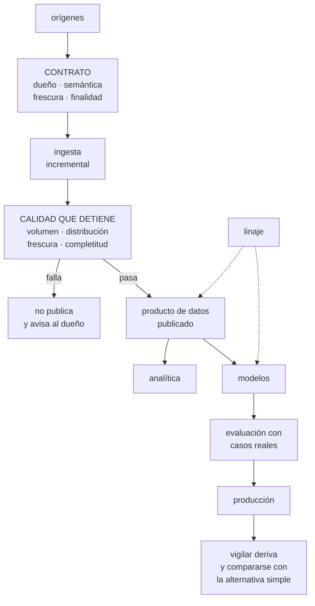

# 284 — Capstone datos e IA: plataforma gobernada

> [← Clase anterior](../../part-23-industry-capstones/283-capstone-saas-multi-tenancy-y-unit-economics/README.md) · [Índice de la parte](../README.md) · [Clase siguiente →](../../part-23-industry-capstones/285-game-day-integrado-y-respuesta-a-incidentes/README.md)

**Parte:** 23 — Capstones por industria y defensa final<br>
**Nivel:** experto · **Horas estimadas:** 8<br>
**Laboratorio:** `capstone` · **Estado:** `EXECUTABLE_CORE`

## 🎯 Propósito

Último capstone sectorial: plataforma de datos e inteligencia artificial gobernada. La clase da el encargo y la restricción que manda —**el fallo no da error, el dato tiene dueño y finalidad, y el modelo hereda todos los defectos de lo que come**—, el gobierno que lo hace sostenible, y las pruebas negativas que revelan lo que ninguna alerta detecta.

## 📚 Resultados de aprendizaje

Al finalizar podrás:

1. **Diseñar** la plataforma en el orden que evita rehacerla.
2. **Gobernar** el dato por dueño, finalidad y contrato, sin frenar el uso.
3. **Detectar** fallos que no producen error, con comparaciones y no con alertas.
4. **Evaluar** modelos con datos reales y decidir cuándo retirarlos.
5. **Verificar** el diseño con las pruebas negativas del sector.

## 🧩 Conceptos centrales

| Concepto | Comprensión verificable |
|---|---|
| `producto de datos` | Conjunto publicado con dueño, contrato, semántica y compromiso de frescura. |
| `gobierno útil` | El que hace más rápido el camino correcto en vez de prohibir los demás. |
| `linaje` | De dónde viene cada dato y qué depende de él. Lo que permite evaluar el impacto de un cambio. |
| `comprobación que detiene` | Validación que impide publicar datos incorrectos, en vez de avisar después. |
| `evaluación con casos reales` | Medir con lo que ocurrió de verdad. Lo imaginado da números que engañan. |
| `finalidad` | Para qué se puede usar un dato. Determina quién accede y qué se permite derivar. |

## 🧠 Modelo mental

El capstone no premia cantidad de servicios, sino trazabilidad entre contexto, decisiones, implementación, fallos, evidencia y aprendizaje.

Aplicado a esta clase, separa siempre cuatro planos: **intención** (qué necesita el usuario),
**configuración** (qué declaramos), **estado observado** (qué existe de verdad) y
**evidencia** (cómo sabemos que cumple). Confundirlos produce diseños que se ven correctos
en un diagrama pero fallan al operar.

## 🗺️ Flujo de razonamiento



## 📖 Desarrollo

### 1. El encargo y la restricción que manda

**El encargo.** La plataforma de datos e inteligencia artificial de CloudShop: alimenta informes de negocio, recomendaciones, previsión de demanda, detección de fraude y el asistente operativo.

```text
CIFRAS DE PARTIDA
  orígenes                                   41
  conjuntos publicados                       610
  consumidores internos                      14 equipos
  modelos en producción                      9
  y el histórico
    incidentes por dato incorrecto           19/año
    detectados por una persona               17/19
    tiempo medio hasta detectarlos           23 días
```

Y la restricción que manda:

```text
EL FALLO NO DA ERROR                          ley 29
  el canal se ejecuta, publica filas y devuelve un informe
  → y todo es incorrecto
  → y lo detecta alguien, semanas después, porque una
    cifra le extraña

→ y de ahí sale toda la arquitectura de este capstone
  no sirve alertar sobre errores: hay que COMPARAR con lo
  de siempre
  volumen, distribución, frescura y completitud
  y detener antes de publicar, no avisar después
```

Y las otras dos restricciones, que son de gobierno:

```text
EL DATO TIENE DUEÑO Y FINALIDAD
  no basta con que exista y sea correcto
  → alguien responde de su significado
  → y hay usos permitidos y usos que no
    → un dato recogido para facturar no vale para
      entrenar un modelo de segmentación sin más
                                            clase 251

EL MODELO HEREDA LOS DEFECTOS DE LO QUE COME
  un modelo sobre datos sin contrato reproduce sus sesgos,
  sus huecos y sus cambios de significado
  → y los amplifica, porque decide muchas veces
  → y su fallo también es silencioso: sigue prediciendo
                                            clase 271
```

Y el orden que evita rehacerlo, que ya se demostró en la parte 20:

```text
1  contratos y semántica       lo más caro de cambiar
2  ingesta y reproceso
3  calidad que detiene
4  atributos, calculados en un solo sitio
5  servicio y evaluación
6  el modelo                   lo más barato de cambiar

→ empezar por el 6 fue lo que costó siete semanas de
  rehacer en el caso de la clase 271
```

### 2. Gobierno que no frena

El gobierno de datos tiene mala fama merecida: comités, formularios y catálogos que nadie mantiene. Lo que funciona es otra cosa.

```text
EL GOBIERNO QUE FRACASA
  aprobación manual para publicar
  catálogo mantenido a mano
  normas escritas sin comprobación automática
  → y el resultado medido: el 71 % del consumo lo rodea
    con exportaciones y copias                ley 16

EL GOBIERNO QUE FUNCIONA
  publicar por el camino oficial es LO MÁS RÁPIDO
  → 2 días, no once semanas               clase 271
  el contrato genera el resto
    permisos derivados del contrato
    documentación generada, no escrita
    comprobaciones de calidad derivadas del esquema
    y linaje capturado automáticamente
  y lo que se prohíbe, se prohíbe técnicamente
    → no con una norma que recordar
```

Y las piezas del gobierno, con lo que aporta cada una:

```text
CONTRATO
  esquema, semántica en palabras, dueño, frescura
  comprometida, finalidad permitida y clasificación de
  sensibilidad
  → y la semántica escrita es lo que evita el error más
    caro: un campo llamado «importe» que significa tres
    cosas                                   clase 252

CATÁLOGO GENERADO
  de los contratos, no a mano
  → un catálogo mantenido a mano está desactualizado
    siempre                                    ley 25

LINAJE AUTOMÁTICO
  qué alimenta qué
  → y sirve para dos cosas concretas
    evaluar el impacto de un cambio antes de hacerlo
    y encontrar, tras un fallo, todo lo que quedó
      contaminado
  → esta segunda es la que salva semanas de trabajo

CLASIFICACIÓN Y FINALIDAD
  qué es personal, qué es sensible, para qué se puede usar
  → y controles automáticos que impiden que un dato
    personal acabe en un conjunto de entrenamiento sin
    autorización

Y RETIRADA
  los conjuntos sin consumo se marcan y se retiran
  → porque un catálogo con 610 conjuntos de los que se
    usan 180 es un catálogo inservible
```

Y la métrica que dice si el gobierno funciona:

```text
no «cuántos conjuntos catalogados»
sino QUÉ PORCENTAJE DEL CONSUMO PASA POR LA PLATAFORMA
  → y si baja, el camino oficial se ha vuelto lento
  → es la misma señal de adopción de la clase 267
```

### 3. Detectar lo que no da error

El corazón técnico del capstone.

```text
LAS CUATRO COMPARACIONES
  VOLUMEN
    ¿cuántas filas frente a lo habitual para este día de
    la semana?
  DISTRIBUCIÓN
    ¿la media, los percentiles y la proporción de valores
    nulos se parecen a las de siempre?
    → esto es lo que detecta el cambio de céntimos a
      euros: todos los valores son posibles
  FRESCURA
    ¿el dato más reciente es de cuándo?
  COMPLETITUD
    ¿faltan orígenes, particiones o claves esperadas?

→ y las cuatro DETIENEN la publicación, no avisan
→ porque una vez publicado, el error se propaga a todo lo
  que consume                              clase 243
```

Y las comprobaciones que la experiencia añade:

```text
REFERENCIAS CRUZADAS
  el total de ventas del almacén frente al del sistema
  operacional
  → discrepancia mayor del X %, se detiene
  → es la comprobación más potente y la que menos se hace

BORRADOS
  ¿cuántos borrados trajo la ingesta incremental?
  → si lleva meses sin traer ninguno, algo está mal
                                            clase 242

CONTINUIDAD TEMPORAL
  ¿hay huecos de horas o días sin datos?

Y VALORES IMPOSIBLES POR CONTEXTO
  una fecha de entrega anterior al pedido
  un descuento del 340 %
  → y estos sí dan error si se comprueban
```

Y el bucle de reproceso, que hay que tener antes de necesitarlo:

```text
CUANDO SE DETECTA UN FALLO ANTIGUO
  1  el linaje dice qué quedó contaminado
  2  se marca lo afectado como no fiable
  3  se reprocesa desde el origen, con la corrección
  4  se recalculan los derivados en orden
  5  y se avisa a los consumidores de qué cifras cambian

→ el paso 5 es el que casi nadie hace
→ y es el que evita que alguien siga decidiendo con la
  cifra vieja
```

Y los modelos, con lo que la parte 20 dejó medido:

```text
ATRIBUTOS EN UN SOLO SITIO
  el mismo cálculo al entrenar y al servir  clase 244
  → 17 atributos calculados distinto costaron un error de
    3,9 días frente a 1,4

EVALUACIÓN CON CASOS REALES
  60 casos imaginados daban 94 %
  los reales dieron 67 %                    clase 250

COMPARACIÓN CON LA ALTERNATIVA SIMPLE, SIEMPRE
  una regla, una media móvil, un umbral
  → y si consigue el 90 % con el 3 % del coste, el modelo
    sobra

Y VIGILANCIA DE DERIVA
  distribución de entradas y de salidas
  → un modelo se degradó de 1,4 a 3,9 días de error
    durante catorce meses sin que nada avisara
                                            clase 246
```

### 4. Las pruebas negativas del capstone

Lo que hay que ejecutar, y que revela lo que ninguna alerta muestra.

```text
DE CALIDAD SILENCIOSA
  ☐ multiplicar por 100 los importes de un origen: ¿se
    detiene la publicación?
  ☐ cambiar la unidad de un campo sin cambiar el esquema:
    ¿se detecta?
  ☐ ejecutar un trabajo antes de que llegue un origen:
    ¿publica parcial?
  ☐ eliminar el 30 % de las filas de una partición: ¿se
    nota?
  ☐ ¿cuánto tarda la ingesta incremental en traer un
    borrado?
  ☐ ¿cuadran las ventas del almacén con las del sistema
    operacional, hoy?

DE GOBIERNO
  ☐ ¿cuánto tarda publicar un conjunto nuevo?
  ☐ ¿qué porcentaje del consumo pasa por la plataforma?
  ☐ ¿cuántos conjuntos publicados no tiene nadie
    consumiendo?
  ☐ ¿algún conjunto no tiene dueño identificable hoy?
  ☐ ¿un dato personal puede acabar en un entrenamiento sin
    autorización?
  ☐ dado un campo, ¿qué informes y modelos dependen de él?

DE MODELOS
  ☐ ¿los atributos se calculan igual al entrenar y al
    servir? demuéstralo
  ☐ ¿de dónde salieron los casos de evaluación?
  ☐ ¿cuál es el resultado de la alternativa simple para
    cada modelo?
  ☐ ¿qué modelo lleva más tiempo sin evaluarse contra
    datos recientes?
  ☐ ¿algún modelo usa un atributo que en producción no
    existe al predecir?

DE RECUPERACIÓN
  ☐ reprocesar tres meses desde el origen: ¿cuánto tarda y
    da lo mismo?
  ☐ ante un fallo detectado hoy con origen hace 40 días,
    ¿qué quedó contaminado?
  ☐ ¿se avisa a los consumidores de que sus cifras
    cambian?
```

**El entregable del capstone:**

```text
1  el mapa de productos de datos con dueño, contrato y
   finalidad
2  el conjunto de comprobaciones que detienen, por
   producto
3  el linaje y una demostración de análisis de impacto
4  el inventario de modelos con su evaluación, su
   alternativa simple y su deriva
5  el procedimiento de reproceso y de aviso a consumidores
6  el coste por consulta y por predicción      clase 270
7  y el resultado de las pruebas negativas, con lo que
   falló
```

Y el cierre que enlaza con la clase siguiente: con los ocho sectores resueltos, queda someterlos a la prueba que este programa considera definitiva: provocar los fallos y ver qué hace la organización. El ensayo integrado es la materia de la clase 285.

## 🔬 Ejemplo trabajado

**El capstone resuelto. Lo que sigue son las seis pruebas de calidad silenciosa con su resultado, el linaje que convirtió una investigación de semanas en veinte minutos, y los tres modelos que se retiraron.**

**Las seis pruebas de calidad silenciosa.**

```text
prueba 1 · multiplicar por 100 los importes de un origen
  antes    publicaba; el informe de ingresos daba ×100 y
           alguien lo veía al día siguiente
  después  DETENIDO en 4 minutos
           → la comprobación de distribución detectó que
             la media se salía 41 desviaciones

prueba 2 · cambiar céntimos a euros sin cambiar esquema
  antes    publicaba; todos los valores eran posibles
           → este fue el fallo real de la parte 20
  después  DETENIDO
           → media dividida por 100; distribución
             incompatible con el histórico

prueba 3 · ejecutar un trabajo antes de que llegue un
           origen
  antes    publicaba con el 61 % de los pedidos, sin error
  después  DETENIDO por la comprobación de completitud
           → «faltan 3 de 8 orígenes esperados»

prueba 4 · eliminar el 30 % de las filas de una partición
  antes    no se detectaba
  después  DETENIDO por volumen frente al histórico del
           mismo día de la semana

prueba 5 · ¿cuánto tarda la ingesta en traer un borrado?
  antes    NUNCA: llevaba 2 años sin traer un solo borrado
           → registros borrados en el origen seguían vivos
             en el almacén                    clase 242
  después  detectado por la comprobación «borrados en los
           últimos 30 días = 0» y corregido
           → aparecieron 41.000 registros que debían haber
             desaparecido

prueba 6 · ¿cuadran las ventas con el sistema operacional?
  primera ejecución                     discrepancia 2,7 %
  → investigada: pedidos cancelados contados distinto en
    los dos sitios
  → definición acordada y escrita
  después                               discrepancia 0,02 %
  y comprobación diaria que detiene si supera el 0,5 %
```

Y el efecto agregado:

```text                                        antes     después
incidentes por dato incorrecto             19/año       3/año
detectados por una persona                  17/19        0/3
tiempo medio hasta detectar               23 días      11 min
publicaciones detenidas por calidad            n/d    41/mes
  de ellas, falsos positivos                   n/d         6
```

Y lo que costaron los falsos positivos:

```text
6 detenciones al mes eran cambios legítimos
  campañas, promociones, cambios de negocio reales

→ y cada una requería una persona para desbloquear
→ se añadió un mecanismo: el dueño del producto puede
  aprobar la publicación con un motivo escrito
  → y esas aprobaciones se revisan mensualmente

→ sin ese mecanismo, la calidad que detiene se habría
  desactivado en tres meses                    ley 16
```

**El linaje, puesto a prueba.**

```text
el caso real
  se detecta que un campo de un origen cambió de
  significado hace 40 días

SIN LINAJE, lo que costaba antes
  buscar a mano qué consultas usan ese campo
  preguntar a los 14 equipos
  revisar informes uno a uno
  → estimación del equipo: 2-3 semanas
  → y con la certeza de olvidarse de alguno

CON LINAJE
  consulta de impacto                        20 minutos
  resultado
    conjuntos derivados afectados                    31
    informes que los usan                            84
    modelos que los usan                              3
    equipos a avisar                                  9

y lo que se hizo
  los 31 conjuntos marcados como no fiables
  reproceso de 40 días desde el origen        6 horas
  recálculo de derivados en orden topológico  3 horas
  aviso a los 9 equipos con la lista de cifras que
    cambiaban y en cuánto
  y 2 de los 3 modelos reentrenados; el tercero no usaba
    ese atributo de forma significativa

tiempo total                              2 días
```

Y el detalle que el equipo consideró más valioso:

```text
el aviso a los consumidores incluía
  «el informe de margen por categoría cambia entre un 3 %
  y un 7 % en el periodo del 1 de marzo al 9 de abril»

→ porque tres de esos informes se habían usado en
  decisiones de compra
→ y sin el aviso, nadie habría revisado esas decisiones
```

**Los modelos: evaluación y retirada.**

```text
inventario inicial: 9 modelos en producción

cada uno evaluado con
  casos reales del último trimestre
  y comparación con la alternativa simple

  modelo                    resultado   alternativa   coste/mes
  previsión de demanda         1,6 d      media
                                          móvil: 2,9 d   3.100
  recomendación de producto    +4,1 %     más vendidos
                                          de categoría:
                                          +3,7 %         8.400
  detección de fraude          0,91       reglas: 0,74   2.200
  previsión de entrega         1,4 d      histórico por
                                          transportista:
                                          2,1 d          1.900
  segmentación de clientes     n/d        no medible       900
  predicción de abandono       0,68       antigüedad +
                                          actividad:
                                          0,66           1.400
  ordenación de búsqueda       +2,3 %     popularidad:
                                          +2,1 %         2.800
  clasificación de incidencias 0,88       palabras
                                          clave: 0,71      600
  precio dinámico              +1,9 %     reglas: +1,8 %  4.200
```

Y las decisiones:

```text
SE RETIRARON 3
  recomendación de producto
    +4,1 % frente a +3,7 % de «más vendidos de la
    categoría»
    → 0,4 puntos por 8.400 USD/mes
    → y la diferencia no era significativa con el volumen
      disponible
  predicción de abandono
    0,68 frente a 0,66 de dos variables
    → retirado
  precio dinámico
    +1,9 % frente a +1,8 % de las reglas
    → retirado, y además reducía la explicabilidad ante
      clientes

SE MANTUVIERON 5, con margen claro
Y 1 SE DEJÓ EN OBSERVACIÓN
  segmentación de clientes: no se pudo medir su efecto
  → se le dio un trimestre para definir una métrica
  → no se definió; se retiró

ahorro directo                        14.500 USD/mes
y el ahorro indirecto
  4 modelos menos que mantener, evaluar y vigilar
  → aproximadamente 0,6 personas
```

Y la observación que el equipo escribió:

```text
ninguno de los cuatro retirados era un mal modelo
→ eran modelos que funcionaban y no aportaban lo bastante
  frente a algo mucho más simple
→ y ninguno se había comparado nunca con esa alternativa
→ porque nadie compara con la alternativa simple DESPUÉS
  de haber construido el modelo

→ por eso la comparación tiene que ser un requisito de
  entrada a producción, no una revisión posterior
```

**El gobierno, medido.**

```text                                        antes     después
plazo de publicar un conjunto nuevo     11 semanas     2 días
consumo que pasa por la plataforma            29 %       96 %
conjuntos publicados                           610        184
  sin consumo en 90 días                       426          0
conjuntos sin dueño identificable              171          0
catálogo mantenido a mano                       sí         no
linaje disponible                               no         sí
análisis de impacto                     2-3 semanas   20 min
controles que impiden dato personal
  en entrenamiento                              no         sí
```

**La lección que este capstone deja**: la ingesta incremental llevaba **dos años sin traer un solo borrado** y nadie lo sabía, porque un canal que se ejecuta bien y publica filas no da ningún error; lo encontró una comprobación que preguntaba lo obvio. Y de nueve modelos en producción, **cuatro se retiraron no por ser malos** sino porque una regla o una media móvil conseguía casi lo mismo por una fracción del coste: ninguno se había comparado nunca con esa alternativa.

## 🧪 Laboratorio guiado

Ejecuta desde la raíz:

```bash
python classes/part-23-industry-capstones/284-capstone-datos-e-ia-plataforma-gobernada/lab.py
```

El laboratorio selecciona el motor de práctica **`capstone`** y produce
`lab_result.json`. El escenario, sus comprobaciones y el artefacto esperado corresponden a
esta clase; no requiere credenciales y deja explícito qué debe revalidarse en un sandbox real.

1. Lee `exercise.steps` y formula una predicción antes de ejecutar.
2. Ejecuta la práctica y verifica todos los elementos de `checks`.
3. Provoca el caso de `negative_test` y explica la señal observada.
4. Materializa `data-ai-capstone` en `evidence/` usando la plantilla indicada.
5. Para proveedor real, sigue `sandbox.requires`, registra costo y ejecuta `destroy`.

### Evidencia esperada

El artefacto principal es un incremento integrado, demostrable y documentado. Además, la entrega debe incluir el comando ejecutado,
la salida estructurada y una conclusión que no exceda lo observado.

## 🏆 Reto verificable

Construye **`data-ai-capstone`** para el caso CloudShop. Incluye una alternativa descartada,
un supuesto que pueda falsarse, una prueba de fallo y una decisión de rollback.

## ✅ Criterio de aceptación

- [ ] `lab.py` termina con código 0 y genera JSON válido.
- [ ] La entrega conecta al menos tres requisitos con mecanismos verificables.
- [ ] Existe una prueba positiva y una prueba negativa con evidencia.
- [ ] Seguridad, costo y operación aparecen como decisiones, no como anexos.
- [ ] Se declara una limitación y una condición que obligaría a revisar el diseño.
- [ ] Otra persona puede repetir el recorrido sin conocimiento tácito.

## ⚠️ Errores frecuentes

| Síntoma | Causa probable | Corrección |
|---|---|---|
| Un dato incorrecto se descubre semanas después por una persona | Se alerta sobre errores y un fallo de datos no produce error | Compara volumen, distribución, frescura y completitud contra el histórico, y detén la publicación en vez de avisar después. |
| La ingesta funciona y faltan registros borrados en el origen | La captura incremental no trae borrados y nadie lo comprueba | Añade una comprobación explícita de borrados por ventana; cero borrados durante meses es una anomalía, no una tranquilidad. |
| Las comprobaciones que detienen acaban desactivadas | Los cambios legítimos de negocio las disparan y desbloquear exige a otra persona | Permite que el dueño del producto apruebe la publicación con motivo escrito y revisa esas aprobaciones cada mes. |
| Tras detectar un fallo antiguo nadie sabe qué quedó contaminado | No hay linaje capturado automáticamente | Captura linaje en la ejecución y ten preparada la consulta de impacto; después avisa a los consumidores de qué cifras cambian y cuánto. |
| El catálogo tiene cientos de conjuntos y nadie encuentra nada | Se cataloga todo y no se retira lo que no se consume | Genera el catálogo de los contratos, marca lo que lleva 90 días sin consumo y retíralo. |
| Hay modelos en producción que nadie sabe si aportan | Nunca se compararon con una alternativa simple | Haz de esa comparación un requisito de entrada a producción y revísala periódicamente; muchos modelos no sobreviven a una media móvil. |

## 🛡️ Seguridad, ética y costo

Trabaja con cuentas propias o sandboxes autorizados. No publiques secretos, identificadores
reales ni datos personales. Antes de crear recursos pagos define presupuesto, etiquetas y
comando de destrucción; después verifica que no queden recursos huérfanos. Los ejemplos
locales enseñan contratos, pero no certifican cumplimiento ni disponibilidad de producción.

## ❓ Preguntas de comprobación

1. ¿Por qué en esta plataforma no sirve alertar sobre errores?
2. ¿Qué distingue un gobierno de datos que funciona de uno que se rodea?
3. ¿Cuáles son las cuatro comparaciones y qué detecta cada una?
4. ¿Para qué sirve el linaje en los dos momentos en que importa?
5. ¿Por qué la comparación con la alternativa simple debe ser requisito de entrada?

## 🔗 Referencias

- Kleppmann, M. (2017). *Designing Data-Intensive Applications*. <https://dataintensive.net/>
- Sculley, D. y otros (2015). *Hidden technical debt in machine learning systems*. <https://papers.nips.cc/paper/2015/hash/86df7dcfd896fcaf2674f757a2463eba-Abstract.html>
- Google Cloud (2024). *Data governance and lineage on BigQuery and Dataplex*. <https://cloud.google.com/dataplex/docs/data-lineage>
- AWS (2024). *Machine Learning Lens and data governance guidance*. <https://docs.aws.amazon.com/wellarchitected/latest/machine-learning-lens/machine-learning-lens.html>
- Microsoft (2024). *Data governance with Microsoft Purview*. <https://learn.microsoft.com/purview/governance-solutions-overview>
- Documentación oficial vigente del servicio implementado; registra URL y fecha de consulta.

---

> [Evaluación](assessment.md) · [Contrato de clase](lesson.yaml) · [Índice de la parte](../README.md)
