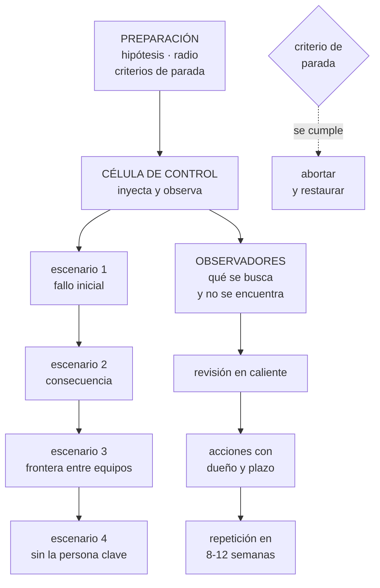

# 285 — Game day integrado y respuesta a incidentes

> [← 284 · Capstone datos e IA: plataforma gobernada](../../part-23-industry-capstones/284-capstone-datos-e-ia-plataforma-gobernada/README.md) · [Índice de la parte](../README.md) · [286 · Revisión Well-Architected multi-proveedor →](../../part-23-industry-capstones/286-revision-well-architected-multi-proveedor/README.md)

**Parte:** 23 — Capstones por industria y defensa final<br>
**Nivel:** experto · **Horas estimadas:** 4<br>
**Laboratorio:** `chaos` · **Estado:** `EXECUTABLE_CORE`

## 🎯 Propósito

Ensayo integrado: provocar fallos en varios sistemas a la vez y observar cómo responde la organización entera. La clase da el diseño de un ejercicio de varias horas con escenarios encadenados, cómo se observa sin intervenir, cómo se evalúa lo que ocurre, y por qué —según la hipótesis de la parte 23— la mayoría de los hallazgos volverán a ser organizativos.

## 📚 Resultados de aprendizaje

Al finalizar podrás:

1. **Diseñar** un ejercicio integrado con escenarios encadenados y radio acotado.
2. **Organizar** roles, observación y criterios de parada para varias horas.
3. **Provocar** los fallos que cruzan equipos, que son los que no se ensayan.
4. **Evaluar** la respuesta con una rúbrica y extraer acciones cerradas.
5. **Comparar** los hallazgos con lo que la hipótesis de la parte 23 predijo.

## 🧩 Conceptos centrales

| Concepto | Comprensión verificable |
|---|---|
| `ensayo integrado` | Ejercicio de varias horas con fallos encadenados que cruzan varios equipos y sistemas. |
| `escenario encadenado` | Un fallo que provoca otro, como ocurre de verdad. Lo que ningún ensayo aislado prueba. |
| `célula de control` | Grupo que dirige el ejercicio, inyecta los fallos y puede abortarlo. |
| `observador` | Quien anota qué ocurre y cuándo, incluido lo que se busca y no se encuentra. |
| `fallo de frontera` | El que ocurre entre equipos y por eso no tiene dueño hasta que alguien lo reclama. |
| `acción cerrada` | Hallazgo convertido en cambio con dueño, plazo y comprobación posterior. |

## 🧠 Modelo mental

El capstone no premia cantidad de servicios, sino trazabilidad entre contexto, decisiones, implementación, fallos, evidencia y aprendizaje.

Aplicado a esta clase, separa siempre cuatro planos: **intención** (qué necesita el usuario),
**configuración** (qué declaramos), **estado observado** (qué existe de verdad) y
**evidencia** (cómo sabemos que cumple). Confundirlos produce diseños que se ven correctos
en un diagrama pero fallan al operar.

## 🗺️ Flujo de razonamiento



## 📖 Desarrollo

### 1. Qué añade un ensayo integrado

Los ensayos por sistema encuentran lo que falla dentro de un equipo. El integrado encuentra lo que falla **entre** equipos, que es donde ocurren los incidentes graves.

```text
LO QUE UN ENSAYO AISLADO NO ENCUENTRA
  quién decide cuando el problema afecta a dos equipos
  qué pasa cuando dos incidentes coinciden  clase 258
  cómo se comunica con un cliente externo mientras se
    arregla
  si el equipo A sabe que el equipo B ya está trabajando
    en ello
  y qué ocurre cuando la respuesta de uno empeora lo del
    otro

→ y estos son exactamente los fallos que alargan los
  incidentes reales
→ porque no tienen dueño hasta que alguien los reclama
```

Y los escenarios que solo se pueden probar así:

```text
FALLOS DE FRONTERA
  una dependencia compartida se degrada y afecta a cuatro
  servicios de tres equipos                clase 185
  → ¿quién coordina?

CAUSAS SIMULTÁNEAS
  dos incidentes distintos a la vez
  → y la correlación automática los presenta como uno
                                            clase 263

EFECTOS CRUZADOS
  el equipo A escala su servicio y satura la base del B
                                            clase 262
  el equipo B activa el vertido de carga y el A ve errores
    que no entiende

DECISIONES QUE NADIE PUEDE TOMAR SOLO
  conmutar de región
  desactivar una función que afecta a ingresos
  comunicar públicamente
  → y aquí aparece el tramo que domina el tiempo, que la
    parte 21 midió: decidir y comunicar   clase 264

Y LA AUSENCIA DE PERSONAS
  quien más sabe no participa                clase 261
```

### 2. El diseño del ejercicio

Un ensayo integrado dura entre tres y seis horas y necesita estructura.

```text
ANTES
  1  HIPÓTESIS por escenario, escritas
     incluida la de detección: ¿saltará la alerta y en
     cuánto?
  2  RADIO DE IMPACTO máximo, por escenario
  3  CRITERIOS DE PARADA medibles, y quién puede
     declararlos
     → cualquiera
  4  RESTAURACIÓN probada de cada inyección
  5  ANUNCIO a todos los equipos y a atención al cliente
     → y aviso a los proveedores externos si procede
  6  Y REGLA DE ORO
     si ocurre un incidente REAL, el ejercicio se detiene
     de inmediato

DURANTE
  CÉLULA DE CONTROL
    inyecta, cronometra, decide si escalar el escenario y
    puede abortar
    → no responde preguntas ni da pistas
  PARTICIPANTES
    los equipos de guardia reales, no los autores
  OBSERVADORES
    uno por equipo, que anota
      qué se mira y en qué orden
      qué se busca y no se encuentra
      qué se supone sin comprobar
      cuándo se pide ayuda y a quién
      y los silencios: cuánto tiempo sin que nadie diga
        nada

DESPUÉS
  revisión en caliente de 45 minutos, ese mismo día
  y acciones con dueño y plazo en 48 horas
```

Y el encadenamiento, que es lo que lo hace realista:

```text
EL PATRÓN DE UN INCIDENTE REAL
  algo se degrada
  → la respuesta automática empeora otra cosa
  → una alerta se dispara en otro equipo
  → y mientras se investiga, aparece un segundo problema
    sin relación

→ un ensayo con un solo fallo no reproduce nada de esto
→ y por eso los escenarios se encadenan, con la célula de
  control decidiendo cuándo introducir el siguiente

Y LA REGLA DE ESCALADA
  el escenario siguiente entra cuando el anterior está
  contenido o cuando pasan N minutos
  → lo segundo es lo que crea presión realista
```

Y las dos cosas que hay que resistir:

```text
AYUDAR
  quien diseñó el ejercicio conoce la respuesta
  → y el impulso de dar una pista destruye el hallazgo
  → los observadores no hablan

Y AMPLIAR EL RADIO SOBRE LA MARCHA
  «esto va bien, vamos a probar también...»
  → los criterios de parada y el radio se fijaron antes
    por una razón                          clase 261
```

### 3. Qué se evalúa

La rúbrica del ejercicio, conocida por todos antes de empezar.

```text
1  DETECCIÓN
   ¿saltó la alerta? ¿en cuánto? ¿la recibió quien debía?
   ¿alguien se enteró por otro camino antes que por la
   alerta?

2  COORDINACIÓN
   ¿se declaró incidente y en cuánto?
   ¿hubo alguien coordinando o todos arreglando?
                                            clase 257
   ¿se supo quién hacía qué?

3  DIAGNÓSTICO
   ¿se consultó la línea de cambios primero? clase 258
   ¿se escribieron hipótesis alternativas?
   ¿se comprobó lo que se daba por sabido?

4  DECISIÓN
   ¿se mitigó antes de entender?
   ¿quién tomó las decisiones que cruzaban equipos?
   ¿hubo alguna decisión que nadie se atrevió a tomar?

5  COMUNICACIÓN
   ¿se comunicó a negocio y a clientes? ¿cuándo y qué?
   ¿la primera comunicación tardó más de lo acordado?

6  Y HERRAMIENTAS
   ¿los procedimientos funcionaron?
   ¿los permisos alcanzaron?
   ¿algún panel no mostraba lo necesario?

→ y las seis se puntúan con lo observado, no con la
  impresión
```

Y las cifras que se extraen del ejercicio:

```text
tiempo hasta detectar, por escenario
tiempo hasta declarar incidente
tiempo hasta la primera hipótesis correcta
tiempo hasta mitigar
tiempo hasta la primera comunicación
número de personas implicadas frente a las necesarias
procedimientos usados y cuántos funcionaron
hallazgos, clasificados en técnicos y organizativos
y decisiones bloqueadas por falta de autoridad
```

Y la clasificación de hallazgos, que la hipótesis de la parte 23 predijo:

```text
la predicción escrita en la clase 276
  «alrededor de dos tercios de los hallazgos volverán a
  ser organizativos»

→ y esta clase la pone a prueba
→ el ejercicio de CloudShop lo comprueba en el ejemplo
```

### 4. De los hallazgos a las acciones

Un ejercicio sin acciones cerradas es una anécdota cara.

```text
LA REVISIÓN EN CALIENTE, ese mismo día
  ¿qué esperábamos y qué pasó?
  ¿qué nos sorprendió?
  ¿qué buscamos y no encontramos?
  ¿qué decisión costó tomarse y por qué?
  ¿qué habría pasado si el radio hubiera sido mayor?
  y ¿qué habría pasado a las 03:00?

→ las dos últimas producen la mitad de las acciones
```

Y las reglas de las acciones:

```text
dueño con nombre, no un equipo
plazo, y no «cuando se pueda»
criterio de cierre comprobable
y priorizadas por lo que habrían costado en un incidente
  real

→ y una comprobación al mes siguiente: ¿cuántas se
  cerraron?
→ si menos del 70 %, el ejercicio siguiente no se hace
  hasta cerrarlas
  → porque repetir un ejercicio con las acciones
    anteriores abiertas encuentra lo mismo
```

Y la repetición, que es lo que lo convierte en programa:

```text
EL MISMO EJERCICIO, 8-12 SEMANAS DESPUÉS
  y las hipótesis ahora deben cumplirse
  → y si no, las acciones no funcionaron

y la cadencia que funciona
  ensayos por sistema             mensuales   clase 261
  ensayo integrado                trimestral
  ensayo integrado con ausencias  semestral
  y conmutación de región completa anual, con acta
                                              clase 278
```

Y los errores que arruinan un ensayo integrado:

```text
1  HACERLO SIN AVISAR
   → produce un incidente real con gente confundida y
     quema la confianza
2  QUE LO RESPONDAN LOS AUTORES
   → sale bien y no enseña nada
3  NO PARAR CUANDO HAY UN INCIDENTE REAL
4  USAR LOS HALLAZGOS PARA SEÑALAR PERSONAS
   → y al siguiente nadie participa de verdad
5  NO CERRAR LAS ACCIONES
6  Y HACERLO DEMASIADO FÁCIL
   → si todo sale perfecto, el ejercicio era pequeño
   → un ensayo que no descubre nada es un ensayo mal
     diseñado
```

Y la lista de comprobación de la clase:

```text
☐ hay hipótesis escritas por escenario, con detección
☐ hay radio máximo y criterios de parada por escenario
☐ la restauración de cada inyección está probada
☐ está anunciado a todos los equipos y a atención al
  cliente
☐ responden los equipos de guardia, no los autores
☐ hay célula de control que no da pistas
☐ hay un observador por equipo que anota los silencios
☐ los escenarios se encadenan y cruzan equipos
☐ se prueba al menos una decisión que nadie puede tomar
  solo
☐ se ensaya la ausencia de la persona clave
☐ el ejercicio se detiene si hay un incidente real
☐ hay revisión en caliente el mismo día
☐ las acciones tienen dueño con nombre y plazo
☐ se repite en 8-12 semanas y las hipótesis se cumplen
```

Y el cierre que enlaza con la clase siguiente: el ensayo dice qué hace la organización cuando algo falla. Queda revisar los ocho capstones con un método estructurado, en los tres proveedores, y anotar los riesgos que quedan. La revisión bien diseñada multiproveedor es la materia de la clase 286.

## 🔬 Ejemplo trabajado

**El ensayo integrado de CloudShop: cinco horas, cuatro escenarios encadenados, cuatro equipos. Lo que sigue es la línea de tiempo, la decisión que nadie tomó durante 31 minutos, y la clasificación de los 47 hallazgos.**

**El diseño.**

```text
duración prevista          5 horas, un jueves de 10:00 a
                           15:00
equipos participantes      plataforma · pedidos · pagos ·
                           datos
célula de control          3 personas
observadores               4, uno por equipo
anunciado a               todos los equipos, atención al
                          cliente y dirección
no anunciado              el contenido de los escenarios

criterio de parada global
  errores de usuario > 1 % durante 3 minutos, o cualquier
  participante lo declara
```

Y las hipótesis escritas antes:

```text
ESCENARIO 1 · una zona del proveedor principal se degrada
  esperamos  detección en < 3 min · incidente declarado en
             < 6 min · tráfico redistribuido · sin errores
             de usuario

ESCENARIO 2 · la respuesta al 1 satura la base de pedidos
  esperamos  el equipo de pedidos detecta y conecta ambos
             sucesos en < 10 min

ESCENARIO 3 · en paralelo, la pasarela de pagos de un
              mercado empieza a responder lento
  esperamos  se trata como incidente SEPARADO y no se
             confunde con el primero

ESCENARIO 4 · las dos personas que más saben de
              conmutación no están disponibles
  esperamos  la conmutación se ejecuta igual, en < 25 min
```

**La línea de tiempo.**

```text
10:00  se degrada la zona
10:02  alerta de instancias sanas                  ✓ 2 min
10:04  incidente declarado; coordina el turno de
       plataforma                                  ✓ 4 min
10:06  tráfico redistribuido; sin errores de usuario ✓

10:14  ESCENARIO 2: la base de pedidos al límite de
       conexiones
10:16  alerta de latencia en pedidos
10:16  el equipo de pedidos abre SU PROPIO incidente
       → sin saber que había otro abierto
10:29  alguien de plataforma ve el segundo incidente y
       conecta los dos                             ✗ 15 min
       → la hipótesis decía < 10

10:35  ESCENARIO 3: la pasarela del mercado B se degrada
10:37  alerta de pagos
10:38  el sistema de correlación agrupa la alerta de
       pagos con el incidente principal
       → «probablemente derivado de la degradación de
         zona»
10:38-11:12  nadie investiga pagos por separado
11:12  atención al cliente informa de reclamaciones de
       pago del mercado B
11:14  se separa el incidente                       ✗ 39 min

11:20  se plantea conmutar la zona degradada por completo
11:20-11:51  NADIE TOMA LA DECISIÓN                 ✗ 31 min
11:51  la célula de control fuerza el escenario 4
       («las dos personas de conmutación no están»)
11:53  el turno de guardia asume la decisión y ejecuta
12:09  conmutación completada                       ✓ 16 min

12:20  primera comunicación a clientes del mercado B
       → 1 h 45 después del inicio de su problema   ✗

13:40  ejercicio finalizado y restaurado
```

**Los tres fallos grandes, analizados.**

```text
FALLO 1 · dos incidentes abiertos sin saberlo
  el equipo de pedidos abrió su incidente a las 10:16
  el de plataforma llevaba uno abierto desde las 10:04
  → 13 minutos de trabajo duplicado y de confusión

  causa
    no había forma de ver «incidentes abiertos ahora
    mismo» en un solo sitio
    → cada equipo usaba su propio canal

  acción
    un canal único de incidentes activos, con quien
    coordina cada uno
    y comprobación obligatoria al declarar: «hay 1
    incidente abierto; ¿el tuyo es el mismo?»

FALLO 2 · la correlación agrupó dos incidentes distintos
  exactamente el riesgo que la clase 263 anticipó
  → y el equipo confió en la agrupación
  → 39 minutos de un problema de pagos sin atender

  causa
    el agrupamiento presentaba una conclusión, no una
    hipótesis
    y separar no era visible

  acción
    botón de separar, visible y en primer plano
    el agrupamiento se presenta como «posible relación»
    y la instrucción para quien coordina: «si la evidencia
    no encaja en una sola historia, sepáralo»
                                            clase 258

FALLO 3 · 31 minutos sin que nadie decidiera
  la conmutación de zona afectaba a pedidos, pagos y
  datos
  → cada equipo esperaba que decidiera otro
  → y el turno de guardia creía que no tenía autoridad

  causa
    el procedimiento decía «coordinar con los equipos
    afectados»
    → y no decía quién decide si no hay acuerdo

  acción
    quien coordina el incidente DECIDE, y esa autoridad
    está escrita y comunicada        clase 257
    lista explícita de decisiones que puede tomar sin
    consultar
    y las que sí requieren negocio, con quién y en cuánto

→ y el equipo comentó que este fallo era el más caro y el
  más barato de arreglar: una frase en un documento
```

**La clasificación de los 47 hallazgos.**

```text
ORGANIZATIVOS                                31   66 %
  autoridad para decidir no definida            6
  información que no estaba donde se buscó      9
  procedimientos incompletos o rotos            7
  comunicación: cuándo, a quién y qué           5
  y coordinación entre equipos                  4

TÉCNICOS                                     16   34 %
  paneles sin la señal necesaria                5
  permisos insuficientes                        3
  correlación mal presentada                    2
  límites de conexión mal dimensionados         3
  y alertas mal enrutadas                       3
```

Y la comparación con la predicción:

```text
la hipótesis de la parte 23 decía
  «alrededor de dos tercios de los hallazgos volverán a
  ser organizativos»

resultado medido                          66 %
la clase 261, con ensayos por sistema     68 %

→ la predicción se cumple
→ y con una precisión que sorprendió al propio equipo
→ y refuerza lo que la parte 22 había concluido: el 11 %
  del contenido que no se predijo —lo organizativo— es
  donde se concentran los fallos
```

**La repetición, 10 semanas después.**

```text
acciones cerradas antes de repetir           41 de 47   87 %

mismos cuatro escenarios, mismas hipótesis

                                     primera    repetición
detección del escenario 1              2 min        2 min
incidente declarado                    4 min        3 min
conectar escenarios 1 y 2             15 min        4 min ✓
separar el incidente de pagos         39 min        6 min ✓
decisión de conmutar                  31 min        2 min ✓
conmutación ejecutada                 16 min       14 min
primera comunicación a clientes     1 h 45 min     11 min ✓

hallazgos nuevos                          47           14
  organizativos                           31            8
  técnicos                                16            6
```

Y la observación del equipo sobre la repetición:

```text
la decisión que costó 31 minutos costó 2
→ y lo único que cambió fue una frase escrita: «quien
  coordina decide»

y los 14 hallazgos nuevos eran de otra clase
  más finos, más profundos
  → el ejercicio había subido de nivel
```

**El coste del ejercicio.**

```text
preparación                              62 horas
ejecución (16 personas × 5 h)            80 horas
revisión y acciones                      94 horas
repetición                              108 horas
                                        ─────────
                                        344 horas

y la comparación que se llevó a dirección
  incidente grave medio en CloudShop     ~40 horas de
                                         equipo
  hallazgos clasificados como «habría causado o alargado
  un incidente grave»                          19 de 47

→ y si solo 9 de esos 19 se hubieran materializado, el
  ejercicio se paga
```

**La lección que este ensayo deja**: los tres fallos mayores no fueron técnicos —dos incidentes abiertos sin que ninguno supiera del otro, una correlación que ocultó un problema de pagos durante 39 minutos, y **31 minutos en que nadie tomó una decisión porque nadie sabía que podía**—. El más caro de los tres se arregló con una frase escrita, y en la repetición esos 31 minutos fueron 2.

## 🧪 Laboratorio guiado

Ejecuta desde la raíz:

```bash
python classes/part-23-industry-capstones/285-game-day-integrado-y-respuesta-a-incidentes/lab.py
```

El laboratorio selecciona el motor de práctica **`chaos`** y produce
`lab_result.json`. El escenario, sus comprobaciones y el artefacto esperado corresponden a
esta clase; no requiere credenciales y deja explícito qué debe revalidarse en un sandbox real.

1. Lee `exercise.steps` y formula una predicción antes de ejecutar.
2. Ejecuta la práctica y verifica todos los elementos de `checks`.
3. Provoca el caso de `negative_test` y explica la señal observada.
4. Materializa `final-gameday` en `evidence/` usando la plantilla indicada.
5. Para proveedor real, sigue `sandbox.requires`, registra costo y ejecuta `destroy`.

### Evidencia esperada

El artefacto principal es una hipótesis de resiliencia y criterio de abortar. Además, la entrega debe incluir el comando ejecutado,
la salida estructurada y una conclusión que no exceda lo observado.

## 🏆 Reto verificable

Construye **`final-gameday`** para el caso CloudShop. Incluye una alternativa descartada,
un supuesto que pueda falsarse, una prueba de fallo y una decisión de rollback.

## ✅ Criterio de aceptación

- [ ] `lab.py` termina con código 0 y genera JSON válido.
- [ ] La entrega conecta al menos tres requisitos con mecanismos verificables.
- [ ] Existe una prueba positiva y una prueba negativa con evidencia.
- [ ] Seguridad, costo y operación aparecen como decisiones, no como anexos.
- [ ] Se declara una limitación y una condición que obligaría a revisar el diseño.
- [ ] Otra persona puede repetir el recorrido sin conocimiento tácito.

## ⚠️ Errores frecuentes

| Síntoma | Causa probable | Corrección |
|---|---|---|
| El ensayo sale bien y no enseña casi nada | Lo respondieron los autores, o el escenario era demasiado sencillo | Que respondan los equipos de guardia reales y encadena escenarios que crucen equipos; un ejercicio que no descubre nada está mal diseñado. |
| Dos equipos trabajan en el mismo incidente sin saberlo | No existe una vista única de incidentes activos y cada equipo usa su canal | Canal único de incidentes con quien coordina cada uno, y comprobación obligatoria al declarar uno nuevo. |
| Un problema queda sin atender porque se agrupó con otro | La correlación presentó una conclusión y separar no era visible | Presenta el agrupamiento como posible relación, pon el botón de separar en primer plano y forma a quien coordina para separar cuando la evidencia no encaja. |
| Una decisión importante queda en el aire mientras todos esperan | El procedimiento pide coordinar y no dice quién decide si no hay acuerdo | Escribe que quien coordina decide, con la lista de decisiones que puede tomar sin consultar y las que requieren negocio y en cuánto tiempo. |
| El ejercicio genera hallazgos y nada cambia | Las acciones no tienen dueño con nombre, plazo ni criterio de cierre | Asigna, fija plazo y comprueba al mes; si no se cierra el 70 %, no repitas el ejercicio hasta cerrarlas. |
| Tras el ensayo hay recelo y menos participación | Los hallazgos se usaron para señalar personas o el ejercicio no se anunció | Anuncia siempre el ejercicio, atribuye los hallazgos al sistema y detén el ensayo de inmediato si aparece un incidente real. |

## 🛡️ Seguridad, ética y costo

Trabaja con cuentas propias o sandboxes autorizados. No publiques secretos, identificadores
reales ni datos personales. Antes de crear recursos pagos define presupuesto, etiquetas y
comando de destrucción; después verifica que no queden recursos huérfanos. Los ejemplos
locales enseñan contratos, pero no certifican cumplimiento ni disponibilidad de producción.

## ❓ Preguntas de comprobación

1. ¿Qué encuentra un ensayo integrado que no encuentra uno por sistema?
2. ¿Qué papel tiene la célula de control y qué no debe hacer?
3. ¿Por qué se encadenan los escenarios y con qué regla se introduce el siguiente?
4. ¿Qué seis dimensiones evalúa la rúbrica del ejercicio?
5. ¿Qué proporción de hallazgos suele ser organizativa y qué implica?

## 🔗 Referencias

- Google (2018). *The Site Reliability Workbook* — DiRT y ejercicios de continuidad. <https://sre.google/workbook/reliable-product-launches/>
- Rosenthal, C. y Jones, N. (2020). *Chaos Engineering: system resiliency in practice*. <https://www.oreilly.com/library/view/chaos-engineering/9781492043850/>
- AWS (2024). *Fault Injection Service: multi-account and multi-region experiments*. <https://docs.aws.amazon.com/fis/latest/userguide/what-is.html>
- Microsoft (2024). *Azure Chaos Studio experiment design*. <https://learn.microsoft.com/azure/chaos-studio/chaos-studio-overview>
- Allspaw, J. (2015). *Trade-offs under pressure* — coordinación en incidentes reales. <https://www.researchgate.net/publication/282869185>
- Documentación oficial vigente del servicio implementado; registra URL y fecha de consulta.

---

> [Evaluación](assessment.md) · [Contrato de clase](lesson.yaml) · [Índice de la parte](../README.md)

| Anterior | Índice | Siguiente |
|---|---|---|
| [← 284 · Capstone datos e IA: plataforma gobernada](../../part-23-industry-capstones/284-capstone-datos-e-ia-plataforma-gobernada/README.md) | [Parte 23](../README.md) · [Programa](../../README.md) | [286 · Revisión Well-Architected multi-proveedor →](../../part-23-industry-capstones/286-revision-well-architected-multi-proveedor/README.md) |
