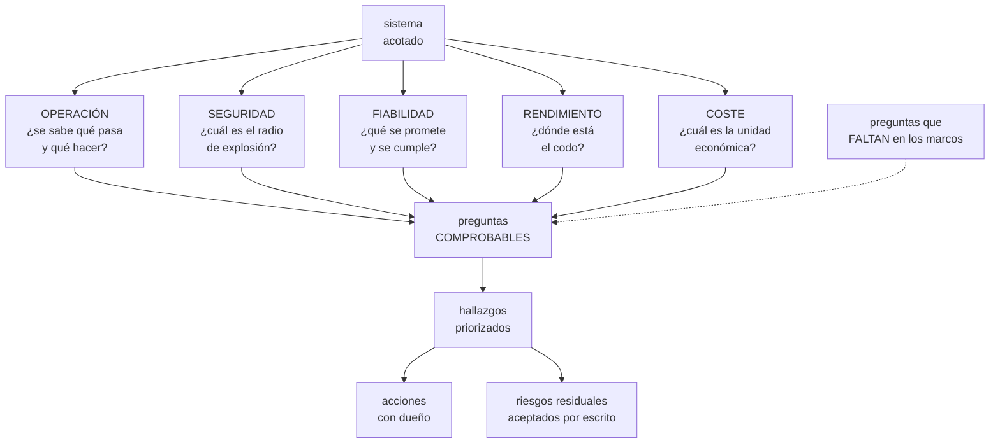

# 286 — Revisión Well-Architected multi-proveedor

> [← 285 · Game day integrado y respuesta a incidentes](../../part-23-industry-capstones/285-game-day-integrado-y-respuesta-a-incidentes/README.md) · [Índice de la parte](../README.md) · [287 · Paquete de evidencia, costos y riesgos residuales →](../../part-23-industry-capstones/287-paquete-de-evidencia-costos-y-riesgos-residuales/README.md)

**Parte:** 23 — Capstones por industria y defensa final<br>
**Nivel:** experto · **Horas estimadas:** 4<br>
**Laboratorio:** `architecture` · **Estado:** `EXECUTABLE_CORE`

## 🎯 Propósito

Revisar un sistema con método estructurado en cualquier proveedor: los cinco pilares comunes, cómo se ejecuta una revisión que produzca acciones en vez de un informe, y —lo más importante— **las preguntas que este programa ha demostrado que faltan en los marcos oficiales**, con las cifras que lo justifican.

## 📚 Resultados de aprendizaje

Al finalizar podrás:

1. **Ejecutar** una revisión estructurada de un sistema en medio día.
2. **Aplicar** los cinco pilares comunes con preguntas comprobables.
3. **Añadir** las preguntas que los marcos oficiales no incluyen.
4. **Priorizar** los hallazgos por riesgo real y no por cantidad.
5. **Convertir** la revisión en acciones con dueño, plazo y comprobación.

## 🧩 Conceptos centrales

| Concepto | Comprensión verificable |
|---|---|
| `revisión estructurada` | Recorrido guiado por preguntas sobre un sistema concreto, con participantes que lo conocen. |
| `pilar` | Dimensión de calidad que se revisa por separado: operación, seguridad, fiabilidad, rendimiento y coste. |
| `pregunta comprobable` | La que se responde con una evidencia, no con una opinión. |
| `riesgo residual` | El que se decide aceptar, con dueño, motivo y vigencia escritos. |
| `hallazgo priorizado` | El que se ordena por impacto y probabilidad reales, no por su gravedad nominal. |
| `revisión que no cambia nada` | Modo de fracaso: se genera un informe extenso y ninguna acción se cierra. |

## 🧠 Modelo mental

El capstone no premia cantidad de servicios, sino trazabilidad entre contexto, decisiones, implementación, fallos, evidencia y aprendizaje.

Aplicado a esta clase, separa siempre cuatro planos: **intención** (qué necesita el usuario),
**configuración** (qué declaramos), **estado observado** (qué existe de verdad) y
**evidencia** (cómo sabemos que cumple). Confundirlos produce diseños que se ven correctos
en un diagrama pero fallan al operar.

## 🗺️ Flujo de razonamiento



## 📖 Desarrollo

### 1. Cómo se ejecuta una revisión que sirve

Una revisión estructurada es media jornada, no un proyecto. Y su valor depende de tres decisiones de formato.

```text
1  ACOTAR EL SISTEMA
   un servicio o un recorrido completo, no «la plataforma»
   → «el flujo de compra, del navegador al almacén»
   → con sus dependencias dibujadas             ley 24

2  LOS PARTICIPANTES SON QUIENES LO CONSTRUYEN Y LO OPERAN
   → no un comité externo
   → y quien facilita hace preguntas, no las responde

3  LAS PREGUNTAS SE RESPONDEN CON EVIDENCIA
   «sí, tenemos copias» no vale
   «restauramos el 14 de marzo en 52 minutos, aquí está el
   acta» sí
   → y esta regla sola cambia el resultado de la revisión
     entera
```

Y el formato que funciona:

```text
media jornada, 4 horas
  0:00-0:20  el equipo presenta el sistema y su diagrama
  0:20-3:00  los cinco pilares, ~30 min cada uno
  3:00-3:30  priorización conjunta
  3:30-4:00  acciones, dueños y plazos

y lo que NO se hace
  no se puntúa al equipo
  no se genera un informe de 60 páginas
  y no se revisa todo el catálogo de preguntas
  → 8-12 preguntas por pilar, las que apliquen
```

Y la priorización, que evita el modo de fracaso:

```text
cada hallazgo con dos números
  IMPACTO       si ocurre, ¿qué pasa?
  PROBABILIDAD  ¿ha estado a punto de pasar?

y tres categorías
  ACTUAR YA        alto impacto, probable
  PLANIFICAR       alto impacto, poco probable
  ACEPTAR          y entonces se escribe como riesgo
                   residual, con dueño y vigencia

→ y la tercera categoría es la que da credibilidad
→ una revisión donde todo hay que arreglarlo produce que
  no se arregle nada
```

Y el criterio de éxito:

```text
no «cuántos hallazgos»
sino CUÁNTAS ACCIONES SE CERRARON EN 90 DÍAS
  → y si es menos del 60 %, la revisión generó una lista
    de deseos, no un plan
```

### 2. Los cinco pilares, con preguntas comprobables

Las preguntas que valen son las que exigen enseñar algo.

```text
OPERACIÓN
  ☐ enséñame el inventario de este sistema con su dueño
  ☐ ¿cuál fue la última alerta y qué hizo quien la
    recibió?
  ☐ coge un procedimiento y ejecútalo ahora
  ☐ ¿dónde está la línea de cambios de este sistema?
  ☐ ¿cuándo fue la última vuelta atrás?
  ☐ ¿cuánto tarda un cambio desde confirmar hasta
    producción?
  ☐ ¿cuántas interrupciones de guardia tuvo el último
    turno?

SEGURIDAD
  ☐ si esta credencial se filtra, ¿hasta dónde llega?
  ☐ ¿queda alguna credencial permanente?
  ☐ ¿quién puede borrar las copias?
  ☐ ¿quién puede desactivar el registro?
  ☐ haz algo que debería detectarse y cronométralo
  ☐ ¿los entornos de prueba tienen datos reales?
  ☐ ¿qué datos salen a terceros y con qué contrato?

FIABILIDAD
  ☐ ¿qué prometes al usuario y cómo lo mides?
  ☐ ¿ese objetivo se incumple alguna vez?
  ☐ restaura una copia ahora y cronométralo
  ☐ ¿qué pasa si cae una zona? ¿lo has probado?
  ☐ ¿qué dependencia te tumba si va LENTA en vez de
    fallar?
  ☐ ¿qué se degrada antes de caer y quién lo decidió?

RENDIMIENTO
  ☐ ¿qué recurso satura primero y dónde está su codo?
  ☐ si el tráfico se duplica, ¿qué se rompe y en cuánto?
  ☐ ¿escalar empeora algún limitante?
  ☐ ¿qué cuotas te limitan y a qué porcentaje estás?
  ☐ ¿la región secundaria tiene cuotas para el 100 %?

COSTE
  ☐ ¿cuál es tu unidad económica y su tendencia?
  ☐ ¿qué porcentaje del coste está atribuido?
  ☐ ¿qué parte del gasto es trabajo que no hace falta?
  ☐ ¿alguna decisión reciente llevó su coste estimado
    delante?
```

Y las preguntas transversales, que suelen dar los mejores hallazgos:

```text
☐ ¿qué parte de este sistema no has probado nunca?
☐ ¿qué te quita el sueño de este sistema?
☐ si te fueras mañana, ¿qué no sabría nadie?
☐ y ¿qué decisión de hace dos años ya no tiene sentido?

→ la tercera es la que más deuda de conocimiento revela
→ y la cuarta, la que más simplificaciones produce
```

### 3. Las preguntas que faltan en los marcos

Los marcos oficiales de los proveedores son buenos y este programa ha encontrado, midiendo, huecos concretos. Estas son las preguntas que hay que añadir, con lo que las justifica.

```text
1  ¿CUÁNDO SE EJECUTÓ POR ÚLTIMA VEZ CADA PROCEDIMIENTO?
   los marcos preguntan si existen procedimientos
   → 19 de 34 estaban rotos al ejecutarlos    clase 259
   → existir y funcionar son cosas distintas      ley 22

2  ¿QUÉ JUICIO APLICA LA PERSONA QUE HACE ESTO A MANO?
   antes de automatizar algo
   → una remediación correcta convirtió una degradación en
     caída total en 3 minutos por no saber cuándo NO
     actuar                                       ley 30

3  ¿CÓMO DETECTAS UN FALLO QUE NO DA ERROR?
   los marcos preguntan por alertas de error
   → un fallo de datos da otro número            ley 29
   → y 17 de 19 incidentes de datos los detectó una
     persona, 23 días después           clases 243, 284

4  ¿QUÉ CUOTAS TIENE LA REGIÓN DE CONMUTACIÓN?
   los marcos preguntan por planes de continuidad
   → la región secundaria daba para el 3,2 % de la
     capacidad prometida                     clase 262

5  ¿MIDES EN EL CLIENTE O EN EL SERVIDOR?
   → 1,23 puntos de diferencia en el éxito de compra,
     unas 4.100 compras al mes invisibles    clase 268

6  ¿QUÉ PASA SI UNA DEPENDENCIA VA LENTA EN VEZ DE
   FALLAR?
   → 200 ms de latencia produjeron 4.100 ms de
     degradación; el mismo servicio CAÍDO se comportaba
     mejor                                   clase 261

7  ¿CUÁNTOS EQUIPOS TOMAN BUENAS DECISIONES SIN
   CONSULTARTE?
   para funciones de apoyo
   → toda función de apoyo deriva hacia autorizar y se
     queda ciega                                  ley 31

8  ¿QUÉ HAS RETIRADO ESTE AÑO?
   los marcos preguntan qué se ha añadido
   → 245 alertas de 412, 9 procedimientos, 426 conjuntos
     de datos, 4 modelos, 61 paneles
   → y retirar fue, medido, de lo más rentable

9  ¿QUIÉN DECIDE CUANDO EL PROBLEMA CRUZA DOS EQUIPOS?
   → 31 minutos sin que nadie decidiera, arreglados con
     una frase escrita                       clase 285

10 Y ¿QUÉ PARTE DE ESTE SISTEMA NO ESTÁ EN EL DIAGRAMA?
   → lo que no está en el diagrama no se analiza  ley 24
```

Y el patrón que comparten las diez:

```text
los marcos preguntan por lo que EXISTE
y estas preguntan por lo que se ha COMPROBADO

→ y la diferencia entre las dos cosas es donde han estado
  casi todos los hallazgos caros de este programa
```

### 4. Revisar en tres proveedores

La revisión es la misma; lo que cambia es dónde se busca la evidencia.

```text
LO QUE NO CAMBIA
  las preguntas
  los pilares
  la exigencia de evidencia
  y la priorización

LO QUE CAMBIA
  el nombre de los servicios
  dónde se consultan las cuotas
  cómo se comprueban los permisos efectivos
  qué informa el detalle de coste y con qué retraso
  y qué hay activado por defecto              ley 26

→ y por eso la rejilla de cinco capas de la clase 273 es
  la herramienta de traducción de la revisión
```

Y los puntos donde una revisión multiproveedor encuentra más:

```text
AISLAMIENTO
  la unidad administrativa no es equivalente entre nubes
  → y una arquitectura copiada de una a otra suele quedar
    peor aislada                             clase 219

PERMISOS
  la semántica de herencia y denegación difiere
  → una política traducida puede conceder de más
                                            clase 273
  → hay que comprobar permisos EFECTIVOS, no textos

CUOTAS
  distintas por defecto y por región
  → y el inventario de cuotas es por nube y por cuenta

COSTE
  distintos modelos y distinto retraso del detalle
  → la unidad económica debe ser comparable entre nubes
                                            clase 270

Y OPERACIÓN
  dos inventarios, dos catálogos de alertas, dos guardias
  → y el coste real de eso, medido: 2,5 personas y
    492.000 USD al año en CloudShop         clase 273
```

Y el cierre de la revisión, que es lo que la hace útil:

```text
EL ACTA, en dos páginas
  el sistema revisado y su alcance
  los hallazgos priorizados, con impacto y probabilidad
  las acciones con dueño y plazo
  los riesgos residuales ACEPTADOS, con dueño y vigencia
  y la fecha de la próxima revisión

→ y a los 90 días, una comprobación de cuántas acciones
  se cerraron
→ que es el único número que dice si la revisión sirvió
```

Y la lista de comprobación de la clase:

```text
☐ el sistema revisado está acotado y dibujado
☐ participan quienes lo construyen y lo operan
☐ cada respuesta va con evidencia enseñada
☐ se ejecuta un procedimiento durante la sesión
☐ se restaura una copia y se cronometra
☐ se hace algo que debería detectarse y se cronometra
☐ se preguntan las diez que faltan en los marcos
☐ los hallazgos se priorizan por impacto y probabilidad
☐ hay riesgos aceptados por escrito, con dueño y vigencia
☐ el acta cabe en dos páginas
☐ y a los 90 días se cuenta cuántas acciones se cerraron
```

Y el cierre que enlaza con la clase siguiente: la revisión produce hallazgos, acciones y riesgos aceptados. Reunir todo eso en un paquete que alguien de fuera pueda evaluar —con costes y con los riesgos que quedan— es la materia de la clase 287.

## 🔬 Ejemplo trabajado

**Dos revisiones de CloudShop, la misma metodología en dos proveedores. Lo que sigue son los hallazgos que solo aparecen al exigir evidencia, la diferencia entre las dos nubes, y qué pasó a los 90 días.**

**Revisión 1 · El flujo de compra, proveedor principal.**

```text
alcance   del navegador al almacén, incluidas pasarelas y
          eventos
duración  4 horas
participan 6 personas del equipo, 1 facilitando
```

Y lo que ocurrió al exigir evidencia:

```text
PREGUNTA   «coge un procedimiento y ejecútalo ahora»
RESPUESTA  se eligió al azar «recuperar la cola de pedidos
           atascada»
RESULTADO  falló en el paso 3: el nombre de la cola había
           cambiado en una migración de hacía 5 meses
           → hallazgo, en directo, en 6 minutos

PREGUNTA   «restaura una copia ahora y cronométralo»
RESPUESTA  «tarda unos 40 minutos»
RESULTADO  3 h 10 min
           → y el objetivo comprometido era de 1 hora
           → hallazgo de impacto alto

PREGUNTA   «haz algo que debería detectarse y
           cronométralo»
RESPUESTA  se creó una clave de acceso permanente
RESULTADO  nadie la detectó en 45 minutos
           → la regla existía y apuntaba a un canal
             retirado                          ley 15

PREGUNTA   «¿mides en el cliente o en el servidor?»
RESPUESTA  en el servidor
RESULTADO  al instrumentar el cliente: 1,23 puntos de
           diferencia
           → 4.100 compras al mes que nadie veía

PREGUNTA   «¿qué pasa si el inventario va LENTO?»
RESPUESTA  «se degradaría un poco»
RESULTADO  ensayo posterior: 200 ms → 4.100 ms
           → hipótesis refutada

PREGUNTA   «¿qué has retirado este año?»
RESPUESTA  silencio, y después «nada»
           → y de ahí salió el trabajo de las 245 alertas
```

Y la priorización:

```text                                    impacto  probab.  acción
restauración 3× peor que el objetivo   alto     alto     YA
no se detecta credencial permanente    alto     medio    YA
degradación por dependencia lenta      alto     alto     YA
procedimiento roto                     medio    alto     YA
medición solo en servidor              medio    alto     YA
cuotas de la región secundaria         alto     bajo     PLANIF
sin retirada de nada                   medio    alto     PLANIF
registro de accesos incompleto         medio    bajo     ACEPTAR
sin cifrado propio en un almacén
  interno                              bajo     bajo     ACEPTAR

hallazgos                                     19
  actuar ya                                    5
  planificar                                   9
  aceptar como riesgo residual                 5
```

Y los cinco riesgos aceptados, escritos:

```text
cada uno con
  qué es, qué pasaría, por qué se acepta, quién lo acepta
  y hasta cuándo

ejemplo
  «el registro de accesos al almacén interno no incluye
  lecturas. Impacto: no podríamos reconstruir quién
  consultó qué en caso de sospecha. Se acepta porque el
  almacén no contiene datos personales y añadirlo cuesta
  6 semanas. Acepta: responsable de plataforma. Vigencia:
  hasta diciembre o hasta que el almacén reciba datos
  personales, lo que ocurra antes.»

→ y esa última cláusula es lo que evita que un riesgo
  aceptado se convierta en un riesgo olvidado
```

**Revisión 2 · El mismo recorrido, segundo proveedor.**

```text
la arquitectura se había copiado del principal
las mismas preguntas, la misma exigencia de evidencia

hallazgos comunes                                 11
hallazgos EXCLUSIVOS del segundo proveedor         8
```

Y los ocho exclusivos:

```text
1  la unidad de aislamiento no era equivalente: entornos
   que en el principal estaban en cuentas separadas aquí
   compartían contenedor administrativo   clase 219

2  la política de permisos, traducida literalmente,
   concedía acceso a 214 conjuntos en vez de 1
   → detectado comparando permisos EFECTIVOS
                                            clase 273

3  cuotas por defecto muy inferiores en 4 servicios
   → y sin alerta de proximidad

4  el registro de auditoría no estaba activado por
   defecto en 2 de 3 cuentas                   ley 26

5  la replicación de copias tenía un destino
   preconfigurado fuera de la región deseada

6  el detalle de coste llegaba con 26 horas de retraso
   frente a 8
   → y la alerta de anomalía se había calibrado con el
     retraso del otro proveedor

7  el balanceador no expulsaba atípicos con la misma
   configuración                            clase 196

8  y la herramienta de infraestructura como código se
   estrangulaba por cuota del plano de control
                                            clase 262
```

Y la conclusión que el equipo escribió:

```text
«copiamos la arquitectura y no copiamos las garantías»

→ 8 de 19 hallazgos venían de suponer equivalencias
→ y ninguno lo habría encontrado una revisión que
  preguntara «¿tenéis aislamiento por entorno?»
→ los encontró preguntar «enséñame el aislamiento
  efectivo»
```

**Los 90 días.**

```text                              revisión 1   revisión 2
hallazgos                              19           19
acciones asignadas                     14           16
cerradas en 90 días                    12           13
                                      86 %         81 %
riesgos residuales escritos             5            3
  revisados al vencer la vigencia       5            3
  de ellos, dejaron de aceptarse        2            1

y el efecto medido de las cerradas
  restauración                    3 h 10 → 52 min
  detección de credencial
    permanente               no detectada → 4 min
  degradación por latencia    4.100 ms → 1.240 ms
  medición en cliente                  no → sí
  cuotas de la secundaria           3,2 % → 100 %
  permisos efectivos del
    segundo proveedor            214 → 1 conjunto
```

Y la comparación con la revisión anterior, hecha un año antes con el formato clásico:

```text                              formato clásico   este formato
duración                          3 días            4 horas
páginas del informe                  61                  2
hallazgos                            94                 19
acciones asignadas                   12                 14
cerradas en 90 días                   3                 12
                                    25 %               86 %
hallazgos encontrados EN LA
  SESIÓN, ejecutando algo              0                  6
```

Y la lectura del equipo:

```text
la revisión de 3 días produjo 94 hallazgos y 3 acciones
cerradas
la de 4 horas produjo 19 y 12

→ la diferencia no fue el rigor: fue exigir evidencia y
  aceptar riesgos por escrito
→ una lista de 94 cosas por arreglar se ignora entera
→ y 5 riesgos aceptados con fecha se revisan
```

**La lección que esta clase deja**: la revisión de tres días con 94 hallazgos cerró **3 acciones en 90 días**; la de cuatro horas con 19 hallazgos cerró **12**, y seis de esos hallazgos aparecieron durante la propia sesión al ejecutar un procedimiento, restaurar una copia y provocar algo que debía detectarse. Y en el segundo proveedor, ocho de diecinueve hallazgos venían de haber copiado la arquitectura **sin copiar las garantías**.

## 🧪 Laboratorio guiado

Ejecuta desde la raíz:

```bash
python classes/part-23-industry-capstones/286-revision-well-architected-multi-proveedor/lab.py
```

El laboratorio selecciona el motor de práctica **`architecture`** y produce
`lab_result.json`. El escenario, sus comprobaciones y el artefacto esperado corresponden a
esta clase; no requiere credenciales y deja explícito qué debe revalidarse en un sandbox real.

1. Lee `exercise.steps` y formula una predicción antes de ejecutar.
2. Ejecuta la práctica y verifica todos los elementos de `checks`.
3. Provoca el caso de `negative_test` y explica la señal observada.
4. Materializa `final-architecture-review` en `evidence/` usando la plantilla indicada.
5. Para proveedor real, sigue `sandbox.requires`, registra costo y ejecuta `destroy`.

### Evidencia esperada

El artefacto principal es un diagrama acompañado por decisiones y trade-offs. Además, la entrega debe incluir el comando ejecutado,
la salida estructurada y una conclusión que no exceda lo observado.

## 🏆 Reto verificable

Construye **`final-architecture-review`** para el caso CloudShop. Incluye una alternativa descartada,
un supuesto que pueda falsarse, una prueba de fallo y una decisión de rollback.

## ✅ Criterio de aceptación

- [ ] `lab.py` termina con código 0 y genera JSON válido.
- [ ] La entrega conecta al menos tres requisitos con mecanismos verificables.
- [ ] Existe una prueba positiva y una prueba negativa con evidencia.
- [ ] Seguridad, costo y operación aparecen como decisiones, no como anexos.
- [ ] Se declara una limitación y una condición que obligaría a revisar el diseño.
- [ ] Otra persona puede repetir el recorrido sin conocimiento tácito.

## ⚠️ Errores frecuentes

| Síntoma | Causa probable | Corrección |
|---|---|---|
| La revisión produce decenas de hallazgos y no cambia nada | No se priorizó ni se aceptó ningún riesgo por escrito | Clasifica en actuar ya, planificar y aceptar; una lista donde todo hay que arreglarlo se ignora entera. |
| Todo se responde afirmativamente y luego falla en un incidente | Las preguntas se responden con opiniones en vez de con evidencia | Exige enseñar: ejecuta un procedimiento, restaura una copia y provoca algo que debería detectarse, todo durante la sesión. |
| Los marcos oficiales se cumplen y siguen apareciendo fallos caros | Preguntan por lo que existe y no por lo que se ha comprobado | Añade las diez preguntas que faltan: última ejecución, juicio implícito, fallos sin error, cuotas de la secundaria, medición en el cliente y qué se ha retirado. |
| Se copia una arquitectura a otro proveedor y queda peor | Se supusieron equivalentes la unidad de aislamiento, los permisos y las cuotas | Revisa el aislamiento y los permisos efectivos en la nube destino, no los textos ni los nombres de servicio. |
| Un riesgo aceptado hace dos años ya no debería aceptarse | Se aceptó sin vigencia ni condición de revisión | Escribe cada riesgo residual con dueño, motivo, vigencia y la condición que lo invalida. |
| La revisión dura días y agota al equipo | Se recorre todo el catálogo de preguntas en vez de las que aplican | Acota el sistema, usa entre ocho y doce preguntas por pilar y cierra en media jornada con acta de dos páginas. |

## 🛡️ Seguridad, ética y costo

Trabaja con cuentas propias o sandboxes autorizados. No publiques secretos, identificadores
reales ni datos personales. Antes de crear recursos pagos define presupuesto, etiquetas y
comando de destrucción; después verifica que no queden recursos huérfanos. Los ejemplos
locales enseñan contratos, pero no certifican cumplimiento ni disponibilidad de producción.

## ❓ Preguntas de comprobación

1. ¿Qué tres decisiones de formato determinan que una revisión sirva?
2. ¿Qué distingue una pregunta comprobable de una que no lo es?
3. ¿Cuáles son las preguntas que faltan en los marcos y qué las justifica?
4. ¿Dónde encuentra más hallazgos una revisión multiproveedor?
5. ¿Cuál es el único número que dice si la revisión funcionó?

## 🔗 Referencias

- AWS (2024). *Well-Architected Framework and Reviews*. <https://docs.aws.amazon.com/wellarchitected/latest/framework/welcome.html>
- Microsoft (2024). *Azure Well-Architected Framework*. <https://learn.microsoft.com/azure/well-architected/>
- Google Cloud (2024). *Architecture Framework*. <https://cloud.google.com/architecture/framework>
- Kim, G. y otros (2016). *The DevOps Handbook* — revisiones que producen cambio. <https://itrevolution.com/product/the-devops-handbook-second-edition/>
- Beyer, B. y otros (2018). *The Site Reliability Workbook*, cap. «Reliability reviews». <https://sre.google/workbook/table-of-contents/>
- Documentación oficial vigente del servicio implementado; registra URL y fecha de consulta.

---

> [Evaluación](assessment.md) · [Contrato de clase](lesson.yaml) · [Índice de la parte](../README.md)

| Anterior | Índice | Siguiente |
|---|---|---|
| [← 285 · Game day integrado y respuesta a incidentes](../../part-23-industry-capstones/285-game-day-integrado-y-respuesta-a-incidentes/README.md) | [Parte 23](../README.md) · [Programa](../../README.md) | [287 · Paquete de evidencia, costos y riesgos residuales →](../../part-23-industry-capstones/287-paquete-de-evidencia-costos-y-riesgos-residuales/README.md) |
