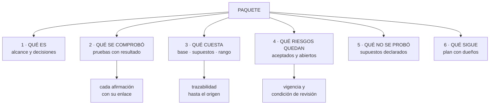

# 287 — Paquete de evidencia, costos y riesgos residuales

> [← 286 · Revisión Well-Architected multi-proveedor](../../part-23-industry-capstones/286-revision-well-architected-multi-proveedor/README.md) · [Índice de la parte](../README.md) · [288 · Defensa final, retrospectiva y plan de 12 meses →](../../part-23-industry-capstones/288-defensa-final-retrospectiva-y-plan-de-12-meses/README.md)

**Parte:** 23 — Capstones por industria y defensa final<br>
**Nivel:** experto · **Horas estimadas:** 4<br>
**Laboratorio:** `assessment` · **Estado:** `EXECUTABLE_CORE`

## 🎯 Propósito

Reunir el trabajo en un paquete de evidencia que alguien de fuera pueda evaluar sin explicaciones: qué se construyó, qué se comprobó, cuánto cuesta y qué riesgos quedan. La clase da la estructura del paquete, cómo se presentan costes que resistan una revisión financiera, y cómo se declaran los riesgos residuales de forma que sean creíbles y revisables.

## 📚 Resultados de aprendizaje

Al finalizar podrás:

1. **Estructurar** un paquete de evidencia que se evalúe sin acompañamiento.
2. **Presentar** costes con base, supuestos y rango, no con una cifra.
3. **Declarar** riesgos residuales con dueño, vigencia y condición de revisión.
4. **Distinguir** lo comprobado de lo supuesto en cada afirmación.
5. **Adaptar** el mismo paquete a ingeniería, a negocio y a auditoría.

## 🧩 Conceptos centrales

| Concepto | Comprensión verificable |
|---|---|
| `paquete de evidencia` | Conjunto de documentos que permite a un tercero evaluar un sistema sin que nadie se lo explique. |
| `afirmación con respaldo` | La que enlaza a la prueba que la sostiene. Sin enlace, es una conjetura. |
| `riesgo residual` | El que se acepta conscientemente, con dueño, motivo, vigencia y condición de revisión. |
| `supuesto declarado` | Lo que se da por cierto sin haberlo comprobado. Se escribe, no se esconde. |
| `coste con rango` | Estimación con banda y con los factores que la mueven, en vez de un número único. |
| `trazabilidad` | Que cada cifra del paquete se pueda seguir hasta su origen. |

## 🧠 Modelo mental

El capstone no premia cantidad de servicios, sino trazabilidad entre contexto, decisiones, implementación, fallos, evidencia y aprendizaje.

Aplicado a esta clase, separa siempre cuatro planos: **intención** (qué necesita el usuario),
**configuración** (qué declaramos), **estado observado** (qué existe de verdad) y
**evidencia** (cómo sabemos que cumple). Confundirlos produce diseños que se ven correctos
en un diagrama pero fallan al operar.

## 🗺️ Flujo de razonamiento



## 📖 Desarrollo

### 1. La estructura del paquete

El criterio: alguien competente que no ha participado debe poder evaluarlo **sin preguntar nada**.

```text
1  QUÉ ES
   el alcance, en una página
   el diagrama por recorrido, no por servicio
   y las decisiones importantes con sus alternativas
                                            clase 272
   → y las decisiones van aquí, no en un anexo

2  QUÉ SE COMPROBÓ
   cada prueba negativa con su resultado y su fecha
   → incluidas las que fallaron y qué se hizo
   → y esta sección es la que da credibilidad al resto

3  QUÉ CUESTA
   coste actual, coste proyectado, unidad económica
   y los supuestos que lo mueven

4  QUÉ RIESGOS QUEDAN
   aceptados, con dueño y vigencia
   y abiertos, con plan

5  QUÉ NO SE PROBÓ
   los supuestos declarados
   → y esta sección, que casi nadie escribe, es la que
     más confianza genera

6  QUÉ SIGUE
   plan con dueños, plazos y criterios de cierre
```

Y las reglas que hacen creíble el paquete:

```text
CADA AFIRMACIÓN CON SU RESPALDO
  «la restauración tarda 52 minutos» → enlace al acta del
  14 de marzo
  → sin enlace, se marca como estimación

SE DISTINGUE COMPROBADO DE SUPUESTO
  y se marca visualmente
  → «comprobado el 14/3» frente a «estimado a partir de
    la prueba de carga de febrero»

LO QUE FALLÓ SE CUENTA
  → un paquete donde todo salió bien no se cree, y con
    razón
  → y este programa lleva 288 clases demostrándolo

Y CABE EN LO QUE SE PUEDE LEER
  20-30 páginas, con anexos aparte
  → un paquete de 200 páginas no se evalúa: se hojea
```

### 2. Costes que resisten una revisión

La sección donde más paquetes pierden credibilidad, por presentar certeza donde hay estimación.

```text
LO QUE NO FUNCIONA
  «costará 41.000 USD al mes»
  → un número sin base ni supuestos
  → y la primera pregunta de finanzas lo desmonta

LO QUE FUNCIONA
  COSTE ACTUAL, medido y trazable
    por componente, con la fuente
  COSTE PROYECTADO, con rango
    «entre 34.000 y 58.000 según el volumen; el factor
    dominante es el tráfico entre zonas, que representa
    el 31 %»
  SUPUESTOS EXPLÍCITOS
    volumen, crecimiento, retención, número de clientes
  SENSIBILIDAD
    «si el volumen se duplica, el coste sube un 60 %, no
    un 100 %, porque el almacenamiento no crece igual»
  UNIDAD ECONÓMICA
    coste por pedido, por cliente o por hora vista
                                            clase 270
  Y COSTE EVITADO
    las alternativas descartadas y lo que habrían costado
```

Y los errores que se detectan de inmediato en una revisión financiera:

```text
1  no incluir el coste de las personas
   → la operación de un sistema cuesta personas, y eso se
     cuenta                                    ley 23
2  no incluir transferencia de datos
   → suele ser el componente que más sorprende
3  usar precios de lista sin descuentos aplicables
   o al revés, contar descuentos que no están firmados
4  ignorar el coste de los entornos que no son producción
   → suelen ser entre el 20 % y el 40 %
5  no decir qué pasa si los supuestos fallan
6  y presentar el ahorro sin la base
   → «ahorramos un 30 %» sin decir de qué ni si el
     sistema creció                          clase 270
```

Y el formato que funciona con negocio:

```text
una tabla con tres columnas
  qué se consigue · qué cuesta · qué riesgo se evita o se
  asume

y la comparación con la alternativa
  → siempre, incluso con la de no hacer nada
  → porque decidir sin alternativa no es decidir
                                            clase 272
```

### 3. Riesgos residuales y supuestos

La sección que distingue un paquete profesional de una presentación comercial.

```text
UN RIESGO RESIDUAL BIEN ESCRITO
  QUÉ ES          en una frase, sin jerga
  QUÉ PASARÍA     impacto concreto, con cifra si se puede
  PROBABILIDAD    y en qué se basa esa apreciación
  POR QUÉ SE ACEPTA  coste o plazo de mitigarlo
  QUIÉN LO ACEPTA nombre, no un equipo
  VIGENCIA        hasta cuándo
  Y CONDICIÓN DE REVISIÓN
                  qué cambio lo invalida

→ las dos últimas son las que evitan que un riesgo
  aceptado se convierta en un riesgo olvidado
→ y son las que casi nunca se escriben
```

Y la sección de supuestos, que genera más confianza que ninguna otra:

```text
QUÉ VA AQUÍ
  lo que damos por cierto y no hemos comprobado
  las pruebas que no hemos hecho y por qué
  las cifras estimadas y su origen
  y las dependencias de terceros que no controlamos

EJEMPLOS REALES DE ESTE PROGRAMA
  «la conmutación de región se ha ensayado con 4
   instancias, no con carga completa; es nuestro mayor
   riesgo abierto»                          clase 276
  «la proyección de temporada alta asume un crecimiento
   del 34 %; el año pasado la campaña la superó por 1,88
   veces y el plan aguantó por el vertido de carga, no
   por la proyección»                       clase 262
  «suponemos que el proveedor de pagos mantiene su tasa
   de aprobación; no tenemos forma de verificarlo»

→ quien escribe esto se hace más creíble, no menos
→ y quien evalúa deja de buscar lo que se esconde
```

Y las tres audiencias, con el mismo contenido:

```text
INGENIERÍA
  mecanismos, compromisos y pruebas
  → y las secciones 2 y 5 son las que leen

NEGOCIO
  qué se consigue, qué cuesta, qué riesgo se asume
  → y la tabla de tres columnas
  → y la unidad económica, no la factura

AUDITORÍA O CLIENTE
  evidencia con fecha, trazabilidad y riesgos declarados
  → y la sección 2 con enlaces a las actas

→ el mismo paquete, distinto punto de entrada
→ y las cifras deben coincidir en las tres lecturas
  → si no coinciden, alguien lo notará
```

### 4. Errores que descartan un paquete

Lo que hace que un evaluador deje de confiar, en orden de gravedad.

```text
1  UNA CIFRA QUE NO CUADRA CON OTRA DEL MISMO PAQUETE
   → y a partir de ahí se desconfía de todas
   → por eso la trazabilidad importa: cada cifra con su
     origen

2  NINGÚN FALLO
   → nadie construye algo sin que falle nada
   → y el evaluador asume que se ha ocultado

3  CERTEZA DONDE HAY ESTIMACIÓN
   «costará exactamente X» o «la disponibilidad será del
   99,99 %»
   → sin decir con qué base

4  NO DECIR LO QUE EMPEORA
   → el error 2 de la clase 272, en formato escrito

5  RIESGOS SIN DUEÑO
   «se mitigará en el futuro»
   → sin nombre ni fecha, no es un plan

6  Y EVIDENCIA SIN FECHA
   «la restauración tarda 52 minutos»
   → ¿medido cuándo? si fue hace 14 meses, no vale
                                                ley 22
```

Y lo que un evaluador experimentado comprueba primero:

```text
  busca la sección de lo que no funcionó
    → si no existe, ya sabe qué clase de documento es
  coge una cifra al azar y pide su origen
  mira la fecha de la evidencia más antigua
  busca un riesgo aceptado y comprueba si tiene vigencia
  y pregunta por lo que NO está en el diagrama    ley 24

→ cinco comprobaciones en diez minutos
→ y deciden cómo se lee el resto
```

Y la lista de comprobación de la clase:

```text
☐ el paquete se puede evaluar sin que nadie lo explique
☐ cabe en 20-30 páginas, con anexos aparte
☐ las decisiones están en el cuerpo, no en un anexo
☐ cada afirmación enlaza a su respaldo
☐ se distingue lo comprobado de lo estimado, con fecha
☐ hay una sección de lo que falló y qué se hizo
☐ hay una sección de lo que NO se probó
☐ los costes llevan base, supuestos, rango y sensibilidad
☐ se incluyen personas, transferencia y entornos no
  productivos
☐ hay unidad económica y coste evitado
☐ cada riesgo aceptado tiene dueño, vigencia y condición
☐ las cifras cuadran entre secciones y son trazables
☐ y el plan tiene dueños con nombre y criterios de cierre
```

Y el cierre que enlaza con la clase siguiente: con el paquete escrito, queda defenderlo y cerrar el programa: corregir la última hipótesis, revisar las leyes acumuladas y escribir el plan de los doce meses siguientes. Es la clase 288, y cierra las 288.

## 🔬 Ejemplo trabajado

**El paquete de evidencia de CloudShop, presentado a un cliente corporativo en una evaluación de proveedor. Lo que sigue es su estructura real, la sección que el evaluador leyó primero, y las dos cifras que no cuadraban.**

**La estructura entregada.**

```text
páginas del cuerpo                              26
anexos                                          9 documentos
actas de pruebas enlazadas                      31

  1  Qué es                                      4 pág
     alcance, diagrama por recorrido y 11 decisiones
     con alternativas
  2  Qué se comprobó                             9 pág
     47 pruebas negativas con resultado y fecha
  3  Qué cuesta                                  5 pág
  4  Qué riesgos quedan                          4 pág
  5  Qué no se probó                             2 pág
  6  Qué sigue                                   2 pág
```

Y lo que el evaluador hizo en los primeros diez minutos:

```text
1  buscó la sección 5 («qué no se probó»)
   → existía; leyó los 6 supuestos declarados
   → comentario posterior: «esa sección decidió que me
     tomara en serio el resto»

2  cogió una cifra al azar
   → «restauración de la base de pedidos: 52 minutos»
   → pidió el origen
   → acta del 14 de marzo, con hora de inicio, hora de
     fin, volumen restaurado y quién lo ejecutó

3  miró la fecha de la evidencia más antigua
   → 11 meses (el ensayo de conmutación de región)
   → y estaba marcada como tal, con la fecha del siguiente
     ensayo ya fijada

4  buscó un riesgo aceptado
   → los 7 tenían dueño con nombre, vigencia y condición

5  preguntó qué no estaba en el diagrama
   → y aquí encontró algo
```

**Lo que el evaluador encontró.**

```text
HALLAZGO 1 · una dependencia fuera del diagrama
  el servicio de verificación de dirección postal, de un
  tercero
  → no aparecía en el diagrama por recorrido
  → y estaba en el camino crítico de la compra

  la pregunta      «¿qué pasa si no responde?»
  la respuesta     «se degrada; el pedido se acepta sin
                   verificar»
  la repregunta    «¿lo habéis probado?»
  la respuesta     «no»

  → se añadió al diagrama, se probó dos días después
  → resultado: con el servicio lento (no caído), el flujo
    de compra se degradaba a 2.900 ms         ley 24
  → y pasó a la sección 5 mientras se corregía

HALLAZGO 2 · dos cifras que no cuadraban
  sección 3: «coste mensual 227.000 USD»
  sección 3, tabla por componente: la suma daba 219.400

  la diferencia: 7.600 USD del entorno de ensayo, incluido
  en el total y no desglosado
  → error de presentación, no de fondo
  → y aun así, el evaluador anotó: «revisar el resto de
    cifras con más cuidado»

  → y eso es exactamente lo que cuesta una cifra que no
    cuadra
```

**La sección de costes, tal como se presentó.**

```text
COSTE ACTUAL, medido, últimos 3 meses

  componente                    USD/mes    fuente
  cómputo                        71.400    facturación
                                           por etiqueta
  base de datos                  48.200    ídem
  almacenamiento                 19.100    ídem
  transferencia de datos         31.900    ídem
  distribución de contenido      14.600    ídem
  servicios gestionados          22.800    ídem
  entornos no productivos        11.400    ídem
  observabilidad                  7.600    ídem
                                ───────
  infraestructura               227.000

  personas de plataforma (4)     41.000    coste interno
                                ───────
  total                         268.000
```

Y la proyección con rango:

```text
supuestos declarados
  crecimiento de pedidos                     +34 % anual
  crecimiento de catálogo                    +12 % anual
  retención de datos                         sin cambios
  y ningún mercado nuevo

proyección a 12 meses
  banda baja        291.000 USD/mes
  banda central     318.000
  banda alta        374.000

factores que la mueven, por orden
  1  transferencia entre zonas         31 % de la
                                       variación
  2  volumen de pedidos                27 %
  3  retención de registros            19 %
  4  el resto                          23 %

sensibilidad
  si los pedidos se duplican, el coste sube un 61 %, no un
  100 %: cómputo y transferencia escalan, almacenamiento y
  servicios gestionados casi no

unidad económica
  coste por pedido    0,41 → 0,17 USD en 24 meses
  con pedidos creciendo un 34 % anual

coste evitado registrado, 14 meses
  16 decisiones con la alternativa descartada
  total anualizado de las alternativas       2.139.000 USD
```

Y el comentario del evaluador sobre esta sección:

```text
«es la primera vez en esta evaluación que veo una
sensibilidad y una banda. Todos los demás me han dado un
número.»

→ y pidió el detalle del punto 3 (retención de registros)
→ que llevó a una conversación técnica de 40 minutos
→ y a una acción: bajar la retención en caliente de 90 a
  30 días, -19.400 USD/mes
```

**Los siete riesgos residuales.**

```text
ejemplo del que más se discutió

  QUÉ ES
    la conmutación de región se ha ensayado con 4
    instancias; nunca con carga completa
  QUÉ PASARÍA
    en una caída real de región, el tiempo de conmutación
    podría superar el objetivo de 30 minutos; estimamos
    entre 30 y 90
  PROBABILIDAD
    caída de región completa: no ha ocurrido en 4 años en
    esta región según el histórico del proveedor
  POR QUÉ SE ACEPTA
    el ensayo con carga completa requiere duplicar
    capacidad durante 6 horas: 14.000 USD y una ventana
    coordinada con negocio
  QUIÉN LO ACEPTA
    el responsable de plataforma, con conocimiento del
    director de tecnología
  VIGENCIA
    hasta el 30 de noviembre
  CONDICIÓN DE REVISIÓN
    antes de la temporada alta, o si un cliente exige
    contractualmente el objetivo de 30 minutos

→ el cliente exigía ese objetivo contractualmente
→ la condición se activó en la propia reunión
→ el ensayo se hizo 5 semanas después: 22 minutos con
  carga completa
```

Y lo que el cliente dijo al respecto:

```text
«que lo tuvierais escrito como riesgo abierto, con el
coste de cerrarlo y la condición exacta que lo activa, es
lo que hizo que confiara en el resto del documento. Si me
hubierais dicho que la conmutación estaba probada, lo
habría comprobado y os habría pillado.»
```

**Las tres versiones del paquete.**

```text
el mismo contenido, tres puntos de entrada

INGENIERÍA
  entra por la sección 2 (qué se comprobó)
  lee las 47 pruebas y los 6 supuestos
  → 45 minutos de lectura

NEGOCIO
  entra por una tabla de 1 página
    qué se consigue · qué cuesta · qué riesgo
  → 10 minutos
  → y la unidad económica, no la factura

AUDITORÍA
  entra por el índice de actas con fechas
  → y de ahí a las pruebas que le interesan

y la comprobación que se hizo antes de entregar
  las cifras de las tres vistas se cotejaron entre sí
  → y ahí se encontró la discrepancia de 7.600 USD
  → tarde: ya estaba impreso
```

**El resultado.**

```text
evaluación de proveedor, 4 candidatos
  CloudShop quedó primero

y lo que el comité escribió
  «único candidato que declaró lo que no había probado»
  «único que presentó rango y sensibilidad de coste»
  «los riesgos aceptados tenían fecha de caducidad»
  y «una discrepancia menor en la tabla de costes, ya
   aclarada»

→ los tres primeros puntos eran secciones que los otros
  candidatos no tenían
→ y el cuarto costó una explicación que no debería haber
  hecho falta
```

**La lección que esta clase deja**: el evaluador leyó primero la sección de **lo que no se había probado**, y fue la que le hizo tomarse en serio el resto; el riesgo declarado con su coste de cierre y su condición de activación fue lo que generó confianza, no la lista de logros. Y una discrepancia de **7.600 USD** entre el total y la suma de componentes —un error de presentación, no de fondo— bastó para que el evaluador anotara que revisaría el resto de cifras con más cuidado.

## 🧪 Laboratorio guiado

Ejecuta desde la raíz:

```bash
python classes/part-23-industry-capstones/287-paquete-de-evidencia-costos-y-riesgos-residuales/lab.py
```

El laboratorio selecciona el motor de práctica **`assessment`** y produce
`lab_result.json`. El escenario, sus comprobaciones y el artefacto esperado corresponden a
esta clase; no requiere credenciales y deja explícito qué debe revalidarse en un sandbox real.

1. Lee `exercise.steps` y formula una predicción antes de ejecutar.
2. Ejecuta la práctica y verifica todos los elementos de `checks`.
3. Provoca el caso de `negative_test` y explica la señal observada.
4. Materializa `final-evidence-pack` en `evidence/` usando la plantilla indicada.
5. Para proveedor real, sigue `sandbox.requires`, registra costo y ejecuta `destroy`.

### Evidencia esperada

El artefacto principal es una evaluación por escenarios con rúbrica y evidencia trazable. Además, la entrega debe incluir el comando ejecutado,
la salida estructurada y una conclusión que no exceda lo observado.

## 🏆 Reto verificable

Construye **`final-evidence-pack`** para el caso CloudShop. Incluye una alternativa descartada,
un supuesto que pueda falsarse, una prueba de fallo y una decisión de rollback.

## ✅ Criterio de aceptación

- [ ] `lab.py` termina con código 0 y genera JSON válido.
- [ ] La entrega conecta al menos tres requisitos con mecanismos verificables.
- [ ] Existe una prueba positiva y una prueba negativa con evidencia.
- [ ] Seguridad, costo y operación aparecen como decisiones, no como anexos.
- [ ] Se declara una limitación y una condición que obligaría a revisar el diseño.
- [ ] Otra persona puede repetir el recorrido sin conocimiento tácito.

## ⚠️ Errores frecuentes

| Síntoma | Causa probable | Corrección |
|---|---|---|
| El paquete necesita que alguien lo explique para entenderse | Está escrito para quien ya conoce el sistema | Escríbelo para un evaluador competente que no participó: alcance, diagrama por recorrido y decisiones en el cuerpo, no en anexos. |
| El evaluador desconfía de todas las cifras tras encontrar una | Una cifra no cuadra con otra del mismo documento | Coteja las cifras entre secciones y vistas antes de entregar, y haz que cada una sea trazable hasta su origen. |
| La sección de costes se desmonta con la primera pregunta | Se presentó un número único sin base, supuestos ni rango | Da coste actual medido, proyección con banda, supuestos, factores dominantes y sensibilidad; incluye personas, transferencia y entornos no productivos. |
| El paquete parece demasiado bueno y genera desconfianza | No cuenta ningún fallo ni ningún supuesto sin comprobar | Incluye una sección de lo que falló y otra de lo que no se probó; ambas aumentan la credibilidad del resto. |
| Un riesgo aceptado hace tiempo ya no debería aceptarse y nadie lo revisó | Se aceptó sin vigencia ni condición de revisión | Cada riesgo residual con dueño con nombre, vigencia y la condición concreta que lo invalida. |
| La evidencia existe pero no convence | No tiene fecha, o la más reciente es de hace más de un año | Fecha cada prueba y marca la evidencia antigua como tal, con la fecha de la siguiente ejecución ya fijada. |

## 🛡️ Seguridad, ética y costo

Trabaja con cuentas propias o sandboxes autorizados. No publiques secretos, identificadores
reales ni datos personales. Antes de crear recursos pagos define presupuesto, etiquetas y
comando de destrucción; después verifica que no queden recursos huérfanos. Los ejemplos
locales enseñan contratos, pero no certifican cumplimiento ni disponibilidad de producción.

## ❓ Preguntas de comprobación

1. ¿Qué seis secciones tiene el paquete y cuál genera más confianza?
2. ¿Qué hace que una sección de costes resista una revisión financiera?
3. ¿Qué siete elementos tiene un riesgo residual bien escrito?
4. ¿Qué comprueba primero un evaluador experimentado?
5. ¿Por qué contar lo que falló aumenta la credibilidad del paquete?

## 🔗 Referencias

- AWS (2024). *Well-Architected Framework: documenting review outcomes*. <https://docs.aws.amazon.com/wellarchitected/latest/framework/welcome.html>
- Nygard, M. (2011). *Documenting architecture decisions*. <https://cognitect.com/blog/2011/11/15/documenting-architecture-decisions>
- ISO/IEC (2022). *ISO 31000: gestión del riesgo — riesgo residual y aceptación*. <https://www.iso.org/iso-31000-risk-management.html>
- FinOps Foundation (2024). *Forecasting and unit economics*. <https://www.finops.org/framework/capabilities/forecasting/>
- Tufte, E. (2006). *Beautiful Evidence* — presentación de evidencia y trazabilidad. <https://www.edwardtufte.com/tufte/books_be>
- Documentación oficial vigente del servicio implementado; registra URL y fecha de consulta.

---

> [Evaluación](assessment.md) · [Contrato de clase](lesson.yaml) · [Índice de la parte](../README.md)

| Anterior | Índice | Siguiente |
|---|---|---|
| [← 286 · Revisión Well-Architected multi-proveedor](../../part-23-industry-capstones/286-revision-well-architected-multi-proveedor/README.md) | [Parte 23](../README.md) · [Programa](../../README.md) | [288 · Defensa final, retrospectiva y plan de 12 meses →](../../part-23-industry-capstones/288-defensa-final-retrospectiva-y-plan-de-12-meses/README.md) |
