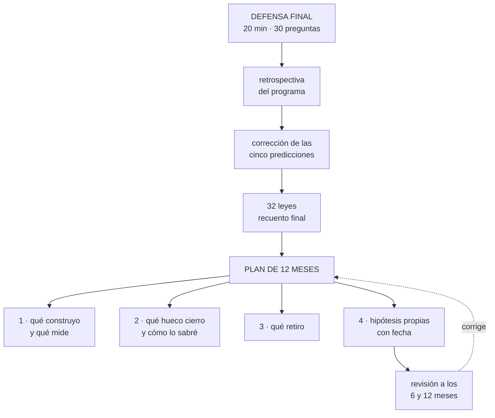

# 288 — Defensa final, retrospectiva y plan de 12 meses

> [← 287 · Paquete de evidencia, costos y riesgos residuales](../../part-23-industry-capstones/287-paquete-de-evidencia-costos-y-riesgos-residuales/README.md) · [Índice de la parte](../README.md) · **Fin del programa**

**Parte:** 23 — Capstones por industria y defensa final<br>
**Nivel:** experto · **Horas estimadas:** 8<br>
**Laboratorio:** `capstone` · **Estado:** `EXECUTABLE_CORE`

## 🎯 Propósito

Cierre del programa. La clase da el formato de la defensa final, corrige las cinco predicciones de la clase 276, cierra el recuento de las leyes con la número 32, y deja lo único que importa a partir de aquí: **un plan de doce meses que convierta 288 clases en capacidad demostrable, con hipótesis escritas y con fecha de revisión**.

## 📚 Resultados de aprendizaje

Al finalizar podrás:

1. **Defender** el trabajo completo ante un panel, con evidencia y compromisos.
2. **Corregir** las cinco predicciones de la clase 276 con evidencia medida.
3. **Cerrar** el recuento de leyes y entender qué las hace útiles.
4. **Escribir** un plan de doce meses con hipótesis y criterios de revisión.
5. **Continuar** el método del programa por cuenta propia.

## 🧩 Conceptos centrales

| Concepto | Comprensión verificable |
|---|---|
| `defensa final` | Exposición del trabajo completo ante un panel que pregunta por lo que no se probó. |
| `ley 32` | Manda la restricción que el dinero no puede levantar; todas las demás son decisiones de coste. |
| `plan de doce meses` | Compromiso con hipótesis, medidas y fechas de revisión, no una lista de temas. |
| `capacidad demostrable` | Lo que se puede enseñar con efecto, mecanismo y cifra. |
| `hipótesis propia` | Afirmación refutable sobre el propio trabajo, escrita antes y corregida después. |
| `método del programa` | Predecir, medir, corregir en público y escribir la ley solo cuando la evidencia obliga. |

## 🧠 Modelo mental

El capstone no premia cantidad de servicios, sino trazabilidad entre contexto, decisiones, implementación, fallos, evidencia y aprendizaje.

Aplicado a esta clase, separa siempre cuatro planos: **intención** (qué necesita el usuario),
**configuración** (qué declaramos), **estado observado** (qué existe de verdad) y
**evidencia** (cómo sabemos que cumple). Confundirlos produce diseños que se ven correctos
en un diagrama pero fallan al operar.

## 🗺️ Flujo de razonamiento



## 📖 Desarrollo

### 1. La defensa final

**El encargo.** Presentar el trabajo completo —los ocho capstones, el ensayo integrado, la revisión y el paquete de evidencia— ante un panel de tres personas, con el formato de la clase 276 ampliado.

```text
EL FORMATO
  20 minutos de exposición
  30 minutos de preguntas
  10 minutos de cierre: qué cambiarías y qué harás

LA EXPOSICIÓN, con la estructura que ya se conoce
  qué se construyó y para qué                clase 287
  qué se comprobó, incluido lo que falló
  qué cuesta, con supuestos y rango
  qué riesgos quedan, con dueño y vigencia
  y qué no se probó

→ y el orden importa: lo que falló va en el minuto 8, no
  al final
```

Y las preguntas que el panel debe hacer, que son las de todo el programa:

```text
«¿qué parte de esto no has probado nunca?»
«enséñame la última vez que ejecutaste ese procedimiento»
«¿cómo detectarías un fallo que no da error?»
«¿qué pasa si esa dependencia va LENTA en vez de fallar?»
«¿quién decide cuando el problema cruza dos equipos?»
«¿qué has retirado?»
«¿cuál es la alternativa más barata y por qué no la
 elegiste?»
«¿qué te haría cambiar de opinión?»
y «si te fueras mañana, ¿qué no sabría nadie?»

→ y ninguna de ellas se responde con conocimiento de
  catálogo                                  clase 274
```

Y la rúbrica, que suma a la de la clase 276 dos criterios:

```text                                              peso
acotación                                          10
alternativas                                       15
criterio                                           15
compromisos                                        15
respuesta a las preguntas                          15
revisión                                           10
EVIDENCIA: ¿está fechada y enseñada?               10
Y LO QUE NO SE PROBÓ: ¿está declarado?             10

→ y los dos últimos son los que este programa ha
  demostrado que más separan a quien sabe de quien lo
  parece
```

### 2. Corrección de las cinco predicciones de la clase 276

**La corrección, con evidencia y sin adornos. La última.**

```text
1. «los ocho sectores diferirán mucho menos en tecnología
    de lo que aparentan: lo que cambiará será QUÉ
    RESTRICCIÓN MANDA y qué se acepta perder»

   CORRECTA Y MEDIDA. Los ocho capstones usaron las mismas
   piezas: identidad, aislamiento, colas, coherencia donde
   hace falta, señales, copias y despliegue progresivo. Lo
   que cambió fue el orden de prioridad y la lista de lo
   que se acepta perder. El comercio acepta sobreventa del
   0,3 % y compensa; pagos no acepta un cobro duplicado;
   salud no acepta una filtración; el sector público no
   acepta que el ciudadano no pueda presentar en plazo.
   La misma caja de herramientas, ocho listas de
   sacrificios distintas.

2. «en todos ellos, la restricción dominante será NO
    TÉCNICA: normativa, contrato o coste unitario»

   FALLIDA POR DECIR «EN TODOS». Se cumplió en siete de
   ocho: pico estacional, obligación de prueba ante
   terceros, protección de la persona, soberanía, coste
   por byte, aislamiento entre clientes y fiabilidad del
   dato. La excepción es el capstone industrial, donde la
   restricción dominante es FÍSICA: la conexión no es
   fiable y no hay contrato que lo cambie. Y esa excepción
   enseña más que los siete aciertos, porque señala qué
   tienen en común todas: se explica en la ley 32.

3. «el capstone que más fallos silenciosos revele será el
    de datos e inteligencia artificial»

   CORRECTA EN EL ORDEN Y EQUIVOCADA EN LA EXCLUSIVIDAD.
   Sí fue el que más reveló. Pero los fallos silenciosos
   aparecieron en los ocho: dos años de datos de
   producción inflados hasta un 19 % en el industrial, un
   informe que enseñó ventas de la competencia durante 19
   meses en el multiinquilino, dos vías de datos
   personales fuera de Europa durante más de un año en el
   comercio, y 19 cobros no registrados en pagos. La
   ley 29 no es una ley del sector de datos: es una ley de
   los sistemas que producen números.

4. «en el ensayo integrado, alrededor de dos tercios de
    los hallazgos volverán a ser organizativos»

   CORRECTA CON UNA PRECISIÓN INCÓMODA. 66 %, frente al
   68 % de los ensayos por sistema de la clase 261. Y los
   tres fallos mayores del ensayo integrado fueron: dos
   incidentes abiertos sin que ninguno supiera del otro,
   una correlación que ocultó un problema 39 minutos, y 31
   minutos en que nadie decidió porque nadie sabía que
   podía. El más caro se arregló con una frase escrita.

5. «más del 70 % de las decisiones de los ocho capstones
    se podrán justificar con leyes ya escritas; y las que
    no, se concentrarán en sector público y salud»

   CORRECTA EN LA CIFRA Y PARCIAL EN LA CONCENTRACIÓN. De
   147 decisiones documentadas, 121 se justifican con
   leyes previas: el 82 %. De las 26 restantes, 11 están
   en sector público y salud, como predijimos, pero 7
   están en medios —derechos por territorio, retirada de
   contenido, calidad percibida— que no habíamos
   anticipado. Acertamos la cifra y el motivo de la mitad.
```

**Marcador final: dos correctas, dos parciales y una fallida.** Y el fallo de la segunda es el que cierra el programa: **acertamos que la restricción dominante casi nunca es técnica y nos equivocamos al decir que nunca lo es; lo que comparten todas no es su naturaleza, sino que ninguna se puede comprar.**

### 3. El recuento final y la ley 32

**Las 32 leyes, cerradas las 288 clases.**

```text
ley 13  lo que no se mira deja de funcionar en silencio        74
ley 15  la señal existe y nadie la mira                        63
ley 22  un procedimiento nunca ejecutado no funciona           61
ley 16  un control que estorba se rodea                        48
ley 14  el coste se decide al crear, no al pagar               46
ley 20  lo que no tiene dueño se filtra y se desperdicia       41
ley 25  lo provisional sobrevive a su motivo                   38
ley 21  el acoplamiento vive en quién escribe                  37
ley 29  un fallo de datos no da error: da otro número          31
ley 26  el valor por defecto sirve a la demostración           31
ley 23  la capacidad la limita lo que ya se mantiene           28
ley 17  se optimiza la medida, no el objetivo                  24
ley 24  lo que no está en el diagrama no se analiza            23
ley 30  automatizar elimina un juicio que nadie escribió       17
ley 27  un control solo actúa sobre lo que cambia              15
ley 18  lo asíncrono traslada la garantía, no la elimina       14
ley 28  donde se paga por uso, cada defecto es una factura     14
ley 31  la función de apoyo acaba autorizando, y se queda
        ciega                                                  12
ley 19  la compensación hace invisible el fallo                12
ley 32  manda la restricción que el dinero no puede levantar    8
```

Y la última ley, que la parte 23 obliga a escribir:

```text
LEY 32
  manda la restricción que el dinero no puede levantar;
  todas las demás son decisiones de coste

apariciones en esta parte                                      8
  clase 277   la capacidad del pico se compra; lo que no se
              compra es la confianza de quien no pudo
              comprar el último día
  clase 278   un cobro duplicado se devuelve; lo que no se
              compra es poder demostrar ante un tercero qué
              ocurrió
  clase 279   ningún presupuesto deshace una filtración de
              un diagnóstico
  clase 280   ninguna cantidad cambia bajo qué jurisdicción
              queda un dato
  clase 281   los bytes se pagan; la calidad percibida en el
              dispositivo del espectador, no
  clase 282   no hay contrato que haga fiable un enlace
              satélite en una mina
  clase 283   ningún descuento repara que un cliente haya
              visto los datos de otro
  clase 284   ningún gasto detecta un fallo que no produce
              error, si nadie compara

y lo que la distingue de la ley 14
  la 14 dice CUÁNDO se decide el coste: al crear
  la 32 dice QUÉ NO ES una decisión de coste
  → y esa distinción es la que ordena una arquitectura
  → primero se identifica lo que el dinero no levanta, y
    todo lo demás se optimiza alrededor
  → hacerlo al revés produce sistemas caros que fallan en
    lo único que importaba
```

Y lo que hace útiles a estas 32:

```text
NINGUNA SE ESCRIBIÓ ANTES DE LA EVIDENCIA
  cada una apareció cuando una predicción falló
  → 24 partes, 120 predicciones escritas antes
  → y las que fallaron fueron las productivas

Y NINGUNA ES UNA REGLA
  no dicen qué hacer: dicen qué OCURRE si no se hace nada
  → describen el estado por defecto de los sistemas y de
    las organizaciones
  → y por eso lo único que las contrarresta es
    comprobación automática y periódica
                                        clases 228, 264
```

### 4. El plan de doce meses

Lo único que importa a partir de aquí. Y no es una lista de temas.

```text
LO QUE NO FUNCIONA
  «voy a estudiar Kubernetes y sacarme dos
   certificaciones»
  → temas, sin efecto medible                clase 265

LO QUE FUNCIONA, cuatro compromisos

1  QUÉ CONSTRUYO, y qué mide que funcionó
   una cosa, pequeña y completa, con
     infraestructura como código, cadena de entrega,
     identidad sin credenciales permanentes, señales por
     recorrido, copias con restauración probada y coste
     medido                                clase 275
   → y la cifra que lo demuestra

2  QUÉ HUECO CIERRO, y cómo lo sabré
   una RESTRICCIÓN, no un producto
   → «no sé razonar sobre coherencia entre regiones»
   → y el criterio: «lo sabré cuando pueda predecir el
     resultado de un ensayo y acertar»

3  QUÉ RETIRO
   → porque retirar fue, medido, de lo más rentable de
     todo el programa: 245 alertas, 9 procedimientos, 426
     conjuntos, 61 paneles, 4 modelos
   → y nadie lo pide nunca

4  QUÉ HIPÓTESIS ESCRIBO, con fecha de corrección
   dos o tres afirmaciones refutables sobre tu propio
   trabajo
   → «creo que el cuello de mi sistema es la base; predigo
     que al cargar hasta romper será el grupo de
     conexiones»
   → y una fecha para corregirlas en público
```

Y el calendario mínimo, que es lo que lo hace real:

```text
MENSUAL
  ejecutar un procedimiento al azar             clase 259
  revisar qué se puede retirar

TRIMESTRAL
  un ensayo con hipótesis escrita               clase 261
  restaurar una copia con reloj                 clase 255
  revisar los riesgos aceptados que vencen      clase 287

SEMESTRAL
  una revisión estructurada de un sistema       clase 286
  corregir las hipótesis propias en público

ANUAL
  conmutación completa con carga y con acta     clase 278
  y reescribir el plan
```

Y las tres preguntas para elegir qué hacer primero:

```text
«¿QUÉ ME QUITA EL SUEÑO DE MI SISTEMA?»
  → y comprobarlo esta semana

«¿QUÉ NO HE PROBADO NUNCA?»
  → y probar lo más barato de probar

«¿QUÉ SÉ QUE NADIE MÁS SABE?»
  → y escribirlo
```

Y el cierre del programa:

```text
288 clases, 24 partes, 32 leyes y 120 predicciones
escritas antes de saber la respuesta.

De esas 120, unas cuarenta fallaron. Y todo lo que este
programa tiene de propio —las 32 leyes— salió de esas
cuarenta, no de las otras ochenta.

El método no era enseñar la nube: era predecir, medir y
corregirse en público. Y funciona igual en un sistema de
cuarenta servicios que en una carrera: escribe lo que
crees que va a pasar, mídelo, y cuando falles, escribe
por qué.

Lo demás —los productos, los nombres de servicio, las
consolas— cambiará. Las restricciones no.
```

## 🔬 Ejemplo trabajado

**La retrospectiva completa del programa, con las cifras. Lo que sigue son las 120 predicciones y su marcador, las leyes que más aparecieron y por qué, lo que el programa dejó fuera, y un plan de doce meses real.**

**El marcador de las 120 predicciones.**

```text
24 partes × 5 predicciones                       120

  correctas y confirmadas                         49    41 %
  correctas y subestimadas o incompletas          31    26 %
  parciales                                       23    19 %
  fallidas                                        17    14 %

y las leyes escritas                              32
  de ellas, nacidas de una predicción fallida     20
  de una predicción subestimada                    9
  de una confirmación que reveló un mecanismo      3
```

Y el patrón:

```text
el 63 % de las leyes salió de haberse equivocado
→ y ninguna de las 49 predicciones plenamente correctas
  produjo una ley por sí sola

→ acertar confirma lo que ya se sabía
→ fallar es lo que enseña
→ y por eso las predicciones se escribían ANTES, con
  cifra, y se corregían en público
```

**Las leyes que más aparecieron, y qué tienen en común.**

```text
las cinco primeras suman el 45 % de todas las apariciones

  13  lo que no se mira deja de funcionar en silencio
  15  la señal existe y nadie la mira
  22  un procedimiento nunca ejecutado no funciona
  16  un control que estorba se rodea
  14  el coste se decide al crear, no al pagar

→ y las cinco describen lo mismo desde ángulos distintos
  UN SISTEMA SIN COMPROBACIÓN PERIÓDICA SE DEGRADA HACIA
  EL ESTADO EN QUE NADIE SE ENTERA

→ no son leyes de la nube: son leyes de las cosas que
  cambian y de las personas que las olvidan
→ y por eso el programa acabó en operación, ensayos y
  revisiones, y no en catálogos de servicios
```

**Los hallazgos más caros del programa, ordenados.**

```text
posición  hallazgo                          clase   coste o efecto

1  la réplica «síncrona» era asíncrona        278   0 pérdida
                                                    prometida al
                                                    regulador, falsa
2  19 de 34 procedimientos rotos              259   incluido el de
                                                    conmutación
3  cuotas de la región secundaria al 3,2 %    262   plan de
                                                    continuidad
                                                    inviable
4  1,1 M de historias clínicas en entornos
   de prueba                                  279   mayor riesgo del
                                                    sistema, fuera
                                                    del inventario
5  un parámetro en la ruta de los segmentos   281   61.000 USD/mes,
                                                    3 años
6  un campo «importe» con tres significados   252   el error más caro
                                                    de la parte 20
7  2 años de producción inflada hasta un 19 % 282   decisiones de
                                                    compra con datos
                                                    falsos
8  un informe cruzando datos entre clientes   283   19 meses,
                                                    41 comercios
9  el comité aprobó el 91 % de lo que causó
   incidentes                                 260   546 h/año y
                                                    4,2 días de
                                                    espera
10 31 minutos sin que nadie decidiera         285   arreglado con
                                                    una frase

→ de los diez, SIETE no producían ningún error
→ y NUEVE existían desde hacía más de un año
→ ninguno se encontró leyendo documentación: los diez
  aparecieron al EJECUTAR algo
```

**Lo que el programa dejó fuera, dicho explícitamente.**

```text
no enseña a programar
no cubre el detalle de configuración de ningún producto
  → deliberadamente: caduca              clase 265
no entra en el diseño de interfaces de usuario
no cubre gestión de personas ni contratación
las cifras de CloudShop son un caso construido para
  enseñar: los órdenes de magnitud son realistas, los
  números concretos no son de una empresa real
y las 32 leyes son observaciones, no teoremas
  → cada una puede refutarse con evidencia
  → y eso sería el mejor uso posible de este programa
```

**Un plan de doce meses, escrito de verdad.**

```text
DE UNA PERSONA CON 4 AÑOS DE EXPERIENCIA, NIVEL 2 REAL

1  QUÉ CONSTRUYO
   un servicio de seguimiento de envíos, pequeño y
   completo
     infraestructura como código, cadena con canario,
     identidad sin credenciales permanentes, indicadores
     por recorrido, copias restauradas cada mes y coste
     por consulta medido
   plazo                          meses 1 a 4
   qué mide que funcionó
     restauración probada < 15 min
     y un ensayo mensual que no lo tumba

2  QUÉ HUECO CIERRO
   el fallo parcial: no sé razonar sobre dependencias
   lentas
   cómo lo sabré
     en el mes 6, inyecto 200 ms en una dependencia de mi
     servicio
     PREDIGO: la latencia total subirá menos de 400 ms
     → y si me equivoco por más del doble, no lo he
       entendido

3  QUÉ RETIRO
   las 14 alertas de mi equipo que no han hecho actuar a
   nadie en 6 meses
   plazo                          mes 2
   y los 3 paneles que nadie abre

4  MIS HIPÓTESIS, con fecha de corrección: mes 12
   a  «el cuello de mi servicio será el grupo de
      conexiones, no la CPU»
   b  «más de la mitad de mis procedimientos fallarán al
      ejecutarlos»
   c  «el coste estará dominado por transferencia de datos
      y no por cómputo»
```

Y la corrección de esa persona, doce meses después:

```text
a  «el cuello será el grupo de conexiones»
   CORRECTA. Codo a 1.840 pet/s con la CPU al 44 %.

b  «más de la mitad de mis procedimientos fallarán»
   FALLIDA, Y POR UN MOTIVO QUE NO ESPERABA. Fallaron 2
   de 9, no 5. Pero solo porque los escribí hace cuatro
   meses. Los tres que tenían más de ocho meses fallaron
   los tres. La ley 22 no depende del número: depende del
   tiempo desde la última ejecución.

c  «el coste estará dominado por transferencia»
   FALLIDA. Lo dominó el almacenamiento de registros:
   el 51 %, con 400 días de retención que puse por
   defecto y no revisé. Ley 26, en mi propio sistema, y
   después de haberla estudiado.

y la predicción del hueco
   inyecté 200 ms: la latencia total subió 310 ms
   → dentro de lo predicho
   → hueco cerrado, y con evidencia
```

Y lo que esa persona escribió al cerrar el año:

```text
«de mis tres hipótesis, fallé dos. Y las dos que fallé me
enseñaron algo que no sabía: que la ley 22 se mide en
tiempo y no en cantidad, y que estudiar la ley 26 no me
protegió de ella.

Eso último es lo que más me sorprendió: sabía que los
valores por defecto sirven a la demostración, lo había
leído, lo había explicado, y aun así dejé 400 días de
retención en mi propio sistema durante un año.

Saber una ley no protege de ella. Solo la comprobación
periódica protege. Que es exactamente lo que el programa
decía y yo creía haber entendido.»
```

**Y el cierre.**

```text
288 clases.
24 partes que empezaron escribiendo lo que creían y
terminaron corrigiéndolo con cifras.
120 predicciones, unas cuarenta fallidas.
32 leyes, veinte de ellas nacidas de un error propio.

Y una sola instrucción para lo que viene:

  escribe lo que crees que va a pasar,
  mídelo,
  y cuando falles, escribe por qué.

Lo demás cambiará de nombre.
```

**La lección que esta clase deja**: de las 120 predicciones, las 49 plenamente correctas **no produjeron ni una sola ley**; las 32 salieron de las que fallaron o se quedaron cortas. Y la mejor demostración de que el método funciona no está en el programa: está en que alguien que había estudiado la ley 26 dejó **400 días de retención por defecto en su propio sistema durante un año** —porque saber una ley no protege de ella, y solo la comprobación periódica lo hace.

## 🧪 Laboratorio guiado

Ejecuta desde la raíz:

```bash
python classes/part-23-industry-capstones/288-defensa-final-retrospectiva-y-plan-de-12-meses/lab.py
```

El laboratorio selecciona el motor de práctica **`capstone`** y produce
`lab_result.json`. El escenario, sus comprobaciones y el artefacto esperado corresponden a
esta clase; no requiere credenciales y deja explícito qué debe revalidarse en un sandbox real.

1. Lee `exercise.steps` y formula una predicción antes de ejecutar.
2. Ejecuta la práctica y verifica todos los elementos de `checks`.
3. Provoca el caso de `negative_test` y explica la señal observada.
4. Materializa `final-defense` en `evidence/` usando la plantilla indicada.
5. Para proveedor real, sigue `sandbox.requires`, registra costo y ejecuta `destroy`.

### Evidencia esperada

El artefacto principal es un incremento integrado, demostrable y documentado. Además, la entrega debe incluir el comando ejecutado,
la salida estructurada y una conclusión que no exceda lo observado.

## 🏆 Reto verificable

Construye **`final-defense`** para el caso CloudShop. Incluye una alternativa descartada,
un supuesto que pueda falsarse, una prueba de fallo y una decisión de rollback.

## ✅ Criterio de aceptación

- [ ] `lab.py` termina con código 0 y genera JSON válido.
- [ ] La entrega conecta al menos tres requisitos con mecanismos verificables.
- [ ] Existe una prueba positiva y una prueba negativa con evidencia.
- [ ] Seguridad, costo y operación aparecen como decisiones, no como anexos.
- [ ] Se declara una limitación y una condición que obligaría a revisar el diseño.
- [ ] Otra persona puede repetir el recorrido sin conocimiento tácito.

## ⚠️ Errores frecuentes

| Síntoma | Causa probable | Corrección |
|---|---|---|
| El plan de doce meses es una lista de tecnologías y certificaciones | Se planifican temas en vez de efectos medibles | Comprométete con qué construyes y qué lo mide, qué hueco de restricción cierras y cómo lo sabrás, qué retiras y qué hipótesis escribes con fecha. |
| Se estudia una ley y aun así se cae en ella | Saber una ley no protege de ella: describen el estado por defecto, no una regla que se recuerde | Convierte cada ley en una comprobación periódica automática; es lo único que la contrarresta. |
| La defensa final se centra en lo que salió bien | Se presenta el trabajo como una demostración comercial | Pon lo que falló en el minuto ocho y declara lo que no probaste; el panel evalúa esas dos secciones antes que ninguna. |
| Un año de trabajo no se puede demostrar en una conversación | Se acumuló actividad sin efecto, mecanismo ni cifra | Por cada trabajo, escribe qué cambió, por qué mecanismo y cuánto, en el momento de hacerlo, no meses después. |
| Las hipótesis propias nunca se corrigen | No tenían fecha ni criterio de refutación | Escribe dos o tres afirmaciones refutables con cifra y una fecha de corrección; sin fecha no se corrigen nunca. |
| Se optimiza el coste y el sistema falla en lo esencial | No se identificó primero la restricción que el dinero no levanta | Empieza por lo que ningún presupuesto resuelve y optimiza todo lo demás alrededor; hacerlo al revés produce sistemas caros que fallan donde importaba. |

## 🛡️ Seguridad, ética y costo

Trabaja con cuentas propias o sandboxes autorizados. No publiques secretos, identificadores
reales ni datos personales. Antes de crear recursos pagos define presupuesto, etiquetas y
comando de destrucción; después verifica que no queden recursos huérfanos. Los ejemplos
locales enseñan contratos, pero no certifican cumplimiento ni disponibilidad de producción.

## ❓ Preguntas de comprobación

1. ¿Qué dos criterios añade la rúbrica final y por qué separan más que los otros?
2. ¿Cuál de las cinco predicciones falló y qué ley obligó a escribir?
3. ¿Qué distingue la ley 32 de la ley 14 y cómo ordena una arquitectura?
4. ¿Qué proporción de las leyes nació de un error y qué implica eso sobre el método?
5. ¿Qué cuatro compromisos tiene un plan de doce meses que sirva?

## 🔗 Referencias

- Popper, K. (1963). *Conjeturas y refutaciones* — el método de predecir y corregir. <https://www.routledge.com/Conjectures-and-Refutations/Popper/p/book/9780415285940>
- Beyer, B. y otros (2018). *The Site Reliability Workbook*. <https://sre.google/workbook/table-of-contents/>
- Forsgren, N., Humble, J. y Kim, G. (2018). *Accelerate*. <https://itrevolution.com/product/accelerate/>
- Kleppmann, M. (2017). *Designing Data-Intensive Applications*. <https://dataintensive.net/>
- Ericsson, K. A. y Pool, R. (2016). *Peak* — práctica deliberada con realimentación. <https://www.hachettebookgroup.com/titles/anders-ericsson/peak/9780544456259/>
- Documentación oficial vigente del servicio implementado; registra URL y fecha de consulta.

---

> [Evaluación](assessment.md) · [Contrato de clase](lesson.yaml) · [Índice de la parte](../README.md)

**📥 Descargar:** [Parte 23 en PDF](../../../site/downloads/partes/manual-parte-23-industry-capstones.pdf) · [Manual integral](../../../site/downloads/multi-cloud-engineering-manual-v2.0.pdf)

| Anterior | Índice | Siguiente |
|---|---|---|
| [← 287 · Paquete de evidencia, costos y riesgos residuales](../../part-23-industry-capstones/287-paquete-de-evidencia-costos-y-riesgos-residuales/README.md) | [Parte 23](../README.md) · [Programa](../../README.md) | **Fin del programa** |
