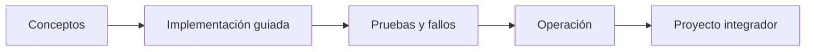

# Parte 23 — Capstones por industria y defensa final

> [← Parte 22](../part-22-specializations-certifications-career/README.md) · [Índice completo](../README.md) · Fin

**Nivel:** experto · **Clases:** 12 · **Duración sugerida:** 6–8 semanas

Integrar arquitectura, implementación, operación, costo y comunicación en casos industriales completos.

## Resultados de la parte

Al completar esta parte podrás explicar el dominio con lenguaje independiente del proveedor,
implementar sus mecanismos esenciales, diagnosticar fallos y defender decisiones mediante
evidencia, costo, seguridad y objetivos de confiabilidad.

## Modelo mental

El capstone no premia cantidad de servicios, sino trazabilidad entre contexto, decisiones, implementación, fallos, evidencia y aprendizaje.

## Secuencia

## Clases

| ID | Clase | Laboratorio | Horas |
|---:|---|---|---:|
| 277 | [Capstone retail: comercio multi-región](277-capstone-retail-comercio-multi-region/README.md) | `capstone` | 8 |
| 278 | [Capstone financiero: pagos, auditoría y recuperación](278-capstone-financiero-pagos-auditoria-y-recuperacion/README.md) | `capstone` | 8 |
| 279 | [Capstone salud: privacidad e interoperabilidad](279-capstone-salud-privacidad-e-interoperabilidad/README.md) | `capstone` | 8 |
| 280 | [Capstone sector público: soberanía y continuidad](280-capstone-sector-publico-soberania-y-continuidad/README.md) | `capstone` | 8 |
| 281 | [Capstone media: streaming y distribución global](281-capstone-media-streaming-y-distribucion-global/README.md) | `capstone` | 8 |
| 282 | [Capstone industria: IoT, edge y operación desconectada](282-capstone-industria-iot-edge-y-operacion-desconectada/README.md) | `capstone` | 8 |
| 283 | [Capstone SaaS: multi-tenancy y unit economics](283-capstone-saas-multi-tenancy-y-unit-economics/README.md) | `capstone` | 8 |
| 284 | [Capstone datos e IA: plataforma gobernada](284-capstone-datos-e-ia-plataforma-gobernada/README.md) | `capstone` | 8 |
| 285 | [Game day integrado y respuesta a incidentes](285-game-day-integrado-y-respuesta-a-incidentes/README.md) | `chaos` | 4 |
| 286 | [Revisión Well-Architected multi-proveedor](286-revision-well-architected-multi-proveedor/README.md) | `architecture` | 4 |
| 287 | [Paquete de evidencia, costos y riesgos residuales](287-paquete-de-evidencia-costos-y-riesgos-residuales/README.md) | `assessment` | 4 |
| 288 | [Defensa final, retrospectiva y plan de 12 meses](288-defensa-final-retrospectiva-y-plan-de-12-meses/README.md) | `capstone` | 8 |

## Evaluación de la parte

- 35 % laboratorios y evidencia reproducible.
- 25 % retos verificables.
- 20 % decisiones y ADR.
- 10 % seguridad, confiabilidad y costo.
- 10 % proyecto integrador de la parte.

Se aprueba con 80 % de clases en nivel B o superior y el proyecto integrador reproducible.

## Pauta bibliográfica

- Building Evolutionary Architectures — Ford, Parsons y Kua.
- Release It! — Michael Nygard.
- Accelerate — Forsgren, Humble y Kim.
