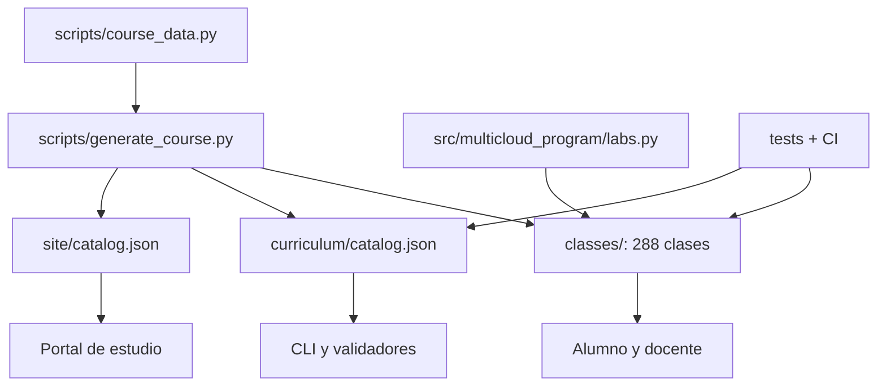

# Arquitectura del producto educativo

## Fuente de verdad

`scripts/course_data.py` define partes, clases, niveles, laboratorios, artefactos y libros.
`scripts/generate_course.py` produce índices, 288 contratos de clase y los catálogos JSON.
Los archivos generados se versionan para permitir estudio sin herramientas adicionales.



## Contrato de evidencia

Todos los laboratorios entregan versión de contrato, identificador, semilla, escenario,
decisión, evidencia, unidades de costo, prueba negativa y limitaciones. Un adapter futuro
para un proveedor puede cambiar la implementación, pero debe preservar esas claves.

## Regeneración

```bash
python scripts/generate_course.py
python scripts/validate_repository.py --strict
python -m unittest discover -s tests -v
```

Editar archivos generados directamente no es estable: el cambio debe originarse en el
catálogo o en la plantilla del generador.
