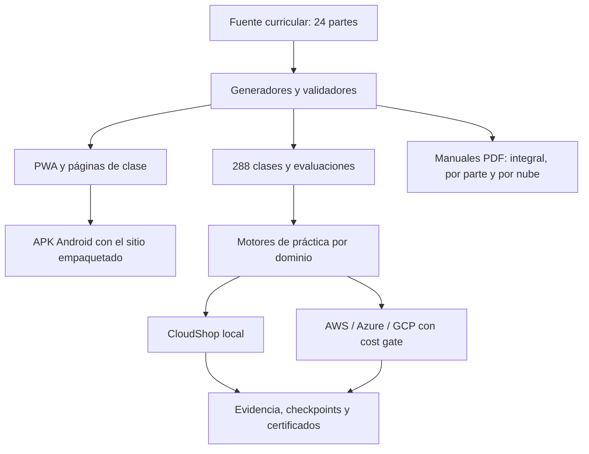

# Arquitectura del sistema pedagógico

La arquitectura de aprendizaje usa una sola fuente versionada, salidas regenerables y una
frontera explícita entre práctica local, sandbox autorizado y producción.
